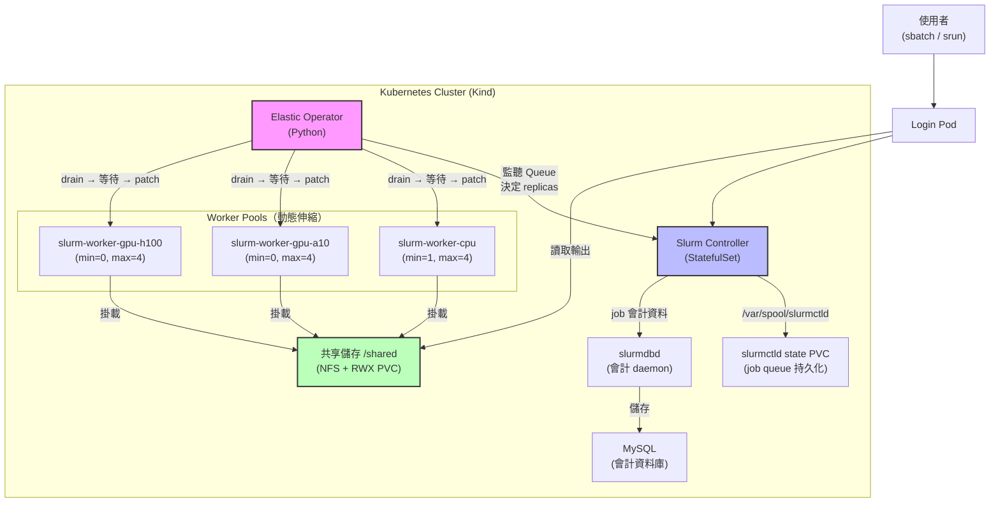

# Slurm-on-K8s-For-DDP

把 HPC 排程器搬進 Kubernetes，讓 AI 訓練任務既能用 Slurm 的精準資源管理，又能享受雲端的彈性伸縮。

- 互動式文件：[](https://deepwiki.com/SoWiEee/Slurm-on-K8s-For-DDP)
- K8s 叢集規格文件：[`docs/cluster.md`](docs/cluster.md)

---

# 🌱 Motivation

如果你曾經跑過分散式 AI 訓練，你大概有過這樣的經驗：

- 租了 8 張 GPU，但模型訓練只用了一半，剩下的資源就這樣閒著。
- 任務跑到一半節點掛掉，checkpoint 沒存好，重頭來過。
- 想擴充節點，卻要等管理員手動改設定。

這些問題的根源在於：現有工具在**資源彈性**和**排程精準度**之間做了取捨。

| 工具 | 擅長 | 不擅長 |
|------|------|--------|
| Kubernetes | 彈性伸縮、容器管理、雲端原生 | HPC workload 的精細資源語意 |
| Slurm | 批次排程、CPU/GPU 精準分配、叢集治理 | 動態節點、雲端彈性、容錯恢復 |

本專案的目標很直接：**讓兩者合作**。把 Slurm 跑在 Kubernetes 上，用 Kubernetes 的彈性支撐 Slurm 的排程能力，並在此基礎上實作 AI 訓練所需的共享儲存與 checkpoint 容錯。

---

# 🚀 Getting Started

> 環境需求：Linux + K3s

## 1. 確認工具已安裝

```bash
docker version
kind version
kubectl version --client
```

## 2. 一鍵部署（核心叢集）

```bash
bash scripts/bootstrap.sh

# 啟用 K8s 1.35 Gang Scheduling 基礎設施（Alpha feature gates）
# 注意：目前只啟用 K8s 層 feature gates；Operator 整合（_ensure_workload）尚未實作
KIND_CONFIG=kind-config.yaml bash scripts/bootstrap.sh
```

`scripts/bootstrap.sh` 自動完成以下步驟：

1. 建立 Kind 叢集（若不存在）
2. 建置 `slurm-controller:latest`、`slurm-worker:latest` Docker image（從 `docker/`），並 load 進 Kind
3. 執行 `scripts/render-core.py` 生成 `manifests/core/slurm-static.yaml`（自動偵測 NFS PVC）
4. 建立 Munge/SSH/JWT secrets（`scripts/create-secrets.sh`）
5. 套用 `manifests/core/` 所有資源（StatefulSet、Service、ConfigMap、DDP runtime、Lmod modulefiles）
6. 等待 controller rollout 完成，確認 `slurmctld` 可 ping
7. 建置 `slurm-elastic-operator:latest` image，套用 `manifests/operator/` 與 `manifests/networking/`
8. 設定三個 worker pool 的 `PARTITIONS_JSON` 環境變數
9. 縮放 cpu pool → 1 replica，GPU pool → 0 replica（初始狀態）

> 慢速機器可加參數：`ROLLOUT_TIMEOUT=600s bash scripts/bootstrap.sh`  
> 完整重建：`FORCE_RECREATE=true DOCKER_BUILD_NO_CACHE=true bash scripts/bootstrap.sh`

## 3. 驗證部署

```bash
bash scripts/verify.sh
```

依序執行：Pod readiness → slurmctld ping → srun 單節點 → sbatch CPU smoke test → operator scale-up/scale-down → GPU pool 路由驗證。

## 4. 部署共享儲存

```bash
# 主機端 NFS server（只需執行一次，在 WSL2 跑）
sudo bash scripts/setup-nfs-server.sh

# 在 K8s 叢集部署 NFS provisioner + 掛載到所有 pod
NFS_SERVER=<nfs-server-ip> NFS_PATH=/srv/nfs/k8s bash scripts/bootstrap-storage.sh

# 驗證
bash scripts/verify-storage.sh
bash scripts/verify-storage-e2e.sh
```

> 若 NFS 不通，可以看[這個](https://github.com/SoWiEee/Slurm-on-K8s-For-DDP/blob/main/docs/note.md#phase-3-%E5%AF%A6%E9%9A%9B%E9%83%A8%E7%BD%B2%E8%B8%A9%E5%9D%91%E7%B4%80%E9%8C%842026-03-29-on-windows-11--wsl2--kind)進行除錯。

> WSL2 的 IP 可以用 `hostname -I` 得知，Windows 每次開機都會變。

## 5. 部署監控

```bash
bash scripts/bootstrap-monitoring.sh
```

自動完成：建置 slurm-exporter 鏡像 → 重建 operator 鏡像（加入 prometheus-client）→ 部署 kube-state-metrics + Prometheus + Grafana + Alertmanager → 套用跨 namespace NetworkPolicy → 等待所有 Pod ready。

```bash
# 存取 Grafana（admin / admin）
kubectl -n monitoring port-forward svc/grafana 3000:3000

# 驗證所有元件正常、metrics 可抓
bash scripts/verify-monitoring.sh

# 存取 Prometheus（debug）
kubectl -n monitoring port-forward svc/prometheus 9090:9090
```

## 6. Lmod 模組系統（已整合至核心）

Lmod 已整合進 `docker/controller` 與 `docker/worker` image，`bootstrap.sh` 執行完畢後即可使用 `module load`。Modulefile 定義在 `manifests/core/lmod-modulefiles.yaml`，以 ConfigMap 管理。

執行一次以確保 NFS job 輸出路徑存在（**需先完成 §4**）：

```bash
bash scripts/bootstrap-lmod.sh
```

**部署後的操作體驗：**

```bash
# 進 login pod（如同登入 HPC login node）
kubectl -n slurm exec -it deploy/slurm-login -- bash

# 查看可用模組
module avail

# 載入 OpenMPI
module load openmpi/4.1

# 確認環境變數已設定
echo $MPI_HOME           # /usr/lib/x86_64-linux-gnu/openmpi
echo $SLURM_MPI_TYPE     # pmi2

# 卸載全部
module purge
```

**在 sbatch 腳本中使用 module（關鍵：需明確 source lmod.sh）：**

```bash
cat > /tmp/my-mpi-job.sh << 'EOF'
#!/bin/bash
#SBATCH --ntasks=2
#SBATCH --nodes=1

source /etc/profile.d/lmod.sh   # 讓 module 指令在批次作業內可用
module load openmpi/4.1

srun --mpi=pmi2 /bin/sh -c 'echo "rank:${SLURM_PROCID} host:$(hostname)"'
EOF

sbatch /tmp/my-mpi-job.sh
```

> **為什麼要明確 source lmod.sh？**  
> `sbatch` 執行腳本時使用非互動、非 login 的 bash，`/etc/profile.d/` 不會自動載入。  
> 明確 source 是標準 HPC 做法，與 TACC、NCHC 等真實系統的 job script 寫法一致。

**驗證（12 個 check 全通過）：**

```bash
bash scripts/verify-lmod.sh
```

驗證項目包含：Lmod 安裝確認 → `module avail` 顯示三個模組 → `module load` 設定 MPI_HOME → `module purge` 清除環境 → sbatch 提交雙 task MPI job → 確認 rank:0 / rank:1 在 job 內正確執行。

**目前內建模組：**

| 模組 | 描述 |
|------|------|
| `openmpi/4.1` | OpenMPI 4.1.2（Ubuntu 22.04 套件），設定 MPI_HOME、LD_LIBRARY_PATH、SLURM_MPI_TYPE=pmi2 |
| `python3/3.10` | 系統 Python 3.10，設定 PYTHON_HOME |
| `cuda/stub` | CUDA 佔位模組，示範 GPU 叢集的 modulefile 結構 |

> 自訂模組只需編輯 `manifests/core/lmod-modulefiles.yaml` 並 `kubectl apply`，**不需要重建 image**，數秒內生效。

---

## 清理環境

```bash
kind delete cluster --name slurm-lab
```

---

# 🏗️ System Architecture

用一句話說：你提交一個 Slurm job，系統自動把需要的節點準備好，跑完之後再把資源還回去。

稍微展開一點：

1. 使用者登入 Login Pod，用熟悉的 `sbatch` 指令提交訓練任務。
2. Elastic Operator 偵測到有 pending job，自動擴充對應的 worker 節點（CPU / GPU-A10 / GPU-H100 各自獨立管理）。
3. 訓練結果存在所有節點都能讀寫的 NFS 共享磁碟（`/shared`）。
4. 任務結束後，Operator 確認節點閒置且 checkpoint 安全，才把資源縮回去。

```
使用者 → sbatch → Slurm Controller → 排程到 Worker Pod
                        ↑
              Elastic Operator（Python）
              偵測 Queue → 擴 / 縮 Worker StatefulSet
```

---

## 系統架構




> 最新架構圖請看 [`architecture.html`](assets/architecture.html)

### 主要元件說明

| 元件 | 角色 |
|------|------|
| `slurm-controller` | 執行 `slurmctld`，負責所有排程決策；job 狀態存於獨立 PVC（`slurm-ctld-state`），pod 重啟後 queue 不遺失 |
| `slurm-login` | 使用者入口，提供 `sbatch`、`srun`、`squeue` 等指令 |
| `slurm-worker-*` | 實際執行計算的節點，分 CPU / GPU-A10 / GPU-H100 三個池 |
| `slurm-elastic-operator` | 自製 Python Operator，監控 Queue 狀態並動態調整各 pool 的 replicas；縮容前先 drain 節點，等待 job 完成後才減少 StatefulSet replica |
| `slurmdbd` | Slurm Database Daemon，將 job 會計紀錄（CPU-hours、用戶統計）持久化到 MySQL，為 Fair-Share 排程提供基礎 |
| `mysql` | 後端資料庫（StatefulSet），儲存 slurmdbd 的會計資料，使用 5 Gi PVC |
| NFS + RWX PVC | 跨所有節點的共享磁碟，job 輸出直接寫入 `/shared` |
| `lmod` + modulefile ConfigMaps | HPC 標準模組系統；`module load openmpi/4.1` 等指令在 login pod 與 job 內均可用；modulefile 以 K8s ConfigMap 管理，`kubectl apply` 即可新增/更新模組 |

---

# 🎯 Development Progress

| Phase# | 狀態 | 內容 |
|-------|------|------|
| 1：基礎 Slurm 叢集 | ✅ 完成 | Controller + Worker + Login Pod，Munge 認證，靜態節點預宣告；slurmctld state PVC（job queue 持久化）；slurmdbd + MySQL 會計後端；PodDisruptionBudget 保護所有關鍵元件；**Lmod 整合**（modulefile ConfigMap，`module load` 開機即可用） |
| 2：彈性 Operator | ✅ 完成 | 多節點池自動擴縮（CPU/GPU 各自獨立）、結構化日誌、Checkpoint-aware 縮容保護（Grace Period 支援）、drain-then-scale；Cooldown 持久化（StatefulSet annotation）；熔斷器 + readinessProbe；全套 NetworkPolicy（Ingress + Egress）|
| 2-E：雙網路拓撲 | ✅ MVP 完成 | 透過 Multus 增加第二張網卡（`net2`），DDP collective traffic（NCCL/Gloo）走獨立網路 |
| 3：共享儲存 | ✅ 完成 | NFS + RWX PVC 掛載到所有節點，`sbatch -o /shared/out-%j.txt` 可直接取得輸出；多節點 E2E 驗證通過（含 slurmctld IP cache 修正） |
| 4：可觀測性 | ✅ 完成 | Prometheus + Grafana 監控，統一呈現 Slurm 排程語意與 K8s 彈性伸縮行為，視覺化兩個世界的橋接過程 |
| 5：Lmod 整合完成 | ✅ 完成 | Lmod 整合至 Phase 1（images + modulefile ConfigMap + `--with-lmod` render）；Phase 5 bootstrap 僅負責確保 `/shared/jobs/` 目錄存在；Worker preStop Hook；job 輸出路徑整合 NFS `/shared/jobs/` |
| 5+：平台化與高可用 | 📋 規劃中 | Helm Chart、OpenTelemetry 分散式追蹤、Fair-Share 多租戶、Operator HA；Gang Scheduling 基礎設施（K8s feature gate）已就緒，Operator 整合待實作 |

---

## 提交一個 Job 長什麼樣子？

部署完成後，你可以直接 `kubectl exec` 進 login pod 提交任務：

```bash
kubectl -n slurm exec -it deploy/slurm-login -- bash
```

寫一個簡單的 job script：

```bash
cat > /shared/my-job.sbatch << 'EOF'
#!/bin/bash
#SBATCH -J my-first-job
#SBATCH -p debug
#SBATCH -N 1
#SBATCH --cpus-per-task=2
#SBATCH -o /shared/out-%j.txt
#SBATCH -e /shared/err-%j.txt

echo "Hello from $(hostname)"
echo "I have $SLURM_CPUS_ON_NODE CPUs"
sleep 10
EOF

sbatch /shared/my-job.sbatch
```

提交後查看狀態，等任務完成再讀取輸出：

```bash
squeue                          # 查看 queue
cat /shared/out-<JOBID>.txt     # 讀取輸出（從任何 pod 都能讀）
```

GPU 任務只需加上 `--constraint` 或 `--gres`，Operator 會自動把對應的 GPU worker 擴充起來：

```bash
#SBATCH --constraint=gpu-a10
#SBATCH --gres=gpu:a10:1
```

---

# ⚡ Useful Commands

## Slurm Cluster

```bash
# 查看所有 pod 狀態
kubectl -n slurm get pods -o wide

# 觀察 worker pool 伸縮
kubectl -n slurm get statefulset -w

# 查看 Operator 決策日誌（結構化 JSON）
kubectl -n slurm logs deployment/slurm-elastic-operator -f | python3 -m json.tool

# 查看 Slurm controller 日誌
kubectl -n slurm logs statefulset/slurm-controller -f

# 查詢 Operator 寫下的 cooldown 時間戳
kubectl -n slurm get statefulset slurm-worker-cpu \
  -o jsonpath='{.metadata.annotations.slurm\.k8s/last-scale-up-at}'

# 查詢 job 會計紀錄（需要 slurmdbd 正常運行）
kubectl -n slurm exec pod/slurm-controller-0 -- sacct -X --format=JobID,User,State,CPUTime,Start,End

# 確認 slurmdbd / MySQL 狀態
kubectl -n slurm get pods -l app=slurmdbd
kubectl -n slurm get pods -l app=mysql

# 進 login pod 提交 job
kubectl -n slurm exec -it deploy/slurm-login -- bash
```

## Monitoring

```bash
# 開啟 Grafana（admin / admin）
kubectl -n monitoring port-forward svc/grafana 3000:3000

# 開啟 Prometheus（raw metrics / 查詢）
kubectl -n monitoring port-forward svc/prometheus 9090:9090

# 直接確認 operator 是否正在輸出 metrics
kubectl -n slurm port-forward svc/slurm-elastic-operator 8000:8000
# → curl http://localhost:8000/metrics | grep slurm_operator

# 直接確認 slurm-exporter 是否正在輸出 metrics
kubectl -n slurm port-forward svc/slurm-exporter 9341:9341
# → curl http://localhost:9341/metrics | grep slurm_queue

# 查看所有監控元件狀態
kubectl -n monitoring get pods -o wide

# 查看 slurm-exporter 日誌（確認是否能連到 slurmrestd）
kubectl -n slurm logs deployment/slurm-exporter --tail=30
```

---

# 📊 Evaluation Metrics

| 指標 | 描述 | 目標 |
|------|------|------|
| Provisioning Latency | 從 job 提交到 worker pod ready 的時間 | < 30 秒 |
| Recovery Time | 節點故障到訓練恢復的時間 | < 60 秒 |
| Resource Efficiency | 任務結束後閒置資源回收速度 | 任務結束 1 分鐘內釋放 |
| Scheduling Overhead | Operator 本身的 CPU/Memory 佔用 | < 5% 總資源 |

---

# 🧱 Tech Stack

| 類別 | 工具 |
|------|------|
| 環境 | Windows 11 + Docker Desktop + Kind |
| 容器編排 | Kubernetes |
| HPC 排程器 | Slurm (slurmctld + slurmd)，MpiDefault=pmi2 |
| 節點認證 | Munge |
| Elastic Operator | Python 3.11 + Slurm REST API (slurmrestd) + Kubernetes Python SDK |
| 會計後端 | slurmdbd + MySQL 8.0（job CPU-hours / 使用者統計 / Fair-Share 前置）|
| 共享儲存 | NFS + nfs-subdir-external-provisioner + RWX PVC |
| DDP 網路 | Multus CNI + secondary NIC (net2) |
| MPI | OpenMPI 4.1.2 + Slurm PMI2 整合 |
| 模組系統 | Lmod 6.6；modulefile 以 K8s ConfigMap 管理，掛載至 `/opt/modulefiles/` |
| 監控 | Prometheus + Grafana + slurm-exporter + kube-state-metrics + Alertmanager |
| 告警 | 8 條 SLO 規則（provisioning latency、queue wait、flapping 等） |

---

# 🔭 Phase 5 Roadmap：平台化與高可用

> Phase 5 的目標是讓這個系統從「可運作的研究原型」演進成「可交付的平台產品」。
> Lmod 模組系統已完成（見 Getting Started §6）；以下為後續規劃，詳細技術設計見 `docs/note.md`。

## 5-A：Helm Chart 封裝

目前每個 Phase 有獨立的 manifest 資料夾，部署需要依序執行多支 bootstrap 腳本。Helm 讓整個系統可以一條指令完成：

```bash
helm install slurm-on-k8s ./chart \
  --set cluster.name=my-lab \
  --set pools.cpu.maxReplicas=8 \
  --set pools.gpuA10.maxReplicas=4 \
  --set monitoring.enabled=true \
  --set alertmanager.slack.webhookUrl="https://hooks.slack.com/..."
```

主要收益：環境差異（dev / staging / prod）只需一份 `values.yaml`，消除目前「改完 JSON 還要重新 render manifest」的摩擦。

## 5-B：OpenTelemetry 分散式追蹤

讓一個訓練 job 的完整生命週期變成一條可視化的 Trace：

```
[sbatch submit] → [pending in queue] → [scale-up decision]
  → [K8s provisioning] → [slurmd registration] → [DDP torchrun]
    → [checkpoint write] → [scale-down decision] → [job complete]
```

每個 span 攜帶 `job_id`、`pool`、`checkpoint_age`、`ddp_rank` 等 attribute，用 Jaeger 或 Grafana Tempo 可視化整條鏈。這是目前所有 Slurm-on-K8s 方案都沒有做到的端到端觀測視角。

## 5-C：Fair-Share 多租戶

支援多個 team / project 共用同一個叢集，搭配 Slurm 的 Fair-Share Scheduler：

- 每個 team 有自己的 Slurm account 和 `shares` 配額
- 新增 Grafana 面板：per-account queue depth、cumulative CPU-hours、FairShare 分數
- Operator 可依 account priority 調整各 pool 的 scale-up 優先順序

目標 TA：多個 AI 研究小組共用 GPU 叢集的組織（學術單位、內部平台團隊）。

## 5-D：Operator 高可用（HA）

目前 Operator 是 Single Replica，Pod 重啟會有 15–30 秒的決策空窗。Phase 5 計畫：

- Leader Election via K8s Lease（`coordination.k8s.io/v1`）：多個 Operator Pod 同時運行，只有 leader 執行 scaling loop
- Cooldown 狀態已透過 StatefulSet annotation 持久化（Phase 2 已完成），重新選主不會重置 cooldown
- 目標：Zero-downtime Operator 滾動升級

---

# 📝 References

- [Slurm Workload Manager Documentation](https://slurm.schedmd.com/)
- [PyTorch Distributed Elastic](https://docs.pytorch.org/docs/stable/distributed.elastic.html)
- [Kubernetes Operator Pythonic Framework (Kopf)](https://github.com/nolar/kopf)
- [Converged Computing: Integrating HPC and Cloud Native](https://www.computer.org/csdl/magazine/cs/2024/03/10770850/22fgId5NFpC)
- [Running Slurm on Amazon EKS with Slinky](https://aws.amazon.com/tw/blogs/containers/running-slurm-on-amazon-eks-with-slinky/)
- [Gang Scheduling](https://kubernetes.io/docs/concepts/scheduling-eviction/gang-scheduling/)
- [Workload Aware Scheduling](https://kubernetes.io/blog/2025/12/29/kubernetes-v1-35-introducing-workload-aware-scheduling/)
- [Slinky Project](https://github.com/slinkyproject)
- [Slonk: Slurm on Kubernetes for ML Research at Character.ai](https://blog.character.ai/slonk/)
- [Prometheus Slurm Exporter](https://github.com/vpenso/prometheus-slurm-exporter)
- [AWS ParallelCluster](https://github.com/aws/aws-parallelcluster)
- [Lmod: An Environment Module System](https://github.com/TACC/Lmod)
- [Spack: A Flexible Package Manager](https://github.com/spack/spack)
- [Grafana](https://grafana.com/)
- [Kube State Metrics](https://github.com/kubernetes/kube-state-metrics)
- 開發筆記（踩坑紀錄、設計決策）：[`docs/note.md`](docs/note.md)
- Phase 4 監控實作規格：[`docs/monitoring.md`](docs/monitoring.md)
- K8s 物件說明：[`docs/cluster.md`](docs/cluster.md)
