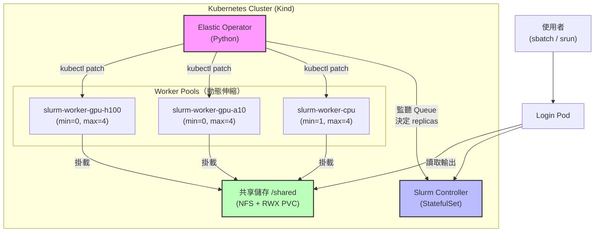

# Slurm-on-K8s-For-DDP

把 HPC 排程器搬進 Kubernetes，讓 AI 訓練任務既能用 Slurm 的精準資源管理，又能享受雲端的彈性伸縮。

互動式文件：[](https://deepwiki.com/SoWiEee/Slurm-on-K8s-For-DDP)

---

# 🌱 Motivation

如果你曾經跑過分散式 AI 訓練，你大概有過這樣的經驗：

- 租了 8 張 GPU，但模型訓練只用了一半，剩下的資源就這樣閒著。
- 任務跑到一半節點掛掉，checkpoint 沒存好，重頭來過。
- 想擴充節點，卻要等管理員手動改設定。

這些問題的根源在於：現有工具在**資源彈性**和**排程精準度**之間做了取捨。

| 工具 | 擅長 | 不擅長 |
|------|------|--------|
| Kubernetes | 彈性伸縮、容器管理、雲端原生 | HPC workload 的精細資源語意 |
| Slurm | 批次排程、CPU/GPU 精準分配、叢集治理 | 動態節點、雲端彈性、容錯恢復 |

本專案的目標很直接：**讓兩者合作**。把 Slurm 跑在 Kubernetes 上，用 Kubernetes 的彈性支撐 Slurm 的排程能力，並在此基礎上實作 AI 訓練所需的共享儲存與 checkpoint 容錯。

---

# 🚀 Getting Started

> 環境需求：Windows 11 + Docker Desktop + Kind + kubectl

## 1. 確認工具已安裝

```bash
docker version
kind version
kubectl version --client
```

## 2. 一鍵部署（Phase 1 + Phase 2）

```bash
bash scripts/bootstrap-dev.sh
```

這支腳本會自動完成：建立 Kind 叢集 → 建置 Docker image → 套用所有 manifest → 啟動 Elastic Operator → 設定三個 worker pool 的初始 replica 數。

> 慢速機器可加參數：`ROLLOUT_TIMEOUT=600s bash scripts/bootstrap-dev.sh`
> 需要完整重建：`FORCE_RECREATE=true DOCKER_BUILD_NO_CACHE=true bash scripts/bootstrap-dev.sh`

## 3. 驗證部署

```bash
bash scripts/verify-dev.sh
```

驗證流程包含：Pod readiness → Slurm controller ping → CPU pool sbatch smoke test → CPU pool 自動擴縮 → GPU pool 路由驗證。
看到 `[dev verify] done. phase1 + phase2 checks passed.` 就代表一切正常。

## 4. 部署共享儲存（Phase 3）

```bash
# 主機端 NFS server（只需執行一次）
sudo bash phase3/scripts/setup-nfs-server.sh

# 在 k8s cluster 部署 NFS provisioner + 掛載到所有 pod
NFS_SERVER=<nfs-server-ip> NFS_PATH=/srv/nfs/k8s bash phase3/scripts/bootstrap-phase3.sh

# 驗證
bash phase3/scripts/verify-phase3.sh
bash phase3/scripts/verify-phase3-e2e.sh
```

> 若 NFS 不通，可以看[這個](https://github.com/SoWiEee/Slurm-on-K8s-For-DDP/blob/main/docs/note.md#phase-3-%E5%AF%A6%E9%9A%9B%E9%83%A8%E7%BD%B2%E8%B8%A9%E5%9D%91%E7%B4%80%E9%8C%842026-03-29-on-windows-11--wsl2--kind)進行除錯。

## 5. 部署監控驗證（Phase 4）

```bash
bash phase4/scripts/bootstrap-phase4.sh
```

這支腳本會自動完成：建置 slurm-exporter 鏡像 → 重建 operator 鏡像（加入 prometheus-client）→ 部署 kube-state-metrics + Prometheus + Grafana → 套用跨 namespace 的 NetworkPolicy → 等待所有 Pod ready。

- Grafana：http://localhost:3000
- Prometheus：http://localhost:9090 (for debug)

```bash
# 存取 Grafana
kubectl -n monitoring port-forward svc/grafana 3000:3000

# 驗證所有元件正常、metrics 可抓
bash phase4/scripts/verify-phase4.sh

# 存取 Prometheus
kubectl -n monitoring port-forward svc/prometheus 9090:9090
```

## 清理環境

```bash
kind delete cluster --name slurm-lab
```

---

# 🏗️ System Architecture

用一句話說：你提交一個 Slurm job，系統自動把需要的節點準備好，跑完之後再把資源還回去。

稍微展開一點：

1. 使用者登入 Login Pod，用熟悉的 `sbatch` 指令提交訓練任務。
2. Elastic Operator 偵測到有 pending job，自動擴充對應的 worker 節點（CPU / GPU-A10 / GPU-H100 各自獨立管理）。
3. 訓練結果存在所有節點都能讀寫的 NFS 共享磁碟（`/shared`）。
4. 任務結束後，Operator 確認節點閒置且 checkpoint 安全，才把資源縮回去。

```
使用者 → sbatch → Slurm Controller → 排程到 Worker Pod
                        ↑
              Elastic Operator（Python）
              偵測 Queue → 擴 / 縮 Worker StatefulSet
```

---

## 系統架構




### 主要元件說明

| 元件 | 角色 |
|------|------|
| `slurm-controller` | 執行 `slurmctld`，負責所有排程決策 |
| `slurm-login` | 使用者入口，提供 `sbatch`、`srun`、`squeue` 等指令 |
| `slurm-worker-*` | 實際執行計算的節點，分 CPU / GPU-A10 / GPU-H100 三個池 |
| `slurm-elastic-operator` | 自製 Python Operator，監控 Queue 狀態並動態調整各 pool 的 replicas |
| NFS + RWX PVC | 跨所有節點的共享磁碟，job 輸出直接寫入 `/shared` |

---

# 🎯 Development Progress

| Phase# | 狀態 | 內容 |
|-------|------|------|
| 1：基礎 Slurm 叢集 | ✅ 完成 | Controller + Worker + Login Pod，Munge/SSH 認證，靜態節點預宣告 |
| 2：彈性 Operator | ✅ 完成 | 多節點池自動擴縮（CPU/GPU 各自獨立）、結構化日誌、Checkpoint-aware 縮容保護 |
| 2-E：雙網路拓撲 | ✅ MVP 完成 | 透過 Multus 增加第二張網卡（`net2`），DDP collective traffic（NCCL/Gloo）走獨立網路 |
| 3：共享儲存 | ✅ 完成 | NFS + RWX PVC 掛載到所有節點，`sbatch -o /shared/out-%j.txt` 可直接取得輸出 |
| 4：可觀測性 | ✅ 完成 | Prometheus + Grafana 監控，統一呈現 Slurm 排程語意與 K8s 彈性伸縮行為，視覺化兩個世界的橋接過程 |

---

# 🔭 Observability

於 Phase 4 實作監控面板，讓「Slurm 語意驅動 K8s 行為」這件事變得可視化。

```
Slurm 世界                     橋接層（Operator）              K8s 世界
────────────────               ──────────────────              ────────────────
Queue pending jobs      ──→    scale-up decision        ──→   StatefulSet +1
Node idle countdown     ──→    scale-down decision       ──→   StatefulSet -1
Checkpoint age check    ──→    guard block               ──→   scale skipped
```

## 監控架構

```
slurm-exporter              kube-state-metrics        operator /metrics:8000
(slurmrestd REST → metrics)  (STS/Pod states)         (scale events, guard blocks)
        ↓                          ↓                          ↓
                          Prometheus :9090
                               ↓
                            Grafana :3000
                   ┌──────────────────────────────────┐
                   │  Slurm↔K8s Bridge Overview       │  ← 主 demo 看板
                   │  K8s Elastic Operator            │
                   └──────────────────────────────────┘
```

> 詳細實作規格請見 [`docs/monitoring.md`](docs/monitoring.md)。

---

## 提交一個 Job 長什麼樣子？

部署完成後，你可以直接 `kubectl exec` 進 login pod 提交任務：

```bash
kubectl -n slurm exec -it deploy/slurm-login -- bash
```

寫一個簡單的 job script：

```bash
cat > /shared/my-job.sbatch << 'EOF'
#!/bin/bash
#SBATCH -J my-first-job
#SBATCH -p debug
#SBATCH -N 1
#SBATCH --cpus-per-task=2
#SBATCH -o /shared/out-%j.txt
#SBATCH -e /shared/err-%j.txt

echo "Hello from $(hostname)"
echo "I have $SLURM_CPUS_ON_NODE CPUs"
sleep 10
EOF

sbatch /shared/my-job.sbatch
```

提交後查看狀態，等任務完成再讀取輸出：

```bash
squeue                          # 查看 queue
cat /shared/out-<JOBID>.txt     # 讀取輸出（從任何 pod 都能讀）
```

GPU 任務只需加上 `--constraint` 或 `--gres`，Operator 會自動把對應的 GPU worker 擴充起來：

```bash
#SBATCH --constraint=gpu-a10
#SBATCH --gres=gpu:a10:1
```

---

## 📦 資源分配說明

每台 worker 宣告 `CPUs=4`，採 `select/cons_tres + CR_Core` 消耗式資源模式：

- **CPU：** 多個 job 可以共用同一台 worker（例如兩個各要 2 cores 的 job 會排進同一台 4 cores 的 worker）。
- **GPU：** 每台 GPU worker 只有 1 張 GPU，為整數消耗，不支援分時共用。

> 注意：目前使用 `TaskPlugin=task/none`，排程層面追蹤 core 數量，但不強制 CPU binding / cgroup 隔離。這在 Kind/Docker 環境下足以驗證排程控制流，但不適合做效能基準測試。

---

# ⚡ Useful Commands

## Slurm Cluster

```bash
# 查看所有 pod 狀態
kubectl -n slurm get pods -o wide

# 觀察 worker pool 伸縮
kubectl -n slurm get statefulset -w

# 查看 Operator 決策日誌（結構化 JSON）
kubectl -n slurm logs deployment/slurm-elastic-operator -f | python3 -m json.tool

# 查看 Slurm controller 日誌
kubectl -n slurm logs statefulset/slurm-controller -f

# 查詢 Operator 寫下的 cooldown 時間戳
kubectl -n slurm get statefulset slurm-worker-cpu \
  -o jsonpath='{.metadata.annotations.slurm\.k8s/last-scale-up-at}'

# 進 login pod 提交 job
kubectl -n slurm exec -it deploy/slurm-login -- bash
```

## Monitoring

```bash
# 開啟 Grafana（admin / admin）
kubectl -n monitoring port-forward svc/grafana 3000:3000

# 開啟 Prometheus（raw metrics / 查詢）
kubectl -n monitoring port-forward svc/prometheus 9090:9090

# 直接確認 operator 是否正在輸出 metrics
kubectl -n slurm port-forward svc/slurm-elastic-operator 8000:8000
# → curl http://localhost:8000/metrics | grep slurm_operator

# 直接確認 slurm-exporter 是否正在輸出 metrics
kubectl -n slurm port-forward svc/slurm-exporter 9341:9341
# → curl http://localhost:9341/metrics | grep slurm_queue

# 查看所有監控元件狀態
kubectl -n monitoring get pods -o wide

# 查看 slurm-exporter 日誌（確認是否能連到 slurmrestd）
kubectl -n slurm logs deployment/slurm-exporter --tail=30
```

---

## 設計重點

**為什麼 Slurm node 要預先全部宣告？**
所有節點在 `slurm.conf` 裡預先定義到 `maxNodes`，Operator 只調整 StatefulSet 的 replica 數，而不重寫 Slurm 設定檔。這避免了每次擴縮時 `slurmctld` 重新解析所有 DNS 造成的連鎖延遲。

**為什麼 Operator 不用 Kopf 或 CRD？**
刻意保持輕量。Operator 是純 Python，沒有自訂 CRD、沒有 webhook，部署門檻低，邏輯一眼就能看懂。Slurm 狀態查詢（queue、job、node）透過 slurmrestd REST API 進行；StatefulSet replica 調整仍透過 `kubectl patch`。

**Checkpoint Guard 是什麼？**
在縮容前，Operator 會檢查執行中 job 的 checkpoint 檔案年齡。若 checkpoint 不存在或超過 `MAX_CHECKPOINT_AGE_SECONDS`（預設 10 分鐘），縮容會被阻擋，避免 DDP 訓練進度因節點被回收而遺失。

---

# 📊 Evaluation Metrics

| 指標 | 描述 | 目標 |
|------|------|------|
| Provisioning Latency | 從 job 提交到 worker pod ready 的時間 | < 30 秒 |
| Recovery Time | 節點故障到訓練恢復的時間 | < 60 秒 |
| Resource Efficiency | 任務結束後閒置資源回收速度 | 任務結束 1 分鐘內釋放 |
| Scheduling Overhead | Operator 本身的 CPU/Memory 佔用 | < 5% 總資源 |

---

# 🧱 Tech Stack

| 類別 | 工具 |
|------|------|
| 環境 | Windows 11 + Docker Desktop + Kind |
| 容器編排 | Kubernetes |
| HPC 排程器 | Slurm (slurmctld + slurmd) |
| 節點認證 | Munge |
| Elastic Operator | Python 3.11 + Slurm REST API (slurmrestd) + kubectl CLI |
| 共享儲存 | NFS + nfs-subdir-external-provisioner + RWX PVC |
| DDP 網路 | Multus CNI + secondary NIC (net2) |
| 監控（Phase 4） | Prometheus + Grafana + prometheus-slurm-exporter |

---

# 📝 References

- [Slurm Workload Manager Documentation](https://slurm.schedmd.com/)
- [PyTorch Distributed Elastic](https://docs.pytorch.org/docs/stable/distributed.elastic.html)
- [Kubernetes Operator Pythonic Framework (Kopf)](https://github.com/nolar/kopf)
- [Converged Computing: Integrating HPC and Cloud Native](https://www.computer.org/csdl/magazine/cs/2024/03/10770850/22fgId5NFpC)
- [Running Slurm on Amazon EKS with Slinky](https://aws.amazon.com/tw/blogs/containers/running-slurm-on-amazon-eks-with-slinky/)
- [Slinky Project](https://github.com/slinkyproject)
- [Slonk: Slurm on Kubernetes for ML Research at Character.ai](https://blog.character.ai/slonk/)
- [Prometheus Slurm Exporter](https://github.com/vpenso/prometheus-slurm-exporter)
- [AWS ParallelCluster](https://github.com/aws/aws-parallelcluster)
- [Grafana](https://grafana.com/)
- [Kube State Metrics](https://github.com/kubernetes/kube-state-metrics)
- 開發筆記（踩坑紀錄、設計決策）：[`docs/note.md`](docs/note.md)
- Phase 4 監控實作規格：[`docs/monitoring.md`](docs/monitoring.md)
- K8s 物件說明：[`docs/cluster.md`](docs/cluster.md)
