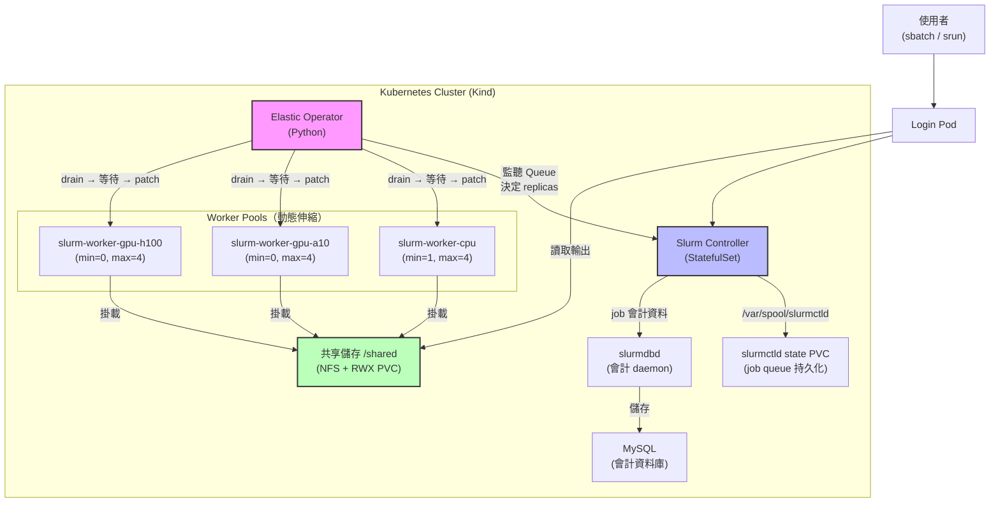
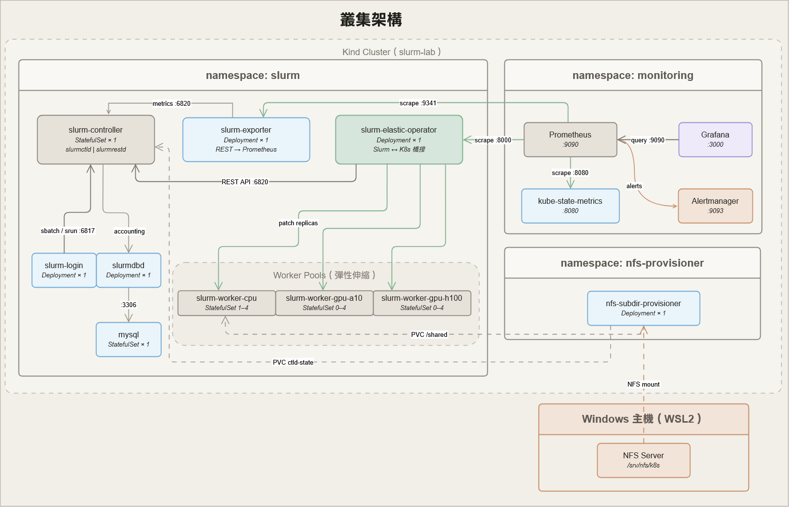

# Slurm-on-K8s

把 HPC 排程器搬進 Kubernetes，打造一個可讓多位使用者共用 CPU + GPU 硬體資源的批次 AI 工作平台。

- 互動式文件：[](https://deepwiki.com/SoWiEee/Slurm-on-K8s-For-DDP)
- K8s 叢集規格文件：[`docs/cluster.md`](docs/cluster.md)

---

# 🌱 Motivation

一台有 CPU 和 GPU 的機器，同時有多種 AI 工作要跑——模型推論、超參數搜尋、fine-tuning、資料前處理。  
沒有好的排程系統時，會發生：

- GPU 跑推論時大量閒置（utilization < 20%），同一張卡只讓一個 process 用。
- 多人共用一台主機互相搶資源，沒有隊列、沒有隔離、先到先得。
- Fine-tuning 跑到一半機器重啟，checkpoint 沒存好，重頭來過。
- 工作量少的時候，worker 進程還是佔著資源不釋放。

這些問題的根源在於：現有工具在**資源彈性**和**排程精準度**之間做了取捨。

| 工具 | 擅長 | 不擅長 |
|------|------|--------|
| Kubernetes | 彈性伸縮、容器管理、雲端原生 | HPC workload 的精細資源語意（CPU affinity、GPU GRES、MPS 分配） |
| Slurm | 批次排程、CPU/GPU 精準分配、叢集治理、多使用者隊列 | 動態節點、雲端彈性、容錯恢復 |

本專案的目標很直接：**讓兩者合作**。把 Slurm 跑在 Kubernetes 上，用 K8s 的彈性伸縮撐起 Slurm 的排程能力，解決硬體資源分配的核心問題：

- **利用率**：透過 Slurm MPS（`--gres=mps:25`）讓多個 AI job 共用同一張 GPU 的 SM，utilization 從 < 20% 提升至 70%+
- **隔離性**：CPU pool 和 GPU pool 獨立 autoscale，不同類型的工作互不競爭
- **彈性**：沒有 job 時 worker pod 自動縮回 0；job 進 queue 時 Operator 自動擴出對應節點
- **容錯**：Checkpoint-aware 縮容保護，確保 fine-tuning job 不被中途打斷；NFS PVC 讓結果跨節點持久化

使用者只需要 SSH 進 login node，用熟悉的 `sbatch` 提交工作，不需要知道底層 K8s 的存在。

---

# 🚀 Getting Started

兩種部署路徑：

| 路徑 | 環境 | GPU | 適用場景 |
|------|------|-----|----------|
| **[A] Linux + k3s](#a-linux--k3s--real-gpu-已驗證)** | Ubuntu 24.04 + k3s | 真實 NVIDIA GPU | 生產/驗證 |
| **[B] Kind（本機模擬）](#b-kind-本機開發模擬)** | Windows/Mac + Docker Desktop | 無（排程邏輯驗證） | 本機開發 |

---

## A. Linux + k3s + Real GPU（已驗證）

> 驗證環境：Ubuntu 24.04 x86\_64 + k3s v1.34 + RTX 4070 + NVIDIA driver 535

### 步驟 1：主機準備

安裝 NVIDIA Container Toolkit、k3s，並複製 kubeconfig：

```bash
sudo bash scripts/setup-linux-gpu.sh
export KUBECONFIG=~/.kube/config
```

確認 GPU 可見：

```bash
nvidia-smi
kubectl get nodes
```

### 步驟 2：部署 NVIDIA device plugin

```bash
kubectl apply -f manifests/gpu/runtime-class.yaml
kubectl apply -f manifests/gpu/nvidia-device-plugin.yaml

# 確認 GPU 資源出現（RTX 4070 time-slicing 4x → 顯示 4）
kubectl get nodes -o jsonpath='{range .items[*]}{.metadata.name}{"\t"}{.status.allocatable.nvidia\.com/gpu}{"\n"}{end}'
```

> **GPU sharing 策略**：目前 `nvidia-device-plugin.yaml` 使用 `rtx4070-timeslicing`（4 replica）。  
> MPS config（`rtx4070-mps`）在 driver 535 + k3s 1.34 + Ubuntu 24.04 上 MPS daemon 無法啟動，  
> 改用 `items[0].key: rtx4070-mps` 可切換（重 apply 即生效）。  
> Time-slicing 下 `--gres=mps:25` 仍可投遞，`CUDA_MPS_ACTIVE_THREAD_PERCENTAGE=25` 由 Slurm prolog 注入。

### 步驟 3：部署核心 Slurm 叢集

```bash
K8S_RUNTIME=k3s REAL_GPU=true bash scripts/bootstrap.sh
```

`bootstrap.sh` 自動完成：建置 controller/worker/operator image → 建立 Munge/SSH/JWT secret → 生成並套用 `slurm-static.yaml`（含 `gres.conf`、`slurm.conf`）→ 等待 rollout → 確認 slurmctld 可 ping。

### 步驟 4：部署共享儲存（NFS）

**4-A：主機 NFS Server（只需執行一次）**

```bash
sudo bash scripts/setup-nfs-server.sh
```

執行完後，確認 `/etc/exports` 涵蓋節點的 **LAN IP 段**（k3s 節點用主機物理 IP 掛載，不是 pod CIDR）：

```bash
cat /etc/exports
# 正確範例（同時含 pod CIDR 和 LAN subnet）：
# /srv/nfs/k8s 10.0.0.0/8(rw,...) 192.168.0.0/25(rw,sync,no_subtree_check,no_root_squash,insecure)
```

若只有 `10.0.0.0/8`，手動加上 LAN 段後重載：

```bash
# 查主機 LAN IP 段
ip addr show | grep 'inet ' | grep -v 127
# 補進 /etc/exports 後：
sudo exportfs -ra
showmount -e localhost   # 確認兩個 rule 都出現
```

**4-B：部署 NFS provisioner**

```bash
# 查主機 LAN IP（k3s pod 可達的介面，通常是 enp5s0 / eth0）
NODE_IP=$(ip -4 addr show scope global | grep -oP '(?<=inet )\S+' | head -1 | cut -d/ -f1)
echo "NFS_SERVER=$NODE_IP"

KUBECONFIG=~/.kube/config \
KUBE_CONTEXT=default \
NFS_SERVER=$NODE_IP \
NFS_PATH=/srv/nfs/k8s \
  bash scripts/bootstrap-storage.sh
```

### 步驟 5：驗證

```bash
# 儲存（PVC Bound + 跨 pod 讀寫 + 多節點 sbatch）
KUBE_CONTEXT=default bash scripts/verify-storage.sh
KUBE_CONTEXT=default bash scripts/verify-storage-e2e.sh

# GPU（device plugin、nvidia-smi in job、MPS GRES）
K8S_RUNTIME=k3s REAL_GPU=true KUBE_CONTEXT=default bash scripts/verify-gpu.sh

# 全叢集（CPU 彈性擴縮、MPI PMI2、GPU pool 彈性擴縮）
K8S_RUNTIME=k3s REAL_GPU=true KUBE_CONTEXT=default bash scripts/verify.sh
```

**預期結果（全通過）：**

```
verify-gpu.sh:
  PASS: device plugin DaemonSet has ready pods
  PASS: cluster has 4 allocatable GPU(s)
  PASS: Slurm nodes have GPU GRES configured
  PASS: GPU name visible in Slurm job output        ← nvidia-smi 輸出真實 GPU 型號
  PASS: CUDA_MPS_ACTIVE_THREAD_PERCENTAGE=25 injected by Slurm prolog

verify.sh:
  [dev verify] done. all checks passed.
```

### 清理環境

```bash
# 移除 k3s（保留 kubeconfig 備份）
/usr/local/bin/k3s-uninstall.sh
# 停止 NFS
sudo systemctl stop nfs-kernel-server
```

---

## B. Kind（本機開發模擬）

> 環境需求：Docker Desktop + kind + kubectl（Windows/Mac/Linux 均可）

### 快速部署

```bash
# 確認工具已安裝
docker version && kind version && kubectl version --client

# 一鍵部署核心叢集（無 GPU，純排程邏輯驗證）
bash scripts/bootstrap.sh

# 驗證
bash scripts/verify.sh
```

`scripts/bootstrap.sh` 自動完成：建立 Kind 叢集 → 建置並 load image → 生成 `slurm-static.yaml` → 套用所有資源 → 等待 rollout → 確認 slurmctld ping。

> 慢速機器：`ROLLOUT_TIMEOUT=600s bash scripts/bootstrap.sh`  
> 完整重建：`FORCE_RECREATE=true DOCKER_BUILD_NO_CACHE=true bash scripts/bootstrap.sh`

### 部署共享儲存（可選）

```bash
# WSL2 主機端 NFS Server
sudo bash scripts/setup-nfs-server.sh

# 部署 provisioner（NFS_SERVER 為 WSL2 IP，hostname -I 取得，每次開機會變）
NFS_SERVER=<wsl2-ip> NFS_PATH=/srv/nfs/k8s bash scripts/bootstrap-storage.sh

bash scripts/verify-storage.sh
bash scripts/verify-storage-e2e.sh
```

### 清理環境

```bash
kind delete cluster --name slurm-lab
```

---

## 通用步驟（兩種路徑都適用）

## 部署監控

```bash
bash scripts/bootstrap-monitoring.sh

# 存取 Grafana（admin / admin）
kubectl -n monitoring port-forward svc/grafana 3000:3000

# 驗證所有元件正常、metrics 可抓
bash scripts/verify-monitoring.sh
```

## Lmod 模組系統（已整合至核心）

Lmod 已整合進 `docker/controller` 與 `docker/worker` image，`bootstrap.sh` 執行完畢後即可使用 `module load`。Modulefile 定義在 `manifests/core/lmod-modulefiles.yaml`，以 ConfigMap 管理。

執行一次以確保 NFS job 輸出路徑存在（**需先完成 §4**）：

```bash
bash scripts/bootstrap-lmod.sh
```

**部署後的操作體驗：**

```bash
# 進 login pod（如同登入 HPC login node）
kubectl -n slurm exec -it deploy/slurm-login -- bash

# 查看可用模組
module avail

# 載入 OpenMPI
module load openmpi/4.1

# 確認環境變數已設定
echo $MPI_HOME           # /usr/lib/x86_64-linux-gnu/openmpi
echo $SLURM_MPI_TYPE     # pmi2

# 卸載全部
module purge
```

**在 sbatch 腳本中使用 module（關鍵：需明確 source lmod.sh）：**

```bash
cat > /tmp/my-mpi-job.sh << 'EOF'
#!/bin/bash
#SBATCH --ntasks=2
#SBATCH --nodes=1

source /etc/profile.d/lmod.sh   # 讓 module 指令在批次作業內可用
module load openmpi/4.1

srun --mpi=pmi2 /bin/sh -c 'echo "rank:${SLURM_PROCID} host:$(hostname)"'
EOF

sbatch /tmp/my-mpi-job.sh
```

> **為什麼要明確 source lmod.sh？**  
> `sbatch` 執行腳本時使用非互動、非 login 的 bash，`/etc/profile.d/` 不會自動載入。  
> 明確 source 是標準 HPC 做法，與 TACC、NCHC 等真實系統的 job script 寫法一致。

**驗證（12 個 check 全通過）：**

```bash
bash scripts/verify-lmod.sh
```

驗證項目包含：Lmod 安裝確認 → `module avail` 顯示三個模組 → `module load` 設定 MPI_HOME → `module purge` 清除環境 → sbatch 提交雙 task MPI job → 確認 rank:0 / rank:1 在 job 內正確執行。

**目前內建模組：**

| 模組 | 描述 |
|------|------|
| `openmpi/4.1` | OpenMPI 4.1.2（Ubuntu 22.04 套件），設定 MPI_HOME、LD_LIBRARY_PATH、SLURM_MPI_TYPE=pmi2 |
| `python3/3.10` | 系統 Python 3.10，設定 PYTHON_HOME |
| `cuda/stub` | CUDA 佔位模組，示範 GPU 叢集的 modulefile 結構 |

> 自訂模組只需編輯 `manifests/core/lmod-modulefiles.yaml` 並 `kubectl apply`，**不需要重建 image**，數秒內生效。

---

---

# 🏗️ System Architecture

用一句話說：你提交一個 Slurm job，系統自動把需要的節點準備好，跑完之後再把資源還回去。

稍微展開一點：

1. 使用者登入 Login Pod，用熟悉的 `sbatch` 指令提交訓練任務。
2. Elastic Operator 偵測到有 pending job，自動擴充對應的 worker 節點（CPU / GPU-A10 / GPU-H100 各自獨立管理）。
3. 訓練結果存在所有節點都能讀寫的 NFS 共享磁碟（`/shared`）。
4. 任務結束後，Operator 確認節點閒置且 checkpoint 安全，才把資源縮回去。

```
使用者 → sbatch → Slurm Controller → 排程到 Worker Pod
                        ↑
              Elastic Operator（Python）
              偵測 Queue → 擴 / 縮 Worker StatefulSet
```

---

## 系統架構






> 最新架構圖請看 [`architecture.html`](assets/architecture.html)

### 主要元件說明

| 元件 | 角色 |
|------|------|
| `slurm-controller` | 執行 `slurmctld`，負責所有排程決策；job 狀態存於獨立 PVC（`slurm-ctld-state`），pod 重啟後 queue 不遺失 |
| `slurm-login` | 使用者入口，提供 `sbatch`、`srun`、`squeue` 等指令 |
| `slurm-worker-*` | 實際執行計算的節點，分 CPU / GPU-A10 / GPU-H100 三個池 |
| `slurm-elastic-operator` | 自製 Python Operator，監控 Queue 狀態並動態調整各 pool 的 replicas；縮容前先 drain 節點，等待 job 完成後才減少 StatefulSet replica |
| `slurmdbd` | Slurm Database Daemon，將 job 會計紀錄（CPU-hours、用戶統計）持久化到 MySQL，為 Fair-Share 排程提供基礎 |
| `mysql` | 後端資料庫（StatefulSet），儲存 slurmdbd 的會計資料，使用 5 Gi PVC |
| NFS + RWX PVC | 跨所有節點的共享磁碟，job 輸出直接寫入 `/shared` |
| `lmod` + modulefile ConfigMaps | HPC 標準模組系統；`module load openmpi/4.1` 等指令在 login pod 與 job 內均可用；modulefile 以 K8s ConfigMap 管理，`kubectl apply` 即可新增/更新模組 |

---

# 🎯 Development Progress

| Phase# | 狀態 | 內容 |
|-------|------|------|
| 1：基礎 Slurm 叢集 | ✅ 完成 | Controller + Worker + Login Pod，Munge 認證，靜態節點預宣告；slurmctld state PVC（job queue 持久化）；slurmdbd + MySQL 會計後端；PodDisruptionBudget 保護所有關鍵元件；**Lmod 整合**（modulefile ConfigMap，`module load` 開機即可用） |
| 2：彈性 Operator | ✅ 完成 | 多節點池自動擴縮（CPU/GPU 各自獨立）、結構化日誌、Checkpoint-aware 縮容保護（Grace Period 支援）、drain-then-scale；Cooldown 持久化（StatefulSet annotation）；熔斷器 + readinessProbe；全套 NetworkPolicy（Ingress + Egress）|
| 2-E：雙網路拓撲 | ✅ MVP 完成 | 透過 Multus 增加第二張網卡（`net2`），DDP collective traffic（NCCL/Gloo）走獨立網路 |
| 3：共享儲存 | ✅ 完成 | NFS + RWX PVC 掛載到所有節點，`sbatch -o /shared/out-%j.txt` 可直接取得輸出；多節點 E2E 驗證通過（含 slurmctld IP cache 修正） |
| 4：可觀測性 | ✅ 完成 | Prometheus + Grafana 監控，統一呈現 Slurm 排程語意與 K8s 彈性伸縮行為，視覺化兩個世界的橋接過程 |
| 5：Lmod 整合完成 | ✅ 完成 | Lmod 整合至 Phase 1（images + modulefile ConfigMap + `--with-lmod` render）；Phase 5 bootstrap 僅負責確保 `/shared/jobs/` 目錄存在；Worker preStop Hook；job 輸出路徑整合 NFS `/shared/jobs/` |
| 5+：平台化與高可用 | 📋 規劃中 | Helm Chart、OpenTelemetry 分散式追蹤、Fair-Share 多租戶、Operator HA；Gang Scheduling 基礎設施（K8s feature gate）已就緒，Operator 整合待實作 |

---

## 提交一個 Job 長什麼樣子？

部署完成後，你可以直接 `kubectl exec` 進 login pod 提交任務：

```bash
kubectl -n slurm exec -it deploy/slurm-login -- bash
```

寫一個簡單的 job script：

```bash
cat > /shared/my-job.sbatch << 'EOF'
#!/bin/bash
#SBATCH -J my-first-job
#SBATCH -p cpu
#SBATCH -N 1
#SBATCH --cpus-per-task=2
#SBATCH -o /shared/out-%j.txt
#SBATCH -e /shared/err-%j.txt

echo "Hello from $(hostname)"
echo "I have $SLURM_CPUS_ON_NODE CPUs"
sleep 10
EOF

sbatch /shared/my-job.sbatch
```

提交後查看狀態，等任務完成再讀取輸出：

```bash
squeue                          # 查看 queue
cat /shared/out-<JOBID>.txt     # 讀取輸出（從任何 pod 都能讀）
```

GPU 任務只需加上 `--constraint` 或 `--gres`，Operator 會自動把對應的 GPU worker 擴充起來：

```bash
#SBATCH --constraint=gpu-a10
#SBATCH --gres=gpu:a10:1
```

---

# ⚡ Useful Commands

## Slurm Cluster

```bash
# 查看所有 pod 狀態
kubectl -n slurm get pods -o wide

# 觀察 worker pool 伸縮
kubectl -n slurm get statefulset -w

# 查看 Operator 決策日誌（結構化 JSON）
kubectl -n slurm logs deployment/slurm-elastic-operator -f | python3 -m json.tool

# 查看 Slurm controller 日誌
kubectl -n slurm logs statefulset/slurm-controller -f

# 查詢 Operator 寫下的 cooldown 時間戳
kubectl -n slurm get statefulset slurm-worker-cpu \
  -o jsonpath='{.metadata.annotations.slurm\.k8s/last-scale-up-at}'

# 查詢 job 會計紀錄（需要 slurmdbd 正常運行）
kubectl -n slurm exec pod/slurm-controller-0 -- sacct -X --format=JobID,User,State,CPUTime,Start,End

# 確認 slurmdbd / MySQL 狀態
kubectl -n slurm get pods -l app=slurmdbd
kubectl -n slurm get pods -l app=mysql

# 進 login pod 提交 job
kubectl -n slurm exec -it deploy/slurm-login -- bash
```

## Monitoring

```bash
# 開啟 Grafana（admin / admin）
kubectl -n monitoring port-forward svc/grafana 3000:3000

# 開啟 Prometheus（raw metrics / 查詢）
kubectl -n monitoring port-forward svc/prometheus 9090:9090

# 直接確認 operator 是否正在輸出 metrics
kubectl -n slurm port-forward svc/slurm-elastic-operator 8000:8000
# → curl http://localhost:8000/metrics | grep slurm_operator

# 直接確認 slurm-exporter 是否正在輸出 metrics
kubectl -n slurm port-forward svc/slurm-exporter 9341:9341
# → curl http://localhost:9341/metrics | grep slurm_queue

# 查看所有監控元件狀態
kubectl -n monitoring get pods -o wide

# 查看 slurm-exporter 日誌（確認是否能連到 slurmrestd）
kubectl -n slurm logs deployment/slurm-exporter --tail=30
```

---

# 📊 Evaluation Metrics

| 指標 | 描述 | 目標 |
|------|------|------|
| Provisioning Latency | 從 job 提交到 worker pod ready 的時間 | < 30 秒 |
| Recovery Time | 節點故障到訓練恢復的時間 | < 60 秒 |
| Resource Efficiency | 任務結束後閒置資源回收速度 | 任務結束 1 分鐘內釋放 |
| Scheduling Overhead | Operator 本身的 CPU/Memory 佔用 | < 5% 總資源 |

---

# 🧱 Tech Stack

| 類別 | 工具 |
|------|------|
| 環境 | Ubuntu 24.04 + k3s（生產）／Windows 11 + Docker Desktop + Kind（本機開發） |
| 容器編排 | Kubernetes |
| HPC 排程器 | Slurm (slurmctld + slurmd)，MpiDefault=pmi2 |
| 節點認證 | Munge |
| Elastic Operator | Python 3.11 + Slurm REST API (slurmrestd) + Kubernetes Python SDK |
| 會計後端 | slurmdbd + MySQL 8.0（job CPU-hours / 使用者統計 / Fair-Share 前置）|
| 共享儲存 | NFS + nfs-subdir-external-provisioner + RWX PVC |
| DDP 網路 | Multus CNI + secondary NIC (net2) |
| MPI | OpenMPI 4.1.2 + Slurm PMI2 整合 |
| 模組系統 | Lmod 6.6；modulefile 以 K8s ConfigMap 管理，掛載至 `/opt/modulefiles/` |
| 監控 | Prometheus + Grafana + slurm-exporter + kube-state-metrics + Alertmanager |
| 告警 | 8 條 SLO 規則（provisioning latency、queue wait、flapping 等） |

---

# 🔭 Phase 5 Roadmap：批次 AI 工作平台

> Phase 5 的目標是讓這個系統從「可運作的基礎設施原型」演進成「能讓使用者直接提交各種 AI job 的批次運算平台」。  
> 目前以**單一使用者**情境為主，多租戶（Fair-Share / 帳號配額）為後續擴充方向。  
> 開發順序：**易部署 → 可觀測 → 工作負載完整 → 真實登入體驗**

## 5-A：Helm Chart 封裝 — 讓部署可重複

**現狀問題：** 多支 bootstrap 腳本需依序執行，manifest 散落在 `manifests/` 各子目錄，`worker-pools.json` 改完還要手動跑 `render-core.py`，雙重維護容易出錯。

**目標：** 整個平台一條指令完成部署，所有可調參數集中在 `values.yaml`。

```bash
# k3s + 真實 GPU + MPS
helm install slurm-platform ./chart -f chart/values-k3s.yaml

# Kind 本機開發（無 GPU）
helm install slurm-platform ./chart -f chart/values-dev.yaml
```

**設計方向：Monolithic chart + Helm template 直接生成 slurm.conf**

- 單一 chart 目錄（不拆 subchart），monitoring / storage 用 `enabled` flag 控制
- `worker-pools.json` 與 `render-core.py` 由 `values.yaml` + Helm Go template 取代：`pools` 定義為有序 list，template 用 `range` 迴圈產生 `NodeName`、`gres.conf`、`PARTITIONS_JSON`
- 環境差異（k3s vs. Kind、real GPU vs. 模擬）用多個 values overlay 管理，不再靠環境變數

詳細設計見 [`docs/note.md §5-A`](docs/note.md)。

## 5-B：OpenTelemetry 分散式追蹤 — 讓 job 生命週期可視化

**目標：** 一個 AI job 從提交到完成的完整鏈路變成一條可視化的 Trace，讓使用者清楚看到時間花在哪裡（排隊、K8s 啟動、實際執行）。

```
[sbatch submit] → [pending in queue] → [Operator scale-up decision]
  → [K8s pod provisioning] → [slurmd registration] → [job execution]
    → [checkpoint write] → [Operator scale-down] → [job complete]
```

每個 span 攜帶 `job_id`、`pool`、`gres`、`provisioning_latency` 等 attribute，用 Grafana Tempo 可視化。這是目前所有 Slurm-on-K8s 開源方案都沒有做到的端到端觀測視角。

**需要做的事：**
- Operator 加入 `opentelemetry-sdk`，在 `scale_action`、`loop_observation` 事件上建立 span
- 部署 Grafana Tempo（加入 `manifests/monitoring/`）
- Prometheus histogram exemplar → Tempo 連結，從 latency spike 直接跳到對應 trace

## 5-C：工作負載模板 — 讓使用者開箱即用

**目標：** NFS 上預放一組 `/shared/templates/` job 腳本，使用者 cp 過去改參數就能跑，涵蓋平台支援的五種典型 AI 工作。

| 模板 | GRES 設定 | 展示的系統能力 |
|------|----------|--------------|
| `01_preprocess.sh` | `--cpus-per-task=8` | CPU pool 獨立 autoscale，與 GPU job 並行不干擾 |
| `02_batch_infer.sh` | `--gres=mps:25` | MPS 多工，同一張 GPU 跑 4 個推論 job |
| `03_hpo_array.sh` | `--array=1-8 --gres=mps:25` | Job array + MPS，8 組超參數實驗並行 |
| `04_finetune_lora.sh` | `--gres=gpu:rtx4080:1` | 整卡獨佔 + checkpoint guard 縮容保護 |
| `05_ddp_2gpu.sh` | `--nodes=2 --gres=gpu:1` | 跨 worker pod 的 2-GPU DDP 訓練 |

**需要做的事：**
- 新增 `templates/` 目錄，放 5 支含詳細註解的 sbatch 腳本
- `bootstrap-lmod.sh` 結尾加一步：把 `templates/` cp 到 `/shared/templates/`
- Login pod 的 `/etc/motd` 顯示平台說明與模板位置

## 5-D：SSH Login — 讓使用者直接登入

**現狀問題：** 目前登入 login node 需要執行 `kubectl exec`，使用者必須先安裝 kubectl 並取得 kubeconfig。

**目標：** 使用者用標準 SSH 直接進入 login pod，不需要知道 K8s 的存在。

```
使用者電腦 → ssh -p 2222 user@<k3s-host-ip>
                  ↓
           NodePort :2222 → slurm-login pod
                              ├── sbatch / squeue / sinfo
                              └── /shared/（NFS 掛載，模型 + 輸出共用）
```

**需要做的事：**
- `docker/login/Dockerfile` 加入 `openssh-server`，設定 SSH key 認證（禁用密碼登入）
- `slurm-login` Service 改為 NodePort，固定 port 2222
- `scripts/bootstrap.sh` 加入 SSH host key 初始化步驟
- 後續（多租戶時）：`scripts/add-user.sh` 同時在 Linux 和 Slurm（`sacctmgr`）建帳號

---

# 📝 References

- [Slurm Workload Manager Documentation](https://slurm.schedmd.com/)
- [PyTorch Distributed Elastic](https://docs.pytorch.org/docs/stable/distributed.elastic.html)
- [Kubernetes Operator Pythonic Framework (Kopf)](https://github.com/nolar/kopf)
- [Converged Computing: Integrating HPC and Cloud Native](https://www.computer.org/csdl/magazine/cs/2024/03/10770850/22fgId5NFpC)
- [Running Slurm on Amazon EKS with Slinky](https://aws.amazon.com/tw/blogs/containers/running-slurm-on-amazon-eks-with-slinky/)
- [Gang Scheduling](https://kubernetes.io/docs/concepts/scheduling-eviction/gang-scheduling/)
- [Workload Aware Scheduling](https://kubernetes.io/blog/2025/12/29/kubernetes-v1-35-introducing-workload-aware-scheduling/)
- [Slinky Project](https://github.com/slinkyproject)
- [Slonk: Slurm on Kubernetes for ML Research at Character.ai](https://blog.character.ai/slonk/)
- [Prometheus Slurm Exporter](https://github.com/vpenso/prometheus-slurm-exporter)
- [AWS ParallelCluster](https://github.com/aws/aws-parallelcluster)
- [Lmod: An Environment Module System](https://github.com/TACC/Lmod)
- [Spack: A Flexible Package Manager](https://github.com/spack/spack)
- [Grafana](https://grafana.com/)
- [Kube State Metrics](https://github.com/kubernetes/kube-state-metrics)
- 開發筆記（踩坑紀錄、設計決策）：[`docs/note.md`](docs/note.md)
- Phase 4 監控實作規格：[`docs/monitoring.md`](docs/monitoring.md)
- K8s 物件說明：[`docs/cluster.md`](docs/cluster.md)
