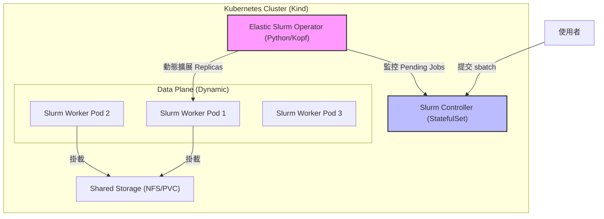

# Slurm-on-K8s-For-DDP

Adaptive HPC Scheduling on Cloud Native Infrastructure

基於 Kubernetes 的彈性 Slurm 架構，目標是把 Slurm 的 HPC 批次排程能力帶到雲端原生環境，並逐步支援分散式 AI 訓練、共享儲存、自動擴縮與故障恢復。

# 🔥 Motivation

隨著深度學習模型規模持續成長，分散式訓練逐漸成為常態。Kubernetes 擅長彈性資源供給，但預設排程器不擅長 HPC workload；Slurm 擅長批次排程，但典型部署多半偏靜態、缺乏雲端原生彈性。

本專案的核心問題是：

**能不能把 Slurm 的 HPC 排程能力放進 Kubernetes，並進一步支援動態節點、共享儲存、checkpoint-aware autoscaling，以及 DDP workload 的故障恢復。**

# ✨ Features

- ✅ **Phase 1 已完成**：可在 Kind 上部署靜態 Slurm Controller + Login + Worker 叢集。
- ✅ **Phase 1 強化完成**：修正 Munge/SSH/ConfigMap 掛載、`NodeAddr`/`NodeHostname`、bootstrap/verify 穩定性。
- ✅ **Phase 2 已完成**：新增 Python Elastic Operator，支援 `Pending Job -> Scale Up` 與 `Idle Node -> Scale Down`。
- ✅ **Phase 2-A 已完成**：完成 operator 等價重構，將資料蒐集、決策、執行拆層。
- ✅ **Phase 2-B 已完成**：完成結構化日誌，支援 `startup` / `loop_observation` / `scale_action` / `scale_skipped` / `error` 事件輸出。
- ✅ **Phase 2-C 已完成**：完成 multi-pool / partition-aware autoscaling，支援 CPU / GPU worker pool 獨立擴縮。
- ✅ **Phase 2-D 已完成**：完成 checkpoint-aware scale-down guard，避免執行中工作在 checkpoint 狀態未知時被過早縮容。
- ✅ **Phase 2-E 已完成 MVP**：新增 dual-subnet topology、正式 runtime manifest、`slurm-ddp-runtime` helper，並讓 login/worker 可以把 DDP/NCCL/Gloo traffic 綁定到 `net2`。
- ✅ **Dev workflow 已補強**：`scripts/bootstrap-dev.sh` 與 `scripts/verify-dev.sh` 可覆蓋目前 Phase 1 + Phase 2 開發驗證流程。
- ✅ **GPU pool smoke test 已納入 verify**：`verify-dev.sh` 會驗證 CPU pool 與 GPU pool 的基本 scale-up / execute / scale-down 行為。

# 🚀 Getting Started

> 適用環境：Windows 11 + Docker Desktop + kind + kubectl

## 1. 前置檢查

請先確認 Docker Desktop 已啟動，並可在終端機執行：

```bash
docker version
kind version
kubectl version --client
```

## 2. 一鍵部署與驗證目前開發版本

### 2.1 整合部署

在專案根目錄執行：

```bash
bash scripts/bootstrap-dev.sh
# 指定 context
# KUBE_CONTEXT=kind-slurm-lab bash scripts/bootstrap-dev.sh
# 慢機器可提高 rollout timeout
# ROLLOUT_TIMEOUT=600s bash scripts/bootstrap-dev.sh
# 需要完全重建時
# FORCE_RECREATE=true DOCKER_BUILD_NO_CACHE=true bash scripts/bootstrap-dev.sh
```

這支腳本目前會完成：

1. Kind/context 與工具檢查。
2. Phase 1 image build/load、secrets、manifest apply、rollout 檢查。
3. Phase 2 operator image build/load、manifest apply。
4. 強制補齊 operator runtime env，包含 `PARTITIONS_JSON`、`OPERATOR_LAYOUT_VERSION` 等 multi-pool 設定。
5. 初始化 worker pool 狀態：CPU baseline 保留 1 個，GPU pool 預設縮為 0，方便觀察自動擴縮。

### 2.2 整合驗證

```bash
bash scripts/verify-dev.sh
# 指定 context
# KUBE_CONTEXT=kind-slurm-lab bash scripts/verify-dev.sh
# 放寬觀察時間
# VERIFY_TIMEOUT_SECONDS=240 bash scripts/verify-dev.sh
```

目前 `verify-dev.sh` 會執行：

1. 核心 Pod readiness 檢查。
2. Slurm client warm-up 與 controller ping。
3. 單節點 `srun` smoke test。
4. CPU pool `sbatch` smoke test。
5. CPU pool scale-up / scale-down 驗證。
6. GPU pool smoke test，確認 GPU constraint / GRES 會導向 `slurm-worker-gpu-a10`，並在工作完成後縮回 0。
7. `phase2/scripts/verify-network.sh` 可視化展示 Phase 2-E 的雙子網設計；若 cluster 已安裝 Multus，還能額外檢查 runtime network attachment。

若最終看到：

```text
[dev verify] done. phase1 + phase2 checks passed.
```

代表目前開發版的 Phase 1 與 Phase 2 主路徑已通過驗證。

## 3. 階段性部署與驗證

### Phase 1

部署：

```bash
bash phase1/scripts/bootstrap-phase1.sh
```

驗證：

```bash
bash phase1/scripts/verify-phase1.sh
```

### Phase 2

部署：

```bash
bash phase2/scripts/bootstrap-phase2.sh
```

驗證：

```bash
bash phase2/scripts/verify-phase2.sh
```


### Phase 2-E MVP

部署：

```bash
bash phase2/scripts/bootstrap-phase2e.sh
```

驗證：

```bash
bash phase2/scripts/verify-network.sh
```

這一版 MVP 的策略是：

- `slurm-controller` 與 `slurm-elastic-operator` 保持 management-only。
- `slurm-login` 與 worker pools 掛上 `management + data`。
- `ddp-env.sh` 會將 `NCCL_SOCKET_IFNAME` / `GLOO_SOCKET_IFNAME` 指向 `net2`。
- `verify-network.sh` 會檢查 annotation、`network-status`、container 內 `net2`、以及 login 對 worker 的 data-plane SSH。

### Phase 3

目前 README 保留原本的 Shared Storage / Application Integration 規劃，但依目前實際開發進度，`Phase 2-A ~ Phase 2-D` 屬於 **Phase 2 底下的細分里程碑**，不是 Shared Storage 的內容。

若要部署 NFS / RWX PVC 流程，可參考既有 Phase 3 指令：

```bash
sudo bash phase3/scripts/setup-nfs-server.sh
NFS_SERVER=<your-ip> NFS_PATH=/srv/nfs/k8s bash phase3/scripts/bootstrap-phase3.sh
bash phase3/scripts/verify-phase3.sh
bash phase3/scripts/verify-phase3-e2e.sh
```

# 🔄 System Architecture

本專案採用「Slurm control plane in Kubernetes + 自製 elastic operator」的設計：




- `slurm-controller`：執行 `slurmctld`。
- `slurm-login`：提供 `sbatch/srun/squeue/sinfo` 等入口。
- `slurm-worker-*`：對應 Slurm node，採多 pool 形式管理。
- `slurm-elastic-operator`：讀取 queue / node 狀態，決定各 pool 的 replicas。

目前資料面已發展成 **multi-pool worker layout**：

- `slurm-worker-cpu`
- `slurm-worker-gpu-a10`
- `slurm-worker-gpu-h100`

其中 autoscaling 由 `PARTITIONS_JSON` 描述各 pool 的：

- `worker_statefulset`
- `min_replicas` / `max_replicas`
- `scale_up_step` / `scale_down_step`
- `scale_down_cooldown`
- `match_features`
- `match_gres`
- `fallback`

# 🧱 Tech Stack

基礎設施與環境

- OS：Windows 11
- Container Runtime：Docker Desktop
- Orchestration：Kubernetes via Kind
- Scheduler：Slurm
- Authentication：Munge
- Operator：Python
- Shared Storage：NFS + `nfs-subdir-external-provisioner`（Phase 3 規劃與實作路徑保留）

# 📘 Development Progress

> 詳細踩坑、debug 筆記與設計演進請看 `docs/note.md`

## Phase 1：基礎架構

- 建置 Slurm Controller / Worker image。
- 在 Kind 上部署靜態 Slurm 叢集。
- 修正 Pod 間 SSH、Munge、ConfigMap/Secret 掛載、FQDN 解析等問題。
- 補齊 `bootstrap` / `verify` 腳本。

## Phase 2：Elastic Operator

### Phase 2 核心

- 完成 `Pending Job -> Scale Up`。
- 完成 `Idle Node -> Scale Down`。
- 完成 `bootstrap-dev.sh` / `verify-dev.sh` 開發工作流。

### Phase 2-A：Operator 架構重構

- 將 operator 分成 state collector / policy / actuator。
- 以 dataclass 管理 `ClusterState` / `ScalingDecision`。
- 保持既有策略等價，先追求可維護性。

### Phase 2-B：結構化日誌

- 導入 JSON line log。
- 補齊 `startup`、`loop_observation`、`scale_action`、`scale_skipped`、`error`。
- 方便後續做 latency、抖動、恢復時間分析。

### Phase 2-C：Multi-pool / Partition-aware Autoscaling

- 引入 `PARTITIONS_JSON`。
- 支援 CPU / GPU pool 各自 scale。
- 支援 `match_features` / `match_gres` / `fallback`，讓不同工作可導向不同節點池。
- 目前 dev verify 已驗證 `slurm-worker-gpu-a10` smoke path。

### Phase 2-D：Checkpoint-aware Scale-down Guard

- 當 queue 清空但仍有執行中工作時，checkpoint 狀態未知可阻擋縮容。
- 支援 `CHECKPOINT_GUARD_ENABLED`、`CHECKPOINT_PATH`、`MAX_CHECKPOINT_AGE_SECONDS`。
- 為 Phase 3 的 DDP / resume / requeue 奠定基礎。

## Phase 3：Shared Storage + 應用整合與容錯

- ✅ 在 Kind 單機環境部署 NFS Server 與 `nfs-subdir-external-provisioner` 的路徑已建立。
- ✅ 建立 StorageClass 與 RWX PVC 的流程已建立。
- ✅ 將 Controller / Worker / Login Pod 掛載共享 NFS 的流程已建立。
- ⏳ 待完成 PyTorch DDP CPU workload、checkpoint heartbeat、resume、`--requeue`、故障恢復量測。

## Phase 4：評估與優化

- 收集 provisioning latency / recovery time / scheduling overhead。
- 撰寫技術報告與整理論文素材。

# 🛠️ Usage Notes

## 1. 目前開發版的重點

目前最穩定、最常用的是：

- `scripts/bootstrap-dev.sh`
- `scripts/verify-dev.sh`

因為它們已經把目前的 Phase 1 + Phase 2 開發修正整合起來，尤其包含：

- create-secrets 與 namespace 問題修補
- operator env 強制覆蓋
- multi-pool layout 驗證
- GPU smoke job 驗證
- Slurm warm-up / flaky query retry

## 2. 常用指令

查看 Pod 狀態：

```bash
kubectl -n slurm get pods -o wide
```

查看 operator 日誌：

```bash
kubectl -n slurm logs deployment/slurm-elastic-operator -f
```

查看 controller 日誌：

```bash
kubectl -n slurm logs statefulset/slurm-controller -f
```

查看 worker pool 伸縮：

```bash
kubectl -n slurm get statefulset -w
```

## 3. 清理環境

```bash
kind delete cluster --name slurm-lab
```

# 📊 Evaluation Metrics

本研究預計觀察以下指標：

| 指標 | 描述 | 目標 |
|---|---|---|
| Provisioning Latency | 從 Job 提交到 Pod Ready 的時間差 | < 30 sec |
| Recovery Time | 從節點故障到訓練恢復的時間 | < 60 sec |
| Resource Efficiency | 閒置資源回收速度 | 任務結束後 1 分鐘內釋放 |
| Scheduling Overhead | Operator 額外 CPU/Mem 成本 | < 5% 總資源 |

# 📝 References

- [Slurm Workload Manager Documentation](https://slurm.schedmd.com/)
- [Kubernetes Operator Pythonic Framework (Kopf)](https://github.com/nolar/kopf)
- [PyTorch Distributed Elastic](https://docs.pytorch.org/docs/stable/distributed.elastic.html)
- Related Paper: [Converged Computing: Integrating HPC and Cloud Native](https://www.computer.org/csdl/magazine/cs/2024/03/10770850/22fgId5NFpC)

## Multi-pool Slurm config generation

`phase1/scripts/render-slurm-static.py` 會依 `phase1/manifests/worker-pools.json` 生成 `phase1/manifests/slurm-static.yaml`，把各 worker pool 的節點展開為明確的 `NodeName` / `NodeAddr` / `NodeHostname`，避免 ranged FQDN 在 Slurm 解析時造成不穩定行為。
