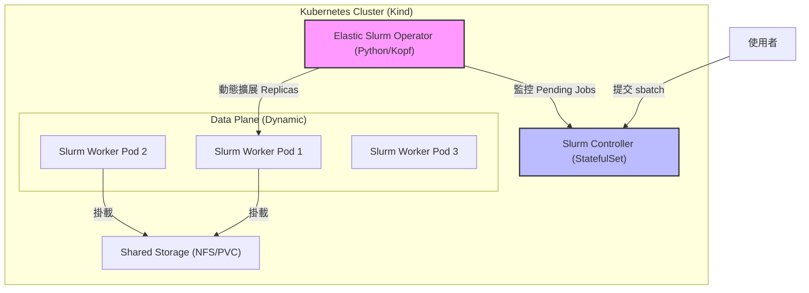

# Slurm-on-K8s-For-DDP

Adaptive HPC Scheduling on Cloud Native Infrastructure

基於 Kubernetes 的彈性 Slurm 架構：應用於分散式 AI 訓練的動態資源調度與自動恢復

# ✨ Features

- ✅ Phase 1 已完成：可在 Kind 上部署「靜態 Slurm Controller + Worker」叢集。
- ✅ 以腳本自動建立 Munge / SSH Secret，減少手動設定錯誤。
- ✅ 提供一鍵 bootstrap + verify 腳本，讓新手可快速重現。
- ✅ 將 Slurm 設定集中於 ConfigMap，提升可維護性與可讀性。
- Phase 1.1 清理：在 `slurm.conf` 為每個 worker 明確設定 `NodeAddr`/`NodeHostname` FQDN 對應，降低 `NO NETWORK ADDRESS FOUND` 機率。
- ✅ Phase 2 已完成：新增 Python Elastic Operator，支援 `Pending Job -> Scale Up` 與 `Idle Node -> Scale Down`。

# 🚀 Getting Started

> 適用對象：Windows 11（已安裝 Docker Desktop、kind、kubectl）

## 1. 前置檢查

請先確認 Docker Desktop 已啟動，並可在終端機執行：

```bash
docker version
kind version
kubectl version --client
```

## 2. 建立與部署 Phase 1&2 環境

### 2.1 整合部署及驗證

- 以下部署腳本會完成 Phase1, Phase2 的整合部署：

```bash
bash scripts/bootstrap-dev.sh
# 指定 context
# KUBE_CONTEXT=kind-slurm-lab bash scripts/bootstrap-dev.sh
# 慢機器可提高 rollout timeout
# ROLLOUT_TIMEOUT=600s bash scripts/bootstrap-dev.sh
# 需要完全重建時
# FORCE_RECREATE=true DOCKER_BUILD_NO_CACHE=true bash scripts/bootstrap-dev.sh
```

- 該腳本會在同一支檔案中完成：

1. Kind/context 與工具檢查
2. Phase 1 image build/load、secrets、manifest apply、rollout 檢查
3. Phase 2 operator image build/load、manifest apply、worker 初始化為 1

- 以下部署腳本會完成 Phase1, Phase2 的整合驗證：

```bash
bash scripts/verify-dev.sh
# 指定 context
# KUBE_CONTEXT=kind-slurm-lab bash scripts/verify-dev.sh
# 放寬 Phase 2 擴縮觀察時間
# VERIFY_TIMEOUT_SECONDS=240 bash scripts/verify-dev.sh
```

- 該腳本會在同一支檔案中完成：

1. Phase 1 健康檢查（pod ready、`sinfo`、`scontrol`、controller->worker SSH）
2. Phase 2 擴縮檢查（先縮到 1、送 pending job 觸發 scale-up、取消後確認 scale-down）

### 2.2 階段性部署及驗證

- 在專案根目錄執行以下腳本來部署 Phase1：

```bash
bash phase1/scripts/bootstrap-phase1.sh
# 若你有多個 kube context，可明確指定 kind context
# KUBE_CONTEXT=kind-slurm-lab bash phase1/scripts/bootstrap-phase1.sh
# 若網速慢或機器較慢，可提高等待時間
# ROLLOUT_TIMEOUT=600s bash phase1/scripts/bootstrap-phase1.sh
# 若要清掉舊 StatefulSet revision 與舊 Pod
# FORCE_RECREATE=true DOCKER_BUILD_NO_CACHE=true bash phase1/scripts/bootstrap-phase1.sh
```

- 該腳本會完成以下事情：

1. 若不存在，建立 `slurm-lab` Kind 叢集。
- 腳本會自動切換到 `KUBE_CONTEXT`（預設 `kind-slurm-lab`），避免套用到錯誤叢集。
2. 建置兩個映像檔：
   - `slurm-controller:phase1`
   - `slurm-worker:phase1`
3. 將映像載入 Kind。
4. 自動產生並套用：
   - `slurm-munge-key`
   - `slurm-ssh-key`
5. 套用 `phase1/manifests/slurm-static.yaml`。
6. 等待 Controller / Worker StatefulSet Ready。

> 若 rollout timeout，`bootstrap-phase1.sh` 會自動輸出 `describe pods` 與 controller/worker logs，方便快速定位問題。

- 執行以下腳本來驗證 Phase1：

```bash
bash phase1/scripts/verify-phase1.sh
# 或指定 context
# KUBE_CONTEXT=kind-slurm-lab bash phase1/scripts/verify-phase1.sh
```

你應該可以看到：

- `sinfo` 有 `debug` 分區。
- `slurm-worker-0`、`slurm-worker-1`、`slurm-worker-2` 狀態可被 `scontrol` 正常辨識。
- Controller 可 SSH 到 Worker（驗證 Pod 間 SSH 基本互通）。

- 執行以下腳本來部署 Phase2：

```bash
bash phase2/scripts/bootstrap-phase2.sh
# 指定 context
# KUBE_CONTEXT=kind-slurm-lab bash phase2/scripts/bootstrap-phase2.sh
# 需要重建 operator image 時
# DOCKER_BUILD_NO_CACHE=true bash phase2/scripts/bootstrap-phase2.sh
```

該腳本會做以下事情：

1. 確認 `slurm-controller` / `slurm-worker`（Phase 1）已存在。
2. 建置 `slurm-elastic-operator:phase2` image 並載入 Kind。
3. 套用 `phase2/manifests/slurm-phase2-operator.yaml`：
   - 建立 Operator 的 ServiceAccount + RBAC。
   - 部署 `slurm-elastic-operator` Deployment。
4. 以 `kubectl scale` 將既有 `slurm-worker` 調整為 `1`（避免以不完整 StatefulSet manifest 更新導致驗證錯誤）。
5. 等待 Operator 與 Worker rollout 完成。

- 執行以下腳本來驗證 Phase2：

```bash
bash phase2/scripts/verify-phase2.sh
# 指定 context
# KUBE_CONTEXT=kind-slurm-lab bash phase2/scripts/verify-phase2.sh
```

驗證腳本會：

1. 先將 worker replicas 固定為 1。
2. 送出一個需要 2 個節點的短任務（預期先 Pending）。
3. 觀察 Operator 是否把 `slurm-worker` 從 1 擴到 >=2。
4. 取消任務後，等待 cooldown，確認能縮回 1。

可用以下指令觀察 Operator：

```bash
kubectl -n slurm logs deployment/slurm-elastic-operator -f
kubectl -n slurm get statefulset slurm-worker -w
```

可選進階設定（Milestone C + D）：

- `PARTITIONS_JSON`：啟用每個 partition 的獨立擴縮。
- `CHECKPOINT_GUARD_ENABLED=true` + `CHECKPOINT_PATH` + `MAX_CHECKPOINT_AGE_SECONDS`：啟用 checkpoint-aware scale-down 保護。

範例（單 partition + checkpoint guard）：

```bash
kubectl -n slurm set env deployment/slurm-elastic-operator \
  SLURM_PARTITION=debug \
  WORKER_STATEFULSET=slurm-worker \
  CHECKPOINT_GUARD_ENABLED=true \
  CHECKPOINT_PATH=/shared/checkpoints/latest.ckpt \
  MAX_CHECKPOINT_AGE_SECONDS=600
```

範例（多 partition）：

```bash
kubectl -n slurm set env deployment/slurm-elastic-operator \
  PARTITIONS_JSON='[
    {"partition":"debug","worker_statefulset":"slurm-worker-debug","min_replicas":1,"max_replicas":3,"scale_up_step":1,"scale_down_step":1,"scale_down_cooldown":60},
    {"partition":"gpu","worker_statefulset":"slurm-worker-gpu","min_replicas":0,"max_replicas":2,"scale_up_step":1,"scale_down_step":1,"scale_down_cooldown":90,"checkpoint_path":"/shared/checkpoints/gpu-latest.ckpt","max_checkpoint_age_seconds":900}
  ]'
```

## 3. 部署 Phase 3（Shared Storage / NFS）

### 3.1 在 WSL/VM 準備 NFS Server

在 Ubuntu WSL2 或 Linux VM 中執行：

```bash
sudo bash phase3/scripts/setup-nfs-server.sh
# 可選參數
# sudo NFS_EXPORT_PATH=/srv/nfs/slurm NFS_EXPORT_CIDR=172.16.0.0/12 bash phase3/scripts/setup-nfs-server.sh
```

完成後取得該 WSL/VM 的 IP（供 Kind 節點連線）：

```bash
hostname -I
```

### 3.2 在 K8s 部署 nfs-subdir-external-provisioner + RWX PVC + Slurm 掛載

在專案根目錄執行：

```bash
NFS_SERVER=<your-wsl-or-vm-ip> \
NFS_PATH=/srv/nfs/k8s \
bash phase3/scripts/bootstrap-phase3.sh

# 可選：指定 context / timeout
# KUBE_CONTEXT=kind-slurm-lab ROLLOUT_TIMEOUT=600s NFS_SERVER=192.168.x.x bash phase3/scripts/bootstrap-phase3.sh
```

此腳本會完成：

1. 部署 `nfs-subdir-external-provisioner`（namespace: `nfs-provisioner`）。
2. 建立 `StorageClass`：`slurm-shared-nfs`。
3. 建立 RWX `PVC`：`slurm/slurm-shared-rwx`（給 shared home/checkpoints）。
4. 建立 `slurm-login` Pod（Deployment）。
5. 以 patch 方式將 `/shared` 掛載到：
   - `slurm-controller`
   - `slurm-worker`
   - `slurm-login`

### 3.3 驗證 Phase 3

```bash
bash phase3/scripts/verify-phase3.sh
bash phase3/scripts/verify-phase3-e2e.sh
# 或指定 context
# KUBE_CONTEXT=kind-slurm-lab bash phase3/scripts/verify-phase3.sh
```

驗證腳本會確認：

- `StorageClass` 存在、PVC 為 `Bound`。
- Controller / Worker / Login 三種 Pod 都有掛載 `/shared`。
- 可由 controller 寫入檔案，並在 worker/login 讀取（驗證 RWX 共用路徑）。

若 `bootstrap-phase3.sh` 在 provisioner rollout timeout，腳本現在會自動輸出 debug 訊息（deployment/pod describe、logs、events、PVC/PV 狀態）並附上常見 root cause 提示，優先檢查：

- `NFS_SERVER:2049` 是否可由 Kind node 連線（含 Windows 防火牆）。
- `/etc/exports` 是否放行 Kind 網段（若看到 `access denied by server while mounting`，幾乎可判定是這裡）。
- `NFS_PATH` 是否存在且已 export。

若你已經有舊的 `/etc/exports` 設定，建議直接重跑：

```bash
sudo NFS_EXPORT_PATH=/srv/nfs/k8s NFS_EXPORT_CIDR=172.16.0.0/12 bash phase3/scripts/setup-nfs-server.sh
```

新版 `setup-nfs-server.sh` 會替換同一路徑的舊 export 規則（避免殘留舊 CIDR 導致 mount 被拒）。

若你像目前案例一樣已重跑 setup 仍是 `access denied`，可先用「debug 放寬 ACL」快速確認是否為來源位址判斷問題：

```bash
sudo NFS_EXPORT_PATH=/srv/nfs/k8s NFS_EXPORT_ALLOW_ALL_DEBUG=true bash phase3/scripts/setup-nfs-server.sh
```

若此模式可通，再改回 `NFS_EXPORT_CIDR=<你的實際來源網段>` 收斂權限。


## 4. 常用操作

### 查看 Pod 狀態

```bash
kubectl -n slurm get pods -o wide
```

### 查看 Controller 日誌

```bash
kubectl -n slurm logs statefulset/slurm-controller -f
```

### 清理環境

```bash
kind delete cluster --name slurm-lab
```

# 🔥 Motivation

隨著深度學習模型的規模日益龐大，分散式訓練已成為常態。然而，目前的運算環境面臨兩難：

- Kubernetes 的局限： K8s 是雲端原生標準，擅長微服務的彈性伸縮，但其預設排程器（Default Scheduler）缺乏對 HPC 任務（如 MPI, Gang Scheduling）的「全有或全無 (All-or-Nothing)」支援，導致資源碎片化或死鎖。
- Slurm 的僵化： Slurm 是 HPC 領域的王者，擁有極佳的批次排程算法，但通常部署於靜態物理集群中，難以適應雲端環境的動態擴縮（Auto-scaling）與節點頻繁失效（Spot Instances）的特性。

本研究旨在整合兩者優勢： 在 Kubernetes 上構建一個「彈性 Slurm 集群」。透過自研的 Operator，使 Slurm 能夠根據負載「無中生有」地調用 K8s Pods 作為運算節點，並針對 PyTorch DDP 訓練任務實現自動故障恢復 (Fault Tolerance)。

# 🔄 System Architecture

本專案採用 Operator Pattern 設計，核心組件如下：




核心流程如下：

1. Job Submission：用戶向 slurmctld 提交作業。
2. Pending Detection：Elastic Slurm Operator 偵測到佇列中有 Pending Job。
3. Scale Up：Operator 修改 Worker Deployment 的 Replicas 數量，K8s 啟動新的 Pods。
4. Registration：新啟動的 Pods 自動向 Slurm Controller 註冊並加入空閒節點池。
5. Execution：Slurm 分派任務至節點執行。
6. Scale Down：任務完成後，Operator 偵測到節點閒置，自動縮減 Pods 以釋放資源。

# 🧱 Tech Stack

基礎設施與環境

- OS：Windows 11
- Container Runtime：[Docker Desktop](https://www.docker.com/products/docker-desktop/)
- Orchestration：[Kubernetes](https://kubernetes.io/) (v1.30+) via [Kind (Kubernetes in Docker)](https://kind.sigs.k8s.io/)
- Storage：NFS + [nfs-subdir-external-provisioner](https://github.com/kubernetes-sigs/nfs-subdir-external-provisioner)（RWX Shared Storage for HPC workloads）

核心組件

- Scheduler：[Slurm](https://github.com/SchedMD/slurm) Workload Manager (v23.02+)
- Controller Logic：Python + [Kopf](https://github.com/nolar/kopf) (Kubernetes Operator Pythonic Framework)
- Communication：[Munge](https://github.com/dun/munge) (Authentication), SSH (Inter-node communication)

應用層

- Framework：[PyTorch](https://pytorch.org/) (Distributed Data Parallel - DDP)
- Workload：ResNet50 / BERT-Tiny (Image Classification / NLP)
- Checkpointing：torch.save / torch.load 機制實作

# 🛠️ Application Integration

本研究將開發一個 PyTorch DDP Wrapper，用於展示系統的容錯能力：

- 斷點續訓 (Checkpointing)：應用程式將定期（每 N 個 Epoch）將模型權重寫入共享存儲（Shared Volume）。
- 彈性感知 (Elasticity Awareness)：使用 torch.distributed.elastic 啟動訓練，允許訓練過程中 Worker 數量的動態變化。
- 混沌工程測試 (Chaos Testing)：在訓練過程中，隨機刪除一個 K8s Pod (模擬節點故障)，驗證 Slurm 是否能重新排程任務，並從最新的 Checkpoint 恢復訓練，而非從頭開始。

# 📘 Timeline

> See development record/manual at `docs/note.md`

Phase 1：基礎架構

- 建置 Slurm Docker Images (Controller/Worker)。
- 在 Kind 上手動部署靜態 Slurm 集群。
- 解決 Pod 間 SSH 互通與 Munge 認證問題。
- 交付 `scripts/bootstrap-dev.sh` / `scripts/verify-dev.sh`，將 Phase 1 + Phase 2 串成一鍵部署與驗證流程，降低新開發者上手成本。

Phase 2：Operator 開發

- 開發 Python Operator，實作 "Pending Job -> Scale Up" 邏輯。
- 實作 "Idle Node -> Scale Down" 邏輯。

Phase 3：Shared Storage + 應用整合與容錯

- ✅ 在 Kind 單機環境部署 NFS Server（WSL/VM）並整合 nfs-subdir-external-provisioner。
- ✅ 建立 StorageClass 與 RWX PVC，作為 Slurm shared home/checkpoints。
- ✅ 將 Controller / Worker / Login Pod 掛載共享 NFS Volume。
- 建立 PyTorch DDP 測試工作負載（CPU 版即可）。
- 實作 checkpoint heartbeat + resume 機制。
- 在 sbatch 工作中加入 --requeue 與自動恢復流程。
- 實作 Operator checkpoint-aware scale-down guard。
- 模擬 Worker Pod 故障並量測 RTO。
- 模擬 Controller 重啟並驗證 Slurm state 恢復。
- 記錄 provisioning latency 與 recovery metrics。

Phase 4：評估與優化

- 收集實驗數據。
- 撰寫技術報告與文件。

# 📊 Evaluation Metrics

本研究將透過以下指標評估系統效能：

|         指標         |               描述               | 目標                    |
|:--------------------:|:-------------------------------- | ----------------------- |
| Provisioning Latency | 從 Job 提交到 Pod Ready 的時間差 | < 30 sec                |
|    Recovery Time     | 從節點故障到訓練恢復的時間 (RTO) | < 60 sec                |
| Resource Efficiency  | 閒置資源的回收速度               | 任務結束後 1 分鐘內釋放 |
| Scheduling Overhead  | Operator 帶來的額外 CPU/Mem 消耗 | < 5% 總資源             |

# 📝 References

- [Slurm Workload Manager Documentation](https://slurm.schedmd.com/)
- [Kubernetes Operator Pythonic Framework (Kopf)](https://github.com/nolar/kopf)
- [PyTorch Distributed Elastic](https://docs.pytorch.org/docs/stable/distributed.elastic.html)
- Related Paper: [Converged Computing: Integrating HPC and Cloud Native](https://www.computer.org/csdl/magazine/cs/2024/03/10770850/22fgId5NFpC)


## Phase A topology model

Phase A introduces a declarative `WorkerClass / NodeSet` topology model via `phase2/manifests/slurm-phaseA-topology.yaml`.
The operator reads `ConfigMap/slurm-topology` (`topology.json`) and uses it as the source of truth for:
- available worker classes
- managed node sets / worker pools
- per-pool scaling bounds and cooldowns
- Slurm node-name prefix mapping for node state reconciliation

This keeps the current single worker pool working, while establishing the data model needed for future multi-pool CPU/GPU autoscaling.
