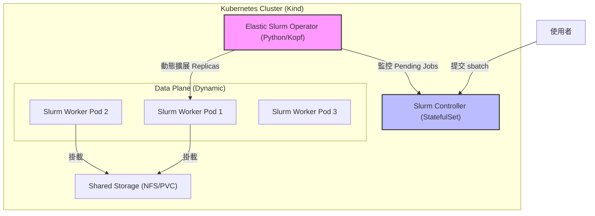

# Slurm-on-K8s-For-DDP

Adaptive HPC Scheduling on Cloud Native Infrastructure

基於 Kubernetes 的彈性 Slurm 架構：應用於分散式 AI 訓練的動態資源調度與自動恢復

# ✨ Features

- ✅ Phase 1 已完成：可在 Kind 上部署「靜態 Slurm Controller + Worker」叢集。
- ✅ 以腳本自動建立 Munge / SSH Secret，減少手動設定錯誤。
- ✅ 提供一鍵 bootstrap + verify 腳本，讓新手可快速重現。
- ✅ 將 Slurm 設定集中於 ConfigMap，提升可維護性與可讀性。

# 🚀 Getting Started

> 適用對象：Windows 11（已安裝 Docker Desktop、kind、kubectl）

## 1) 前置檢查

請先確認 Docker Desktop 已啟動，並可在終端機執行：

```bash
docker version
kind version
kubectl version --client
```

## 2) 建立與部署 Phase 1 環境

在專案根目錄執行：

```bash
bash phase1/scripts/bootstrap-phase1.sh
# 若你有多個 kube context，可明確指定 kind context
# KUBE_CONTEXT=kind-slurm-lab bash phase1/scripts/bootstrap-phase1.sh
# 若網速慢或機器較慢，可提高等待時間
# ROLLOUT_TIMEOUT=600s bash phase1/scripts/bootstrap-phase1.sh
# 若要清掉舊 StatefulSet revision 與舊 Pod
# FORCE_RECREATE=true DOCKER_BUILD_NO_CACHE=true bash phase1/scripts/bootstrap-phase1.sh
```

該腳本會完成以下事情：

1. 若不存在，建立 `slurm-lab` Kind 叢集。
- 腳本會自動切換到 `KUBE_CONTEXT`（預設 `kind-slurm-lab`），避免套用到錯誤叢集。
2. 建置兩個映像檔：
   - `slurm-controller:phase1`
   - `slurm-worker:phase1`
3. 將映像載入 Kind。
4. 自動產生並套用：
   - `slurm-munge-key`
   - `slurm-ssh-key`
5. 套用 `phase1/manifests/slurm-static.yaml`。
6. 等待 Controller / Worker StatefulSet Ready。


> 若 rollout timeout，`bootstrap-phase1.sh` 會自動輸出 `describe pods` 與 controller/worker logs，方便快速定位問題。

## 3) 驗證 Slurm 狀態

```bash
bash phase1/scripts/verify-phase1.sh
# 或指定 context
# KUBE_CONTEXT=kind-slurm-lab bash phase1/scripts/verify-phase1.sh
```

你應該可以看到：

- `sinfo` 有 `debug` 分區。
- `slurm-worker-0`、`slurm-worker-1`、`slurm-worker-2` 狀態可被 `scontrol` 正常辨識。
- Controller 可 SSH 到 Worker（驗證 Pod 間 SSH 基本互通）。

## 4) 常用操作

### 查看 Pod 狀態

```bash
kubectl -n slurm get pods -o wide
```

### 查看 Controller 日誌

```bash
kubectl -n slurm logs statefulset/slurm-controller -f
```

### 清理環境

```bash
kind delete cluster --name slurm-lab
```


## 5) Windows 常見錯誤（你這次遇到的）

### 錯誤 1：`/usr/bin/env: '''bash\r''': No such file or directory`

這代表腳本檔案是 CRLF（`\r\n`）換行，Linux 容器需要 LF（`\n`）。

本專案已加入 `.gitattributes` 強制 shell/yaml/dockerfile 使用 LF。若你本機還是遇到：

```bash
git rm --cached -r .
git reset --hard
```

再重新 build：

```bash
DOCKER_BUILD_NO_CACHE=true bash phase1/scripts/bootstrap-phase1.sh
```

### 錯誤 2：`error mounting ... /etc/slurm/slurm.conf ... no such file or directory`

已改成把 ConfigMap 直接掛載到 `/etc/slurm`（不再使用 `subPath` 掛單檔），可降低 Windows/容器 runtime 下的 subPath 邊緣問題。

### 錯誤 3：`chmod: changing permissions of '/etc/munge/munge.key': Read-only file system`

Kubernetes Secret 掛載本質是唯讀，不能直接在掛載點上 `chmod/chown`。

已改為：
- Secret 掛載到 `/slurm-secrets/*`（避免 `subPath` 與系統 secrets 路徑衝突）
- entrypoint 啟動時把 key 複製到可寫入的 `/etc/munge/munge.key` 再設定權限


### 錯誤 4：`munged: Error: PRNG seed dir is insecure: invalid ownership of "/var/lib/munge"`

這表示 `munged` 檢查到目錄權限/擁有者不安全。

已修正 entrypoint 啟動流程：
- 明確對 `/etc/munge`、`/var/lib/munge`、`/var/log/munge` 做 `chown munge:munge` 與 `chmod 0700`（含遞迴）
- `/run/munge` 使用 `chmod 0711`（`munged` 要求 socket 路徑對 all 具有 execute）
- 以 `munge` 使用者啟動 `munged`，避免權限檢查不一致
- 若 `munged` 啟動失敗，額外輸出上述目錄權限與 `id munge` 供除錯

### 錯誤 5：`This host (...) not a valid controller` 或 worker 無法解析 controller FQDN

已修正 `slurm.conf`：
- `SlurmctldHost=slurm-controller-0`（與 Pod hostname 一致）
- `SlurmctldAddr=slurm-controller-0.slurm-controller.slurm.svc.cluster.local`（固定可解析 FQDN）
- 並把 worker CPU 拓撲參數調整為符合 Kind 節點常見硬體，降低 slurmd 拓撲不一致警告


# 🔥 Motivation

隨著深度學習模型的規模日益龐大，分散式訓練已成為常態。然而，目前的運算環境面臨兩難：

- Kubernetes 的局限： K8s 是雲端原生標準，擅長微服務的彈性伸縮，但其預設排程器（Default Scheduler）缺乏對 HPC 任務（如 MPI, Gang Scheduling）的「全有或全無 (All-or-Nothing)」支援，導致資源碎片化或死鎖。
- Slurm 的僵化： Slurm 是 HPC 領域的王者，擁有極佳的批次排程算法，但通常部署於靜態物理集群中，難以適應雲端環境的動態擴縮（Auto-scaling）與節點頻繁失效（Spot Instances）的特性。

本研究旨在整合兩者優勢： 在 Kubernetes 上構建一個「彈性 Slurm 集群」。透過自研的 Operator，使 Slurm 能夠根據負載「無中生有」地調用 K8s Pods 作為運算節點，並針對 PyTorch DDP 訓練任務實現自動故障恢復 (Fault Tolerance)。

# 🔄 System Architecture

本專案採用 Operator Pattern 設計，核心組件如下：




核心流程如下：

1. Job Submission：用戶向 slurmctld 提交作業。
2. Pending Detection：Elastic Slurm Operator 偵測到佇列中有 Pending Job。
3. Scale Up：Operator 修改 Worker Deployment 的 Replicas 數量，K8s 啟動新的 Pods。
4. Registration：新啟動的 Pods 自動向 Slurm Controller 註冊並加入空閒節點池。
5. Execution：Slurm 分派任務至節點執行。
6. Scale Down：任務完成後，Operator 偵測到節點閒置，自動縮減 Pods 以釋放資源。

# 🧱 Tech Stack

基礎設施與環境

- OS：Windows 11
- Container Runtime：[Docker Desktop](https://www.docker.com/products/docker-desktop/)
- Orchestration：[Kubernetes](https://kubernetes.io/) (v1.30+) via [Kind (Kubernetes in Docker)](https://kind.sigs.k8s.io/)
- Storage：[Local Path Provisioner](https://github.com/rancher/local-path-provisioner) (模擬 NFS 共享存儲)

核心組件

- Scheduler：[Slurm](https://github.com/SchedMD/slurm) Workload Manager (v23.02+)
- Controller Logic：Python + [Kopf](https://github.com/nolar/kopf) (Kubernetes Operator Pythonic Framework)
- Communication：[Munge](https://github.com/dun/munge) (Authentication), SSH (Inter-node communication)

應用層

- Framework：[PyTorch](https://pytorch.org/) (Distributed Data Parallel - DDP)
- Workload：ResNet50 / BERT-Tiny (Image Classification / NLP)
- Checkpointing：torch.save / torch.load 機制實作

# 🛠️ Application Integration

本研究將開發一個 PyTorch DDP Wrapper，用於展示系統的容錯能力：

- 斷點續訓 (Checkpointing)：應用程式將定期（每 N 個 Epoch）將模型權重寫入共享存儲（Shared Volume）。
- 彈性感知 (Elasticity Awareness)：使用 torch.distributed.elastic 啟動訓練，允許訓練過程中 Worker 數量的動態變化。
- 混沌工程測試 (Chaos Testing)：在訓練過程中，隨機刪除一個 K8s Pod (模擬節點故障)，驗證 Slurm 是否能重新排程任務，並從最新的 Checkpoint 恢復訓練，而非從頭開始。

# 📘 Timeline

> See development record/manual at `docs/note.md`

Phase 1：基礎架構

- 建置 Slurm Docker Images (Controller/Worker)。
- 在 Kind 上手動部署靜態 Slurm 集群。
- 解決 Pod 間 SSH 互通與 Munge 認證問題。

Phase 2：Operator 開發

- 開發 Python Operator，實作 "Pending Job -> Scale Up" 邏輯。
- 實作 "Idle Node -> Scale Down" 邏輯。

Phase 3：應用整合與容錯

- 整合 PyTorch DDP 應用。
- 實作 Checkpoint/Resume 機制。
- 進行故障模擬測試。

Phase 4：評估與優化

- 收集實驗數據。
- 撰寫技術報告與文件。

# 📊 Evaluation Metrics

本研究將透過以下指標評估系統效能：

|         指標         |               描述               | 目標                    |
|:--------------------:|:-------------------------------- | ----------------------- |
| Provisioning Latency | 從 Job 提交到 Pod Ready 的時間差 | < 30 sec                |
|    Recovery Time     | 從節點故障到訓練恢復的時間 (RTO) | < 60 sec                |
| Resource Efficiency  | 閒置資源的回收速度               | 任務結束後 1 分鐘內釋放 |
| Scheduling Overhead  | Operator 帶來的額外 CPU/Mem 消耗 | < 5% 總資源             |

# 📝 References

- [Slurm Workload Manager Documentation](https://slurm.schedmd.com/)
- [Kubernetes Operator Pythonic Framework (Kopf)](https://github.com/nolar/kopf)
- [PyTorch Distributed Elastic](https://docs.pytorch.org/docs/stable/distributed.elastic.html)
- Related Paper: [Converged Computing: Integrating HPC and Cloud Native](https://www.computer.org/csdl/magazine/cs/2024/03/10770850/22fgId5NFpC)
