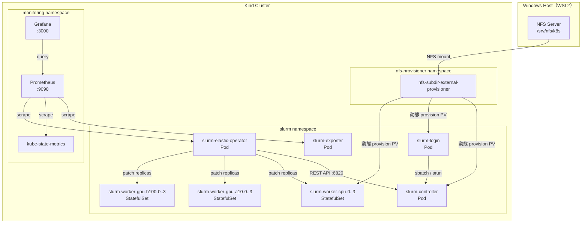
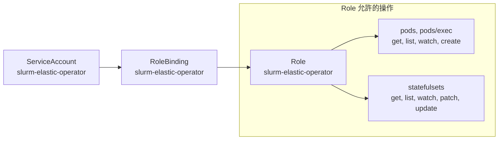
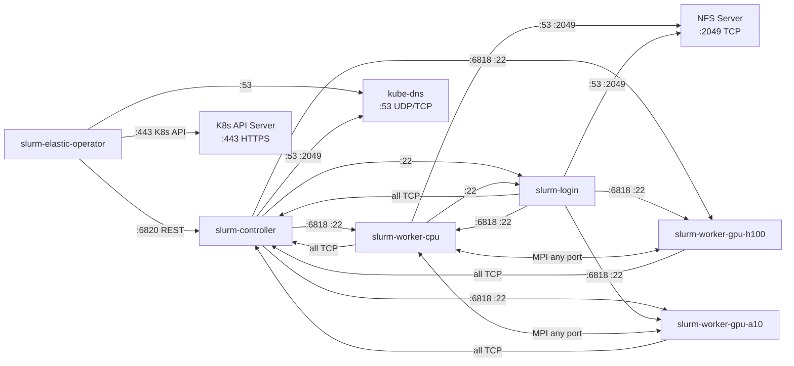
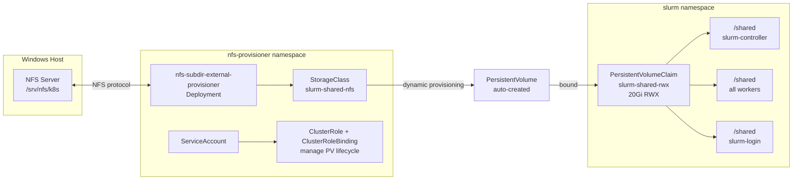
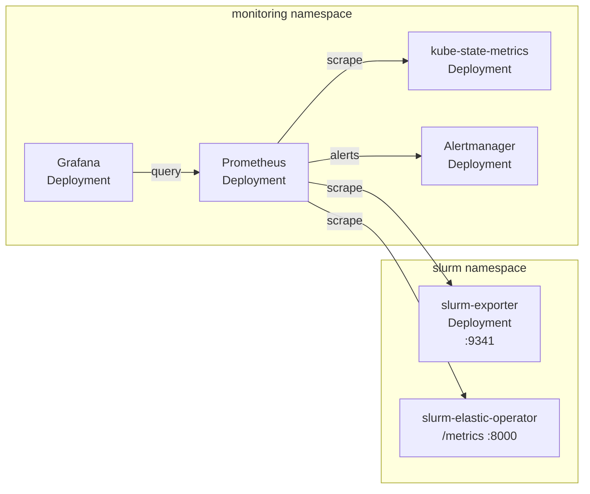
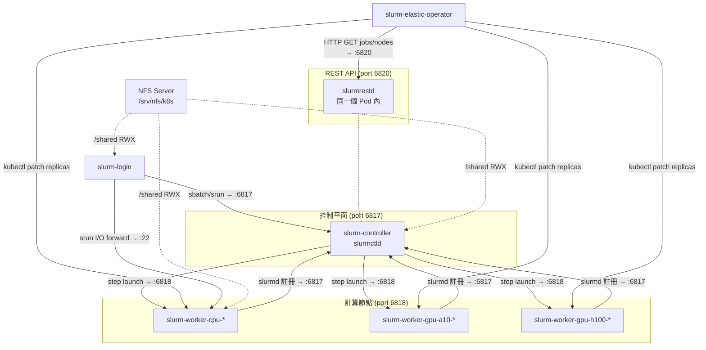

# Kubernetes Cluster Architecture

---

## 目錄

1. [架構總覽](#1-架構總覽)
2. [Namespace 佈局](#2-namespace-佈局)
3. [核心 Slurm 叢集](#3-核心-slurm-叢集)
   - [3.1 Workloads](#31-workloads)
   - [3.2 Services](#32-services)
   - [3.3 ConfigMaps](#33-configmaps)
   - [3.4 Secrets](#34-secrets)
4. [Elastic Operator](#4-elastic-operator)
   - [4.1 控制迴圈](#41-控制迴圈)
   - [4.2 RBAC](#42-rbac)
5. [NetworkPolicy](#5-networkpolicy)
6. [共享 NFS 儲存](#6-共享-nfs-儲存)
7. [監控堆疊](#7-監控堆疊)
8. [網路流量總覽](#8-網路流量總覽)
9. [Volume 掛載總覽](#9-volume-掛載總覽)
10. [常用 kubectl 指令速查](#10-常用-kubectl-指令速查)
11. [附錄：K8s 物件速查表](#11-附錄k8s-物件速查表)

---

## 1. 架構總覽

這個系統在單台 Windows 11 + Docker Desktop 上，用 Kind (Kubernetes in Docker) 模擬一個 HPC 叢集。核心概念：

- **Slurm** 負責排程（誰的工作跑哪台機器、何時跑）
- **Kubernetes** 負責容器生命週期（Pod 的啟動、重啟、縮放）
- **Elastic Operator** 作為橋樑，監看 Slurm 佇列，動態調整 worker StatefulSet replicas
- **Shared NFS Storage** 讓所有 Pod 讀寫同一個檔案系統，job 輸出才看得到
- **Prometheus + Grafana** 視覺化整個 Slurm ↔ K8s 橋接過程



**Bootstrap 腳本對應：**

| 元件 | 腳本 |
|------|------|
| 核心叢集 + Operator | `bash scripts/bootstrap.sh` |
| NFS 儲存 | `NFS_SERVER=<ip> bash scripts/bootstrap-storage.sh` |
| 監控堆疊 | `bash scripts/bootstrap-monitoring.sh` |
| Lmod + /shared/jobs | `bash scripts/bootstrap-lmod.sh` |

---

## 2. Namespace 佈局

整個系統使用三個 namespace：

| Namespace | 用途 | 建立時機 |
|-----------|------|--------|
| `slurm` | 所有 Slurm 相關的 Pod、Service、ConfigMap、Secret、NetworkPolicy | `bootstrap.sh` |
| `nfs-provisioner` | NFS subdir external provisioner（動態 PV 供應商） | `bootstrap-storage.sh` |
| `monitoring` | Prometheus、Grafana、kube-state-metrics | `bootstrap-monitoring.sh` |

> **為什麼要分 Namespace？**
> Namespace 是 K8s 的隔離邊界。NetworkPolicy、RBAC 都以 namespace 為範圍。把 provisioner 和監控元件獨立出去，避免其 RBAC 污染 `slurm` namespace 的最小權限原則。跨 namespace 的 scrape 流量（Prometheus → slurm-exporter）透過 NetworkPolicy 明確開放。

---

## 3. 核心 Slurm 叢集

核心叢集物件定義在 `manifests/core/slurm-static.yaml`（由 `scripts/render-core.py` 從 `manifests/core/worker-pools.json` 生成）。

### 3.1 Workloads

#### StatefulSet: `slurm-controller`

| 欄位 | 值 |
|------|-----|
| Replicas | 1（固定，不縮放） |
| Image | `slurm-controller:phase1` |
| 主要程序 | `slurmctld`（排程控制器）+ `slurmrestd`（REST API）+ `slurmdbd`（accounting） |
| 容器 Port | 6817 (slurmctld), 6820 (slurmrestd), 22 (SSH) |
| Readiness Probe | `pgrep -x slurmctld && pgrep -x munged` |
| Liveness Probe | `pgrep -x slurmctld && pgrep -x slurmrestd`（初始等 60s） |

**為什麼用 StatefulSet？** Controller 需要穩定的 Pod 名稱（`slurm-controller-0`）和 DNS，讓 worker 在 `slurm.conf` 裡知道控制器在哪。Deployment 的 Pod 名稱是隨機的，不適合。

#### StatefulSet: `slurm-worker-cpu`

| 欄位 | 值 |
|------|-----|
| Replicas | 執行時 1–4（由 Operator 動態調整） |
| Image | `slurm-worker:phase1` |
| 主要程序 | `slurmd`（工作節點 daemon） |
| 容器 Port | 6818 (slurmd), 22 (SSH) |
| Slurm Features | `cpu`（讓 job 用 `--constraint=cpu` 指定） |

#### StatefulSet: `slurm-worker-gpu-a10`

| 欄位 | 值 |
|------|-----|
| Replicas | 執行時 0–4（有需求才拉起） |
| Image | `slurm-worker:phase1` |
| Slurm Features | `gpu,gpu-a10` |
| Slurm GRES | `gpu:a10:1`（Kind 環境用 `/dev/null` 模擬） |

#### StatefulSet: `slurm-worker-gpu-h100`

與 gpu-a10 結構相同，差別在 feature 為 `gpu-h100`、GRES 為 `gpu:h100:1`。

#### Deployment: `slurm-login`

| 欄位 | 值 |
|------|-----|
| Replicas | 1 |
| Image | `slurm-worker:phase1`（借用 worker image） |
| 用途 | 使用者透過 `kubectl exec` 進入此 Pod 提交 `sbatch` / `srun` |
| 主要程序 | `munged` + `sshd`（無 slurmd） |
| 特別掛載 | `slurm-ddp-runtime` ConfigMap → `/opt/slurm-runtime-src` |

> **為什麼 login 用 Deployment 而非 StatefulSet？**
> Login node 不需要穩定編號，也不需要 Headless Service。Deployment 提供 rolling update，更適合這種無狀態前端節點。

#### Deployment: `slurm-exporter`

| 欄位 | 值 |
|------|-----|
| Image | `slurm-exporter:phase4` |
| 主要程序 | `docker/slurm-exporter/exporter.py`（自製 REST API exporter） |
| Port | 9341（Prometheus scrape） |
| 用途 | 把 slurmrestd job/node 資料轉換成 Prometheus metrics |

### 3.2 Services

K8s Service 解決「怎麼找到 Pod」的問題。有兩種類型：

**Headless Service**（`clusterIP: None`）— 不分配虛擬 IP，而是直接把 DNS 解析到每個 Pod 的 IP。StatefulSet 需要這個來讓每個 Pod 有可預測的 FQDN：

```
slurm-controller-0.slurm-controller.slurm.svc.cluster.local
slurm-worker-cpu-0.slurm-worker-cpu.slurm.svc.cluster.local
```

| Service 名稱 | 類型 | Port | 對應 Pod |
|-------------|------|------|---------|
| `slurm-controller` | Headless | 6817 | slurm-controller |
| `slurm-restapi` | ClusterIP | 6820 | slurm-controller（slurmrestd） |
| `slurm-worker-cpu` | Headless | 6818 | slurm-worker-cpu-* |
| `slurm-worker-gpu-a10` | Headless | 6818 | slurm-worker-gpu-a10-* |
| `slurm-worker-gpu-h100` | Headless | 6818 | slurm-worker-gpu-h100-* |
| `slurm-login` | ClusterIP | 22 | slurm-login |
| `slurm-exporter` | ClusterIP | 9341 | slurm-exporter |
| `slurm-elastic-operator` | ClusterIP | 8000 | slurm-elastic-operator（/metrics） |

> `slurm-restapi` 是唯一非 Headless 的核心 Slurm Service，因為 Operator 需要一個穩定的 ClusterIP 來連 HTTP。

### 3.3 ConfigMaps

#### `slurm-config`

存放 Slurm 的兩個核心設定檔：

- **`slurm.conf`**: 宣告所有節點（含未來 max replicas 的節點）、partition、auth 方式、resource tracking 模式
  - `SelectType=select/cons_tres` → CPU 以 core 為單位可消耗資源
  - `AuthAltTypes=auth/jwt` → 啟用 JWT 認證供 slurmrestd 使用
- **`gres.conf`**: 宣告 GPU worker 的 GRES 設定（Kind 環境用 `File=/dev/null` 模擬）

> [!IMPORTANT] **靜態預宣告節點**
> `slurm.conf` 一開始就宣告了所有 pool 的最大節點數（如 cpu-0 到 cpu-3）。
> Operator 縮放時只改 StatefulSet replicas，不重新設定 Slurm。
> 好處是避免 scale event 時大量 DNS 解析失敗衝擊 slurmctld。

#### `slurm-ddp-runtime`

存放 DDP 訓練的 runtime 腳本，掛到 login pod 的 `/opt/slurm-runtime-src/`：

- `ddp-env.sh`: 設定 NCCL/Gloo 使用哪張網路介面（`net2`，dual-subnet 拓撲）
- `sample-ddp-job.sh`: 示範如何 `sbatch` 一個 DDP 訓練 job

#### Lmod Modulefile ConfigMaps

由 `manifests/core/lmod-modulefiles.yaml` 定義，整合在核心叢集中（不需要額外 image rebuild）：

| ConfigMap | 掛載路徑 | 說明 |
|-----------|---------|------|
| `slurm-modulefile-openmpi` | `/opt/modulefiles/openmpi` | OpenMPI module 定義 |
| `slurm-modulefile-python3` | `/opt/modulefiles/python3` | Python3 module 定義 |
| `slurm-modulefile-cuda` | `/opt/modulefiles/cuda` | CUDA module 定義（模擬） |

### 3.4 Secrets

Secrets 由 `scripts/create-secrets.sh` 在本機生成並上傳到 K8s。

| Secret 名稱 | 內容 | 用途 |
|------------|------|------|
| `slurm-munge-key` | `munge.key`（隨機 512 bytes） | Munge 認證所有 Slurm daemon 之間的通訊 |
| `slurm-ssh-key` | `id_ed25519`, `id_ed25519.pub` | Pod 間 SSH 互信（srun step launch 需要） |
| `slurm-jwt-secret` | `jwt_hs256.key` | slurmrestd 的 JWT HS256 簽名金鑰 |

所有 Pod 透過 **Projected Secret Volume** 掛載這些 secrets，啟動時複製到需要的路徑。Projected Volume 讓多個 secret 合併進同一個掛載點。

---

## 4. Elastic Operator

Python Operator 監看 Slurm 佇列，根據 pending jobs 和 idle nodes 自動調整 worker StatefulSet replicas。原始碼在 `operator/` 目錄，各模組職責：

| 模組 | 職責 |
|------|------|
| `models.py` | 純 dataclass：PartitionConfig, Config, PartitionState, ScalingDecision |
| `metrics.py` | Prometheus 指標定義（module-level singletons） |
| `k8s.py` | K8sClient：StatefulSet 操作、pod exec、node drain/resume |
| `slurm.py` | SlurmRestClient：HTTP + JWT，stdlib urllib only |
| `collector.py` | PartitionConfigLoader + ClusterStateCollector |
| `policy.py` | CheckpointAwareQueuePolicy（純邏輯，無 I/O） |
| `app.py` | JsonLogger + StatefulSetActuator + OperatorApp 主迴圈 |
| `main.py` | validate_config() + main() 入口點 |

### 4.1 控制迴圈

#### Deployment: `slurm-elastic-operator`

| 欄位 | 值 |
|------|-----|
| Image | `slurm-elastic-operator:phase2` |
| 主要程序 | `operator/main.py`（Python polling loop） |
| Poll 間隔 | 15 秒（`POLL_INTERVAL_SECONDS`） |
| 查詢方式 | slurmrestd REST API（失敗時 fallback 到 kubectl exec） |
| Metrics Port | 8000（`/metrics`，Prometheus scrape） |


**重要環境變數（由 `bootstrap.sh` 設定）：**

| 變數 | 說明 |
|------|------|
| `PARTITIONS_JSON` | 各 pool 的縮放策略（min/max replicas、cooldown、feature 對應、checkpoint_grace_seconds） |
| `SLURM_REST_URL` | `http://slurm-restapi.slurm.svc.cluster.local:6820` |
| `CHECKPOINT_GUARD_ENABLED` | 啟用 scale-down 前的 checkpoint 保護（`CHECKPOINT_PATH=""` 時自動停用） |
| `CHECKPOINT_GRACE_SECONDS` | job 啟動初期允許縮容的 grace period 秒數（預設 0） |
| `SLURM_JWT_KEY_PATH` | JWT 金鑰路徑（從 `slurm-jwt-secret` 掛載） |

**Cooldown 持久化：**
Scale_up 成功後，時間戳寫到 StatefulSet annotation `slurm.k8s/last-scale-up-at`（Unix epoch float）。Operator Pod 重啟時從 annotation 恢復，避免冷卻時間歸零後立即 scale-down。

**Circuit breaker：**
REST API 或 kubectl exec 連續失敗時，Operator 以指數退避（最長 60s）暫停 poll loop。`/tmp/operator-alive` 持續更新維持 livenessProbe；第一次成功完整 poll 後寫入 `/tmp/operator-ready`（readinessProbe 依此判斷 Pod 就緒）。

### 4.2 RBAC



`patch` statefulsets 同時涵蓋縮放（改 `spec.replicas`）和寫 annotation（`slurm.k8s/last-scale-up-at`）。

---

## 5. NetworkPolicy

NetworkPolicy 同時控制 Ingress（接收流量）與 Egress（出站流量）：

- **Ingress**：預設拒絕所有，再依文件化通訊路徑白名單開放
- **Egress**：預設拒絕所有，再依各 Pod 類型最小化白名單開放（含 DNS、NFS、pod-to-pod）



十一條 NetworkPolicy 物件（定義在 `manifests/networking/network-policy.yaml`）：

**Ingress 規則（4 條）：**

| Policy 名稱 | 保護的 Pod | 允許來源 |
|------------|-----------|---------|
| `default-deny-ingress` | 全部（`podSelector: {}`） | 預設拒絕所有 ingress |
| `allow-controller-ingress` | `slurm-controller` | workers, login, operator, exporter（port 6817/6820/22） |
| `allow-worker-ingress` | 三個 worker pools | controller, login（port 6818/22）；inter-worker MPI（any port） |
| `allow-login-ingress` | `slurm-login` | controller, workers（僅 port 22） |

**Egress 規則（7 條）：**

| Policy 名稱 | 限制的 Pod | 允許出站目標 |
|------------|-----------|------------|
| `default-deny-egress` | 全部（`podSelector: {}`） | 預設拒絕所有 egress |
| `allow-dns-egress` | 全部 | kube-dns UDP/TCP 53 |
| `allow-operator-egress` | operator | K8s API TCP 443（any）；controller TCP 6820 |
| `allow-controller-egress` | controller | workers TCP 6818/22；login TCP 22；slurmdbd TCP 6819；NFS TCP 2049 |
| `allow-worker-egress` | workers | controller（**所有 TCP 埠**）；inter-worker MPI any port；login TCP 22；NFS TCP 2049 |
| `allow-login-egress` | login | controller（**所有 TCP 埠**）；workers TCP 6818/22；NFS TCP 2049 |
| `allow-slurmdbd-egress` | slurmdbd | MySQL TCP 3306 |

> **為什麼 worker / login → controller 允許所有 TCP 埠？**
> Slurm 的 fan-out tree RPC 協定：slurmctld 向多節點廣播 `REQUEST_PING` 時，worker 必須把子樹回應（`RESPONSE_FORWARD_FAILED`）送回 controller 的**臨時埠**（OS 隨機分配，非固定 6817）。若只允許 6817，這些回應封包會被 NetworkPolicy drop，導致節點持續顯示 `idle*`（NOT_RESPONDING）。出站目標仍嚴格限制在 controller pod。
>
> **為什麼 worker inter-worker MPI 允許 any port？**
> NCCL 和 Gloo 使用 ephemeral port range（通常 1024–65535）進行 collective 通訊（AllReduce、AllGather 等）。Egress 目標仍嚴格限制在 `slurm` namespace 內的 worker pods，不允許連到外部網路。
>
> **為什麼 K8s API egress 用 port 443 而非 podSelector？**
> K8s API server 在 Kind 中以 host network 運行，不是 `slurm` namespace 的 Pod，無法用 podSelector 匹配。允許 TCP 443 到任意目標，比「任意 egress」更受限，且是 operator in-cluster SDK 的必要條件。

跨 namespace 的監控流量（Prometheus → slurm-exporter、operator）由 `manifests/networking/network-policy-monitoring.yaml` 另外開放。

---

## 6. 共享 NFS 儲存

解決「`sbatch` job 的輸出檔案只寫在 worker 本機，login 看不到」的問題。所有 workload 共享同一個 `/shared` NFS 掛載點，job 輸出對全叢集可見。

### 6.1 架構



### 6.2 StorageClass 與 PVC

**StorageClass `slurm-shared-nfs`：**

| 欄位 | 值 | 說明 |
|------|-----|------|
| Provisioner | `k8s-sigs.io/slurm-nfs-subdir-external-provisioner` | 對應 provisioner 設定的 name |
| ReclaimPolicy | `Retain` | PVC 刪除後 PV 不自動清除，保留資料 |
| VolumeBindingMode | `Immediate` | PVC 一建立就立刻 bind |
| AccessMode | `ReadWriteMany (RWX)` | 多個 Pod 同時可讀寫 |

**PVC `slurm-shared-rwx`：**
- Namespace: `slurm`，Capacity: 20Gi，Mode: ReadWriteMany

所有 StatefulSet 和 Login Deployment 都掛載這個 PVC 到 `/shared`。Job 輸出導向：

```bash
#SBATCH --output=/shared/jobs/out-%j.txt
#SBATCH --error=/shared/jobs/err-%j.txt
```

### 6.3 NFS Provisioner RBAC

NFS provisioner 需要 **ClusterRole**（非 namespace 級 Role），因為 PersistentVolume 是 cluster-scoped 資源。

| RBAC 物件 | Namespace | 用途 |
|----------|-----------|------|
| ServiceAccount `nfs-subdir-external-provisioner` | nfs-provisioner | provisioner Pod 身份 |
| ClusterRole `nfs-subdir-external-provisioner-runner` | cluster-wide | 管理 PV、PVC、StorageClass |
| ClusterRoleBinding `run-nfs-subdir-external-provisioner` | cluster-wide | SA → ClusterRole |
| Role `leader-locking-nfs-subdir-external-provisioner` | nfs-provisioner | leader election lease lock |
| RoleBinding `leader-locking-nfs-subdir-external-provisioner` | nfs-provisioner | SA → Role |

---

## 7. 監控堆疊

監控堆疊部署在獨立的 `monitoring` namespace，透過 Prometheus 收集三個 scrape target 的 metrics，由 Grafana 視覺化。詳細規格見 [`docs/monitoring.md`](monitoring.md)。



**元件清單：**

| 元件 | Kind | Namespace | 說明 |
|------|------|-----------|------|
| `prometheus` | Deployment | monitoring | 集中收集 metrics，scrape 三個 endpoint |
| `grafana` | Deployment | monitoring | 視覺化 dashboard（Slurm↔K8s Bridge Overview 等三個看板） |
| `alertmanager` | Deployment | monitoring | 告警路由與靜音管理 |
| `kube-state-metrics` | Deployment | monitoring | 暴露 StatefulSet replicas、Pod ready 等 K8s 原生指標 |
| `slurm-exporter` | Deployment | slurm | 把 slurmrestd REST 回應轉成 Prometheus metrics（port 9341） |
| `prometheus-config` | ConfigMap | monitoring | Prometheus scrape target 設定 |

**存取方式：**

```bash
kubectl -n monitoring port-forward svc/grafana 3000:3000     # Grafana（admin/admin）
kubectl -n monitoring port-forward svc/prometheus 9090:9090  # Prometheus
kubectl -n monitoring port-forward svc/alertmanager 9093:9093
bash scripts/verify-monitoring.sh                            # 驗證所有 metrics endpoint
```

---

## 8. 網路流量總覽

整合所有元件的通訊路徑。虛線代表 NFS 掛載路徑（需要 `bootstrap-storage.sh` 部署後才有）。



---

## 9. Volume 掛載總覽

| Volume 名稱 | 類型 | controller | worker-* | login | operator |
|------------|------|:----------:|:--------:|:-----:|:--------:|
| `slurm-config` | ConfigMap | `/etc/slurm` ✓ | `/etc/slurm` ✓ | `/etc/slurm` ✓ | — |
| `slurm-secrets` | Projected Secret（munge + ssh + jwt） | `/slurm-secrets` ✓ | `/slurm-secrets` ✓（無 jwt） | `/slurm-secrets` ✓（無 jwt） | — |
| `slurm-ddp-runtime` | ConfigMap | — | — | `/opt/slurm-runtime-src` ✓ | — |
| `shared-storage` | PVC `slurm-shared-rwx` | `/shared` ✓ | `/shared` ✓ | `/shared` ✓ | — |
| `slurm-jwt-secret` | Secret | — | — | — | `/slurm-jwt/` ✓ |
| `slurm-modulefile-openmpi` | ConfigMap | — | `/opt/modulefiles/openmpi` ✓ | `/opt/modulefiles/openmpi` ✓ | — |
| `slurm-modulefile-python3` | ConfigMap | — | `/opt/modulefiles/python3` ✓ | `/opt/modulefiles/python3` ✓ | — |
| `slurm-modulefile-cuda` | ConfigMap | — | `/opt/modulefiles/cuda` ✓ | `/opt/modulefiles/cuda` ✓ | — |

---

## 10. 常用 kubectl 指令速查

```bash
# 看 slurm namespace 裡所有物件
kubectl -n slurm get all -o wide

# 看所有 StatefulSet 目前的 replicas
kubectl -n slurm get statefulsets

# 進 login pod 提交 job
kubectl -n slurm exec -it deploy/slurm-login -- bash

# 即時看 operator 的結構化 log
kubectl -n slurm logs deployment/slurm-elastic-operator -f | python -m json.tool

# 查 operator 寫的 cooldown annotation
kubectl -n slurm get statefulset slurm-worker-cpu \
  -o jsonpath='{.metadata.annotations.slurm\.k8s/last-scale-up-at}'

# 查目前有哪些 NetworkPolicy
kubectl -n slurm get networkpolicies

# 確認 PVC 狀態
kubectl -n slurm get pvc slurm-shared-rwx

# 確認 NFS provisioner 是否正常
kubectl -n nfs-provisioner get pods

# 重新部署整個叢集
bash scripts/bootstrap.sh

# 刪除叢集重來
kind delete cluster --name slurm-lab
```

---

## 11. 附錄：K8s 物件速查表

### `slurm` namespace

| 名稱 | Kind | 說明 |
|------|------|------|
| `slurm-controller` | StatefulSet | slurmctld + slurmrestd + slurmdbd |
| `slurm-worker-cpu` | StatefulSet | CPU worker pool（1–4 replicas） |
| `slurm-worker-gpu-a10` | StatefulSet | A10 GPU worker pool（0–4 replicas） |
| `slurm-worker-gpu-h100` | StatefulSet | H100 GPU worker pool（0–4 replicas） |
| `slurm-login` | Deployment | 使用者入口，提交 job |
| `slurm-elastic-operator` | Deployment | 自動縮放 operator |
| `slurm-exporter` | Deployment | Prometheus metrics exporter（port 9341） |
| `slurm-controller` | Service (Headless) | controller DNS + :6817 |
| `slurm-restapi` | Service (ClusterIP) | slurmrestd :6820 |
| `slurm-worker-cpu` | Service (Headless) | worker DNS + :6818 |
| `slurm-worker-gpu-a10` | Service (Headless) | worker DNS + :6818 |
| `slurm-worker-gpu-h100` | Service (Headless) | worker DNS + :6818 |
| `slurm-login` | Service (ClusterIP) | login SSH :22 |
| `slurm-exporter` | Service (ClusterIP) | exporter metrics :9341 |
| `slurm-elastic-operator` | Service (ClusterIP) | operator metrics :8000 |
| `slurm-config` | ConfigMap | slurm.conf + gres.conf |
| `slurm-ddp-runtime` | ConfigMap | DDP runtime scripts |
| `slurm-modulefile-openmpi` | ConfigMap | Lmod openmpi modulefile |
| `slurm-modulefile-python3` | ConfigMap | Lmod python3 modulefile |
| `slurm-modulefile-cuda` | ConfigMap | Lmod cuda modulefile |
| `slurm-munge-key` | Secret | Munge 認證金鑰 |
| `slurm-ssh-key` | Secret | Pod 間 SSH 互信 |
| `slurm-jwt-secret` | Secret | REST API JWT 金鑰 |
| `slurm-elastic-operator` | ServiceAccount | operator 身份 |
| `slurm-elastic-operator` | Role | pods/exec + statefulsets |
| `slurm-elastic-operator` | RoleBinding | SA → Role |
| `default-deny-ingress` | NetworkPolicy | 拒絕所有 ingress（白名單起點） |
| `allow-controller-ingress` | NetworkPolicy | controller ingress 白名單 |
| `allow-worker-ingress` | NetworkPolicy | worker ingress 白名單（含 inter-worker MPI） |
| `allow-login-ingress` | NetworkPolicy | login ingress 白名單（port 22） |
| `default-deny-egress` | NetworkPolicy | 拒絕所有 egress（白名單起點） |
| `allow-dns-egress` | NetworkPolicy | 所有 Pod → kube-dns UDP/TCP 53 |
| `allow-operator-egress` | NetworkPolicy | operator → K8s API (443) + controller (6820) |
| `allow-controller-egress` | NetworkPolicy | controller → workers + login + NFS |
| `allow-worker-egress` | NetworkPolicy | worker → controller（所有埠）+ inter-worker + NFS |
| `allow-login-egress` | NetworkPolicy | login → controller（所有埠）+ workers + NFS |
| `allow-slurmdbd-egress` | NetworkPolicy | slurmdbd → MySQL (3306) |
| `slurm-shared-rwx` | PersistentVolumeClaim | 20Gi RWX 共享儲存 |

### `monitoring` namespace

| 名稱 | Kind | 說明 |
|------|------|------|
| `prometheus` | Deployment | Prometheus 主程序，scrape 三個 target |
| `grafana` | Deployment | Grafana（Bridge Overview、Slurm State、Operator 三看板） |
| `alertmanager` | Deployment | 告警路由管理 |
| `kube-state-metrics` | Deployment | K8s 原生 StatefulSet/Pod 狀態指標 |
| `prometheus` | Service (ClusterIP) | :9090 |
| `grafana` | Service (ClusterIP) | :3000 |
| `alertmanager` | Service (ClusterIP) | :9093 |
| `kube-state-metrics` | Service (ClusterIP) | :8080 |
| `prometheus-config` | ConfigMap | scrape target 設定 |
| `grafana-provisioning` | ConfigMap | datasource + dashboard 掛載設定 |
| `grafana-dashboards` | ConfigMap | 三個 Grafana dashboard JSON |
| `prometheus-alert-rules` | ConfigMap | SLO alert rules |

### `nfs-provisioner` namespace

| 名稱 | Kind | 說明 |
|------|------|------|
| `nfs-subdir-external-provisioner` | Deployment | 動態 PV 供應商 |
| `nfs-subdir-external-provisioner` | ServiceAccount | provisioner 身份 |
| `nfs-subdir-external-provisioner-runner` | ClusterRole | 管理 PV 生命週期 |
| `run-nfs-subdir-external-provisioner` | ClusterRoleBinding | SA → ClusterRole |
| `leader-locking-nfs-subdir-external-provisioner` | Role | leader election |
| `leader-locking-nfs-subdir-external-provisioner` | RoleBinding | SA → Role |
| `slurm-shared-nfs` | StorageClass | NFS dynamic provisioner（cluster-scoped） |
