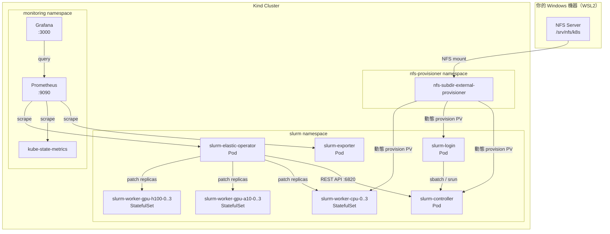
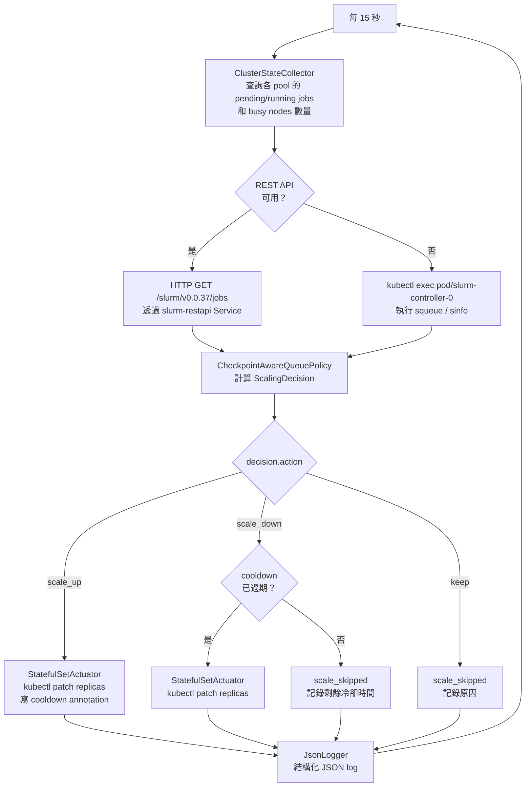
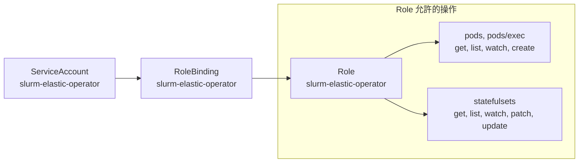
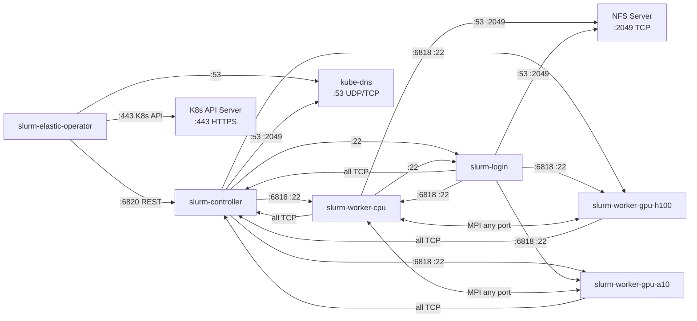
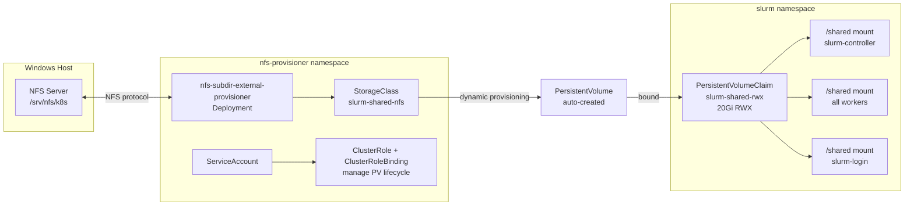
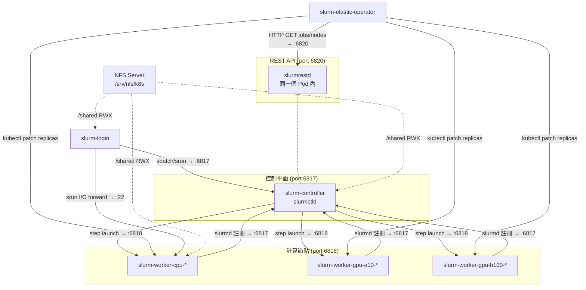
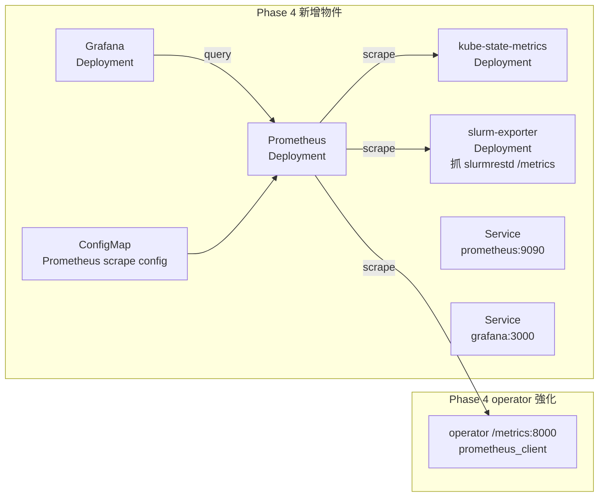

# Kubernetes Cluster Architecture

---

## 目錄

1. [30 秒快速概覽](#1-30-秒快速概覽)
2. [Namespace 佈局](#2-namespace-佈局)
3. [Phase 1 — 靜態 Slurm 叢集](#3-phase-1--靜態-slurm-叢集)
4. [Phase 2 — 彈性 Operator](#4-phase-2--彈性-operator)
5. [Phase 3 — 共享 NFS 儲存](#5-phase-3--共享-nfs-儲存)
6. [跨 Phase 的網路流量圖](#6-跨-phase-的網路流量圖)
7. [跨 Phase 的 Volume 掛載總覽](#7-跨-phase-的-volume-掛載總覽)
8. [Phase 4 監控架構（已部署）](#8-phase-4-監控架構已部署)
9. [常用 kubectl 指令速查](#9-常用-kubectl-指令速查)

---

## 1. 30 秒快速概覽

這個系統在單台 Windows 11 + Docker Desktop 上，用 Kind (Kubernetes in Docker) 模擬一個 HPC 叢集。核心概念是：

- Slurm 負責排程（誰的工作跑哪台機器、何時跑）
- Kubernetes 負責容器生命週期（Pod 的啟動、重啟、縮放）
- Elastic Operator 作為橋樑，監看 Slurm 的佇列，動態調整 Pod 數量
- NFS Shared Storage 讓所有 Pod 讀寫同一個檔案系統，job 輸出才看得到
- Prometheus + Grafana 視覺化整個 Slurm ↔ K8s 橋接過程



---

## 2. Namespace 佈局

整個系統使用三個 namespace：

| Namespace | 用途 | 誰建立 |
|-----------|------|--------|
| `slurm` | 所有 Slurm 相關的 Pod、Service、ConfigMap、Secret、NetworkPolicy | Phase 1 bootstrap |
| `nfs-provisioner` | NFS subdir external provisioner（動態 PV 供應商） | Phase 3 bootstrap |
| `monitoring` | Prometheus、Grafana、kube-state-metrics | Phase 4 bootstrap |

> **為什麼要分 Namespace？**
> Namespace 是 K8s 的隔離邊界。NetworkPolicy、RBAC 都以 namespace 為範圍。把 provisioner 和監控元件獨立出去，避免其 RBAC 污染 `slurm` namespace 的最小權限原則。跨 namespace 的 scrape 流量（Prometheus → slurm-exporter）透過 NetworkPolicy 明確開放。

---

## 3. Phase 1 — 靜態 Slurm 叢集

Phase 1 建立基本的 Slurm 叢集骨架。所有物件定義在 `phase1/manifests/slurm-static.yaml`（由 `phase1/scripts/render-slurm-static.py` 生成）。

### 3.1 Workloads

#### StatefulSet: `slurm-controller`
| 欄位 | 值 |
|------|-----|
| Replicas | 1（固定，不縮放） |
| Image | `slurm-controller:phase1` |
| 主要程序 | `slurmctld`（排程控制器）+ `slurmrestd`（REST API） |
| 容器 Port | 6817 (slurmctld), 6820 (slurmrestd), 22 (SSH) |
| Readiness Probe | `pgrep -x slurmctld && pgrep -x munged` |
| Liveness Probe | `pgrep -x slurmctld && pgrep -x slurmrestd`（初始等 60s） |

**為什麼用 StatefulSet？** Controller 需要穩定的 Pod 名稱（`slurm-controller-0`）和 DNS，讓 worker 在 `slurm.conf` 裡知道控制器在哪。Deployment 的 Pod 名稱是隨機的，不適合。

#### StatefulSet: `slurm-worker-cpu`
| 欄位 | 值 |
|------|-----|
| Replicas | 執行時 1–4（由 Operator 動態調整） |
| Image | `slurm-worker:phase1` |
| 主要程序 | `slurmd`（工作節點 daemon） |
| 容器 Port | 6818 (slurmd), 22 (SSH) |
| Slurm Features | `cpu`（用來讓 job 用 `--constraint=cpu` 指定） |

#### StatefulSet: `slurm-worker-gpu-a10`
| 欄位 | 值 |
|------|-----|
| Replicas | 執行時 0–4（需求時才拉起） |
| Image | `slurm-worker:phase1` |
| Slurm Features | `gpu,gpu-a10` |
| Slurm GRES | `gpu:a10:1`（在 Kind 用 `/dev/null` 模擬） |

#### StatefulSet: `slurm-worker-gpu-h100`
與 gpu-a10 結構相同，差別在 feature 為 `gpu-h100`、GRES 為 `gpu:h100:1`。

#### Deployment: `slurm-login`
| 欄位 | 值 |
|------|-----|
| Replicas | 1 |
| Image | `slurm-worker:phase1`（借用 worker image） |
| 用途 | 使用者透過 `kubectl exec` 進入此 Pod 提交 `sbatch` / `srun` |
| 主要程序 | `munged` + `sshd`（無 slurmd） |
| 特別掛載 | `slurm-ddp-runtime` ConfigMap → `/opt/slurm-runtime-src` |

> [!NOTE] 為什麼用 Deployment 而非 StatefulSet？
> Login node 不需要穩定編號，也不需要 Headless Service。Deployment 提供的 rolling update 機制更適合這種無狀態前端節點。

### 3.2 Services

K8s Service 解決「怎麼找到 Pod」的問題。有兩種類型：

**Headless Service**（`clusterIP: None`）— 不分配虛擬 IP，而是直接把 DNS 解析到每個 Pod 的 IP。StatefulSet 需要這個來讓每個 Pod 有可預測的 FQDN：

```
slurm-controller-0.slurm-controller.slurm.svc.cluster.local
slurm-worker-cpu-0.slurm-worker-cpu.slurm.svc.cluster.local
```

| Service 名稱 | 類型 | Port | 對應 Pod |
|-------------|------|------|---------|
| `slurm-controller` | Headless | 6817 | slurm-controller |
| `slurm-restapi` | ClusterIP | 6820 | slurm-controller（slurmrestd） |
| `slurm-worker-cpu` | Headless | 6818 | slurm-worker-cpu-* |
| `slurm-worker-gpu-a10` | Headless | 6818 | slurm-worker-gpu-a10-* |
| `slurm-worker-gpu-h100` | Headless | 6818 | slurm-worker-gpu-h100-* |
| `slurm-login` | ClusterIP | 22 | slurm-login |

> `slurm-restapi` 是唯一非 Headless 的 Slurm Service，因為 Operator 需要一個穩定的 ClusterIP 來連 HTTP。

### 3.3 ConfigMap

#### `slurm-config`
存放 Slurm 的兩個核心設定檔：

- **`slurm.conf`**: 宣告所有節點（含未來 max replicas 的節點）、partition、auth 方式、resource tracking 模式
  - `SelectType=select/cons_tres` → CPU 以 core 為單位可消耗資源
  - `AuthAltTypes=auth/jwt` → 啟用 JWT 認證供 slurmrestd 使用
- **`gres.conf`**: 宣告 GPU worker 的 GRES 設定（Kind 環境用 `File=/dev/null` 模擬）

> [!IMPORTANT]靜態預宣告節點
> `slurm.conf` 一開始就宣告了所有 pool 的最大節點數（如 cpu-0 到 cpu-3）。
> Operator 縮放時只改 StatefulSet replicas，不重新設定 Slurm。
> 好處是避免 scale event 時大量 DNS 解析失敗衝擊 slurmctld。

#### `slurm-ddp-runtime`
存放 DDP 訓練的 runtime 腳本，掛到 login pod 的 `/opt/slurm-runtime-src/`：

- `ddp-env.sh`: 設定 NCCL/Gloo 使用哪張網路介面（`net2`，Phase 2-E dual-subnet）
- `sample-ddp-job.sh`: 示範如何 `sbatch` 一個 DDP 訓練 job

### 3.4 Secrets

Secrets 由 `phase1/scripts/create-secrets.sh` 在本機生成並上傳到 K8s。

| Secret 名稱 | 內容 | 用途 |
|------------|------|------|
| `slurm-munge-key` | `munge.key`（隨機 512 bytes） | Munge 認證所有 Slurm daemon 之間的通訊 |
| `slurm-ssh-key` | `id_ed25519`, `id_ed25519.pub` | Pod 間 SSH 互信（srun step launch 需要） |
| `slurm-jwt-secret` | `jwt_hs256.key` | slurmrestd 的 JWT HS256 簽名金鑰 |

所有 Pod 透過 **Projected Secret Volume** 掛載這些 secrets，啟動時複製到需要的路徑。Projected Volume 讓多個 secret 合併進同一個掛載點。

---

## 4. Elastic Operator

Phase 2 加入 Python Operator，讓叢集能根據 Slurm 佇列自動縮放 worker pod 數量。

### 4.1 Operator Deployment：`slurm-elastic-operator`

| 欄位 | 值 |
|------|-----|
| Image | `slurm-elastic-operator:phase2` |
| 主要程序 | `phase2/operator/main.py`（Python polling loop） |
| Poll 間隔 | 15 秒（`POLL_INTERVAL_SECONDS`） |
| 查詢方式 | slurmrestd REST API（失敗時 fallback 到 kubectl exec） |

**Operator 控制迴圈：**



重要環境變數（由 bootstrap 設定）：

| 變數 | 說明 |
|------|------|
| `PARTITIONS_JSON` | 各 pool 的縮放策略（min/max replicas、cooldown、feature 對應、checkpoint_grace_seconds） |
| `SLURM_REST_URL` | `http://slurm-restapi.slurm.svc.cluster.local:6820` |
| `CHECKPOINT_GUARD_ENABLED` | 啟用 scale-down 前的 checkpoint 保護（`CHECKPOINT_PATH=""` 時自動停用） |
| `CHECKPOINT_GRACE_SECONDS` | job 啟動初期允許縮容的 grace period 秒數（預設 0） |
| `SLURM_JWT_KEY_PATH` | JWT 金鑰路徑（從 `slurm-jwt-secret` 掛載） |

Cooldown 持久化機制：
Operator 在 scale_up 成功後，會把時間戳寫到 StatefulSet 的 annotation `slurm.k8s/last-scale-up-at`（Unix epoch float）。Operator Pod 重啟時從 annotation 恢復，避免冷卻時間歸零後立即 scale-down。

Circuit breaker：
當 REST API 或 kubectl exec 連續失敗時，Operator 以指數退避（最長 60s）暫停 poll loop，防止錯誤 log 爆炸。`/tmp/operator-alive` 持續更新以維持 livenessProbe。第一次成功完整 poll 後寫入 `/tmp/operator-ready`（readinessProbe 依此判斷 Pod 就緒）。

### 4.2 RBAC



`patch` statefulsets 同時涵蓋：
1. 縮放（改 `spec.replicas`）
2. 寫 annotation（`kubectl annotate --overwrite`，底層也是 PATCH 請求）

### 4.3 NetworkPolicy

NetworkPolicy 同時控制 Ingress（接收流量）與 Egress（出站流量）：
- **Ingress**：預設拒絕所有，再依文件化通訊路徑白名單開放
- **Egress**：預設拒絕所有，再依各 Pod 類型最小化白名單開放（含 DNS、NFS、pod-to-pod）



十一條 NetworkPolicy 物件：

**Ingress 規則（4 條）：**

| Policy 名稱 | 保護的 Pod | 允許來源 |
|------------|-----------|---------|
| `default-deny-ingress` | 全部（`podSelector: {}`） | 預設拒絕所有 ingress |
| `allow-controller-ingress` | `slurm-controller` | workers, login, operator（port 6817/6820/22） |
| `allow-worker-ingress` | 三個 worker pools | controller, login（port 6818/22）；inter-worker MPI（any port） |
| `allow-login-ingress` | `slurm-login` | controller, workers（僅 port 22） |

**Egress 規則（7 條）：**

| Policy 名稱 | 限制的 Pod | 允許出站目標 |
|------------|-----------|------------|
| `default-deny-egress` | 全部（`podSelector: {}`） | 預設拒絕所有 egress |
| `allow-dns-egress` | 全部 | kube-dns UDP/TCP 53 |
| `allow-operator-egress` | operator | K8s API TCP 443（any）；controller TCP 6820 |
| `allow-controller-egress` | controller | workers TCP 6818/22；login TCP 22；slurmdbd TCP 6819；NFS TCP 2049 |
| `allow-worker-egress` | workers | controller（**所有 TCP 埠**）；inter-worker MPI any port；login TCP 22；NFS TCP 2049 |
| `allow-login-egress` | login | controller（**所有 TCP 埠**）；workers TCP 6818/22；NFS TCP 2049 |

> **為什麼 worker / login → controller 允許所有 TCP 埠？**
> Slurm 的 fan-out tree RPC 協定：slurmctld 向多節點廣播 `REQUEST_PING` 時，worker 必須把子樹回應（`RESPONSE_FORWARD_FAILED`）送回 controller 的**臨時埠**（OS 隨機分配，非固定 6817）。若只允許 6817，這些回應封包會被 NetworkPolicy drop，導致節點持續顯示 `idle*`（NOT_RESPONDING）。因此 worker 和 login 往 controller 的出站流量不設埠限制（出站目標仍嚴格限制在 controller pod）。
>
> **為什麼 worker inter-worker MPI 允許 any port？**
> NCCL 和 Gloo 使用 ephemeral port range（通常 1024–65535）進行 collective 通訊（AllReduce、AllGather 等）。若限制特定 port，DDP job 將無法完成 rendezvous。Egress 目標仍嚴格限制在 `slurm` namespace 內的 worker pods，不允許連到外部網路。
>
> **為什麼 K8s API egress 用 port 443 而非 podSelector？**
> K8s API server 在 Kind 中以 host network 運行，不是 `slurm` namespace 的 Pod，無法用 podSelector 匹配。允許 TCP 443 到任意目標，比「任意 egress」更受限，且是 operator in-cluster SDK 的必要條件。

---

## 5. Shared NFS Storage

Phase 3 解決「`sbatch` job 的輸出檔案只寫在 worker 本機，login 看不到」的問題。

### 5.1 架構概覽



### 5.2 StorageClass：`slurm-shared-nfs`

| 欄位 | 值 | 說明 |
|------|-----|------|
| Provisioner | `k8s-sigs.io/slurm-nfs-subdir-external-provisioner` | 對應 nfs-subdir-provisioner 設定的 name |
| ReclaimPolicy | `Retain` | PVC 刪除後 PV 不自動清除，保留資料 |
| VolumeBindingMode | `Immediate` | PVC 一建立就立刻 bind（不等 Pod 排程） |
| AccessMode | `ReadWriteMany (RWX)` | 多個 Pod 同時可讀寫 |

### 5.3 PersistentVolumeClaim：`slurm-shared-rwx`

```
Namespace: slurm
Capacity:  20Gi
Mode:      ReadWriteMany
Status:    Bound（Phase 3 bootstrap 後）
```

所有 StatefulSet 和 Login Deployment 都掛載這個 PVC 到 `/shared`。Job script 的輸出導向：

```bash
#SBATCH --output=/shared/out-%j.txt
#SBATCH --error=/shared/err-%j.txt
```

### 5.4 NFS Provisioner 的 RBAC

NFS provisioner 需要 **ClusterRole**（非 namespace 級 Role），因為它要操作 PersistentVolume 這種 cluster-scoped 資源（PV 不屬於任何 namespace）。

| RBAC 物件 | Namespace | 用途 |
|----------|-----------|------|
| `ServiceAccount` nfs-subdir-external-provisioner | nfs-provisioner | provisioner Pod 的身份 |
| `ClusterRole` nfs-subdir-external-provisioner-runner | cluster-wide | 管理 PV、PVC、StorageClass |
| `ClusterRoleBinding` run-nfs-subdir-external-provisioner | cluster-wide | 把 ClusterRole 綁到 ServiceAccount |
| `Role` leader-locking-nfs-subdir-external-provisioner | nfs-provisioner | leader election 用的 lease lock |
| `RoleBinding` leader-locking-nfs-subdir-external-provisioner | nfs-provisioner | 把 Role 綁到 ServiceAccount |

---

## 6. 跨 Phase 的網路流量圖

這張圖整合所有 Phase 的通訊路徑。虛線代表 Phase 3 後才有的路徑（NFS）。



---

## 7. 跨 Phase 的 Volume 掛載總覽

| Volume 名稱 | 類型 | 掛載到 controller | 掛載到 worker-* | 掛載到 login |
|------------|------|:-----------------:|:---------------:|:------------:|
| `slurm-config` | ConfigMap (`slurm-config`) | `/etc/slurm` ✓ | `/etc/slurm` ✓ | `/etc/slurm` ✓ |
| `slurm-secrets` | Projected Secret（munge + ssh + jwt） | `/slurm-secrets` ✓ | `/slurm-secrets` ✓（無 jwt） | `/slurm-secrets` ✓（無 jwt） |
| `slurm-ddp-runtime` | ConfigMap (`slurm-ddp-runtime`) | — | — | `/opt/slurm-runtime-src` ✓ |
| `shared-storage` | PVC (`slurm-shared-rwx`) | `/shared` ✓ | `/shared` ✓ | `/shared` ✓ |
| `slurm-jwt-secret` | Secret（operator 專用） | — | — | `/slurm-jwt/` ✓（operator） |
| `slurm-modulefile-openmpi` | ConfigMap（Phase 1 整合） | — | `/opt/modulefiles/openmpi` ✓ | `/opt/modulefiles/openmpi` ✓ |
| `slurm-modulefile-python3` | ConfigMap（Phase 1 整合） | — | `/opt/modulefiles/python3` ✓ | `/opt/modulefiles/python3` ✓ |
| `slurm-modulefile-cuda` | ConfigMap（Phase 1 整合） | — | `/opt/modulefiles/cuda` ✓ | `/opt/modulefiles/cuda` ✓ |

---

## 8. Phase 4 監控架構（已部署）

Phase 4 已完成部署，新增 `monitoring` namespace 並引入以下元件。詳細規格見 [`docs/monitoring.md`](monitoring.md)。



**Phase 4 新增的 K8s 物件：**

| 物件 | 類型 | Namespace | 說明 |
|------|------|-----------|------|
| `prometheus` | Deployment | monitoring | 集中收集 metrics，scrape 三個 endpoint |
| `grafana` | Deployment | monitoring | 視覺化 dashboard（Slurm↔K8s Bridge Overview 等三個看板） |
| `slurm-exporter` | Deployment | slurm | 把 slurmrestd REST 回應轉成 Prometheus metrics（port 9341） |
| `kube-state-metrics` | Deployment | monitoring | 暴露 StatefulSet replicas、Pod ready 等 K8s 原生指標 |
| `prometheus-config` | ConfigMap | monitoring | Prometheus scrape target 設定 |
| `prometheus` | Service | monitoring | 暴露 :9090 給 Grafana 查詢 |
| `grafana` | Service | monitoring | 暴露 :3000 給瀏覽器存取 |

**存取方式：**
```bash
kubectl -n monitoring port-forward svc/grafana 3000:3000     # Grafana（admin/admin）
kubectl -n monitoring port-forward svc/prometheus 9090:9090  # Prometheus
bash phase4/scripts/verify-phase4.sh                         # 驗證所有 metrics endpoint
```

---

## 9. 常用 kubectl 指令速查

```bash
# 看 slurm namespace 裡所有物件
kubectl -n slurm get all -o wide

# 看所有 StatefulSet 目前的 replicas
kubectl -n slurm get statefulsets

# 進 login pod 提交 job
kubectl -n slurm exec -it deploy/slurm-login -- bash

# 即時看 operator 的結構化 log
kubectl -n slurm logs deployment/slurm-elastic-operator -f | python -m json.tool

# 查 operator 寫的 cooldown annotation
kubectl -n slurm get statefulset slurm-worker-cpu \
  -o jsonpath='{.metadata.annotations.slurm\.k8s/last-scale-up-at}'

# 查目前有哪些 NetworkPolicy
kubectl -n slurm get networkpolicies

# 確認 PVC 狀態（Phase 3）
kubectl -n slurm get pvc slurm-shared-rwx

# 確認 NFS provisioner 是否正常
kubectl -n nfs-provisioner get pods

# 強制重跑全部部署
bash scripts/bootstrap-dev.sh

# 刪除叢集重來
kind delete cluster --name slurm-lab
```

---

## 附錄：物件總覽速查表

### `slurm` namespace

| 名稱 | Kind | Phase | 說明 |
|------|------|-------|------|
| `slurm-controller` | StatefulSet | 1 | slurmctld + slurmrestd |
| `slurm-worker-cpu` | StatefulSet | 1 | CPU worker pool（1–4 replicas） |
| `slurm-worker-gpu-a10` | StatefulSet | 1 | A10 GPU worker pool（0–4） |
| `slurm-worker-gpu-h100` | StatefulSet | 1 | H100 GPU worker pool（0–4） |
| `slurm-login` | Deployment | 1 | 使用者入口，提交 job |
| `slurm-elastic-operator` | Deployment | 2 | 自動縮放 operator |
| `slurm-controller` | Service (Headless) | 1 | controller DNS + :6817 |
| `slurm-restapi` | Service (ClusterIP) | 1 | slurmrestd :6820 |
| `slurm-worker-cpu` | Service (Headless) | 1 | worker DNS + :6818 |
| `slurm-worker-gpu-a10` | Service (Headless) | 1 | worker DNS + :6818 |
| `slurm-worker-gpu-h100` | Service (Headless) | 1 | worker DNS + :6818 |
| `slurm-login` | Service (ClusterIP) | 1 | login SSH :22 |
| `slurm-config` | ConfigMap | 1 | slurm.conf + gres.conf |
| `slurm-ddp-runtime` | ConfigMap | 2-E | DDP runtime scripts |
| `slurm-munge-key` | Secret | 1 | Munge 認證金鑰 |
| `slurm-ssh-key` | Secret | 1 | Pod 間 SSH 互信 |
| `slurm-jwt-secret` | Secret | 1 | REST API JWT 金鑰 |
| `slurm-elastic-operator` | ServiceAccount | 2 | operator 身份 |
| `slurm-elastic-operator` | Role | 2 | pods/exec + statefulsets |
| `slurm-elastic-operator` | RoleBinding | 2 | SA → Role |
| `default-deny-ingress` | NetworkPolicy | 2 | 拒絕所有 ingress（白名單起點） |
| `allow-controller-ingress` | NetworkPolicy | 2 | controller ingress 白名單（6817/6820/22） |
| `allow-worker-ingress` | NetworkPolicy | 2 | worker ingress 白名單（6818/22 + inter-worker any port） |
| `allow-login-ingress` | NetworkPolicy | 2 | login ingress 白名單（22） |
| `default-deny-egress` | NetworkPolicy | 2 | 拒絕所有 egress（白名單起點） |
| `allow-dns-egress` | NetworkPolicy | 2 | 所有 Pod → kube-dns UDP/TCP 53 |
| `allow-operator-egress` | NetworkPolicy | 2 | operator → K8s API (443) + controller (6820) |
| `allow-controller-egress` | NetworkPolicy | 2 | controller → workers (6818/22) + login (22) + NFS (2049) |
| `allow-worker-egress` | NetworkPolicy | 2 | worker → controller（所有埠）+ inter-worker（所有埠）+ login (22) + NFS (2049) |
| `allow-login-egress` | NetworkPolicy | 2 | login → controller（所有埠）+ workers (6818/22) + NFS (2049) |
| `allow-slurmdbd-egress` | NetworkPolicy | 2 | slurmdbd → MySQL (3306) |
| `slurm-shared-rwx` | PersistentVolumeClaim | 3 | 20Gi RWX 共享儲存 |
| `slurm-shared-nfs` | StorageClass | 3 | NFS dynamic provisioner |

### `monitoring` namespace

| 名稱 | Kind | Phase | 說明 |
|------|------|-------|------|
| `prometheus` | Deployment | 4 | Prometheus 主程序，scrape 三個 target |
| `grafana` | Deployment | 4 | Grafana（Bridge Overview、Slurm State、Operator 三看板） |
| `kube-state-metrics` | Deployment | 4 | K8s 原生 StatefulSet/Pod 狀態指標 |
| `prometheus` | Service | 4 | :9090 ClusterIP |
| `grafana` | Service | 4 | :3000 ClusterIP |

### `nfs-provisioner` namespace

| 名稱 | Kind | Phase | 說明 |
|------|------|-------|------|
| `nfs-subdir-external-provisioner` | Deployment | 3 | 動態 PV 供應商 |
| `nfs-subdir-external-provisioner` | ServiceAccount | 3 | provisioner 身份 |
| `nfs-subdir-external-provisioner-runner` | ClusterRole | 3 | 管理 PV 生命週期 |
| `run-nfs-subdir-external-provisioner` | ClusterRoleBinding | 3 | SA → ClusterRole |
| `leader-locking-nfs-subdir-external-provisioner` | Role | 3 | leader election |
| `leader-locking-nfs-subdir-external-provisioner` | RoleBinding | 3 | SA → Role |
