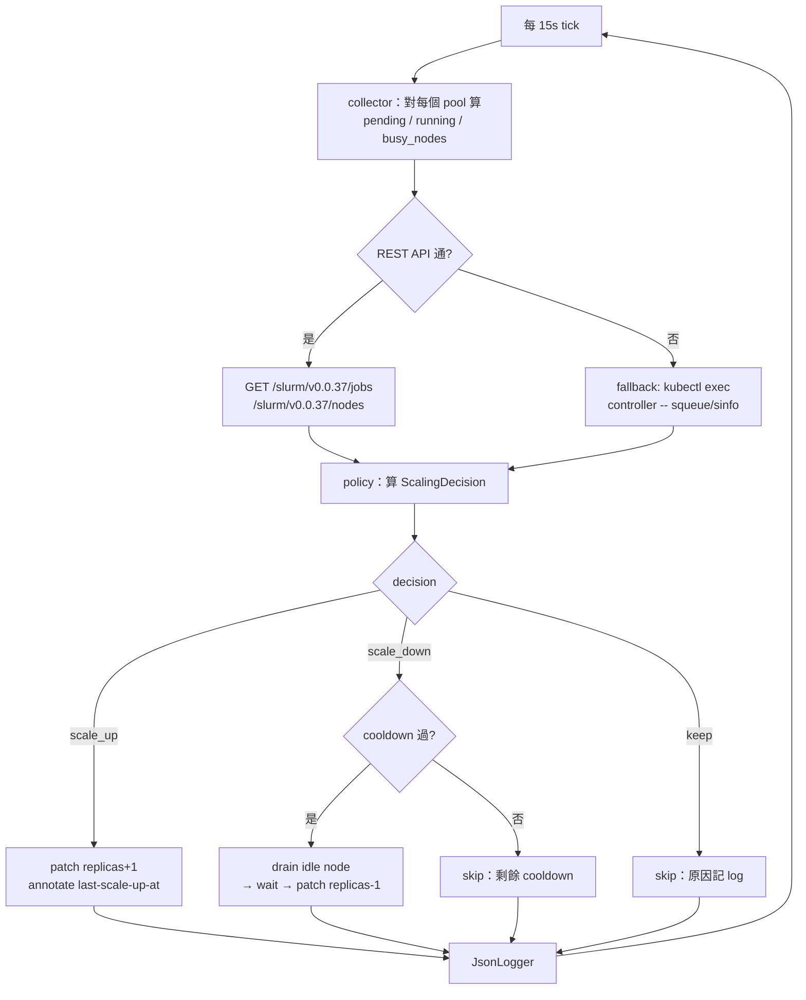
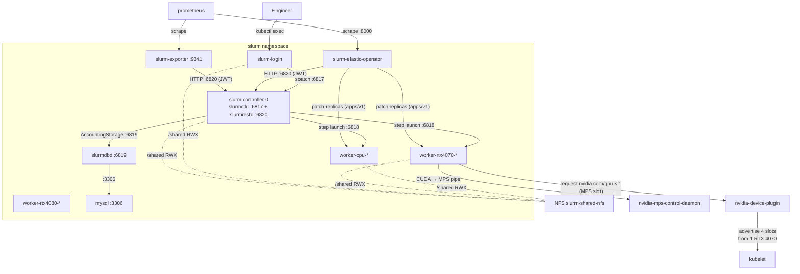

# Kubernetes Cluster Architecture

> 本文件對齊 Phase 5-A 之後的實作（Helm chart cutover + k3s + RTX 4070 已驗證）。
> 部署來源由 `manifests/core/slurm-static.yaml` 改為 `chart/`（Helm chart）；
> `bootstrap.sh` / `render-core.py` 已退役。

---

## 目錄

1. [架構總覽](#1-架構總覽)
2. [Namespace 佈局](#2-namespace-佈局)
3. [核心 Slurm 叢集（slurm namespace）](#3-核心-slurm-叢集slurm-namespace)
   - [3.1 Workloads](#31-workloads)
   - [3.2 Services](#32-services)
   - [3.3 ConfigMaps](#33-configmaps)
   - [3.4 Secrets](#34-secrets)
   - [3.5 PVC / 持久化儲存](#35-pvc--持久化儲存)
4. [Elastic Operator](#4-elastic-operator)
5. [GPU Operator + MPS（gpu-operator namespace）](#5-gpu-operator--mpsgpu-operator-namespace)
6. [共享 NFS 儲存（nfs-provisioner namespace）](#6-共享-nfs-儲存nfs-provisioner-namespace)
7. [監控堆疊（monitoring namespace）](#7-監控堆疊monitoring-namespace)
8. [NetworkPolicy](#8-networkpolicy)
9. [網路與資源流量總覽](#9-網路與資源流量總覽)
10. [Volume 掛載總覽](#10-volume-掛載總覽)
11. [常用 kubectl / helm 指令速查](#11-常用-kubectl--helm-指令速查)
12. [附錄：K8s 物件速查表](#12-附錄k8s-物件速查表)

---

## 1. 架構總覽

實機運行於 **Ubuntu 24.04 + k3s v1.34 + RTX 4070 (driver 595-open)**，由
**Helm chart `chart/`** 一鍵部署整個 Slurm 平台。Kind / Docker Desktop 仍然支援
作為開發 baseline（`values.yaml` 的預設值）。

- **Slurm**：HPC 排程器，靜態預宣告所有節點到 `maxNodes`；scaling 只改 K8s replicas，不重新生成 `slurm.conf`
- **Kubernetes (k3s)**：管理 Pod 生命週期、Service DNS、Volume、NetworkPolicy
- **Elastic Operator**：Python 控制迴圈，輪詢 slurmrestd 並 patch worker StatefulSet replicas
- **GPU Operator + MPS Control Daemon**：NVIDIA 官方 operator 提供 device-plugin、driver validator 與 MPS sharing；單張 RTX 4070 可同時切成 4 個 `nvidia.com/gpu` slot
- **NFS subdir provisioner**：把 host 上 `/srv/nfs/k8s` 動態 provision 為 RWX PVC，所有 Slurm pod 共享 `/shared`
- **Prometheus + Grafana + Alertmanager**：scrape slurm-exporter、operator、kube-state-metrics

```mermaid
graph TD
    USER[Engineer\nssh / kubectl exec] --> LOGIN
    subgraph HOST["Linux Host (acane: Ubuntu 24.04 + k3s)"]
        NVDR[NVIDIA Driver 595-open\n+ container-toolkit]
        GPU0[/dev/nvidia0 — RTX 4070]
        NFSH[NFS export\n/srv/nfs/k8s]
    end

    subgraph K3S["k3s cluster"]
        subgraph SL["slurm namespace"]
            LOGIN[slurm-login\nDeployment]
            CTL[slurm-controller-0\nStatefulSet :6817 :6820]
            OP[slurm-elastic-operator\nDeployment]
            EXP[slurm-exporter\nDeployment :9341]
            CPU[slurm-worker-cpu\nStatefulSet]
            R70[slurm-worker-gpu-rtx4070\nStatefulSet]
            R80[slurm-worker-gpu-rtx4080\nStatefulSet]
            DBD[slurmdbd\nDeployment :6819]
            SQL[mysql\nStatefulSet :3306]
        end
        subgraph GO["gpu-operator namespace"]
            DP[nvidia-device-plugin\nDaemonSet]
            MPS[nvidia-device-plugin-\nmps-control-daemon\nDaemonSet]
            NFD[NFD master/worker\n+ gpu-feature-discovery]
        end
        subgraph MON["monitoring namespace"]
            PROM[prometheus :9090]
            GRAF[grafana :3000]
            AM[alertmanager :9093]
            KSM[kube-state-metrics]
        end
        subgraph NP["nfs-provisioner namespace"]
            PROV[nfs-subdir-external-\nprovisioner]
        end
    end

    LOGIN -- sbatch/srun :6817 --> CTL
    CTL -- step launch :6818 --> CPU
    CTL -- step launch :6818 --> R70
    OP -- HTTP :6820 --> CTL
    OP -- patch replicas --> CPU
    OP -- patch replicas --> R70
    EXP -- HTTP :6820 --> CTL
    PROM -- scrape --> EXP
    PROM -- scrape --> OP
    PROM -- scrape --> KSM
    GRAF --> PROM
    PROM --> AM

    CTL -- "AccountingStorage :6819" --> DBD
    DBD -- ":3306" --> SQL

    DP -- "advertise nvidia.com/gpu × 4" --> R70
    MPS -- "manage MPS daemon" --> GPU0
    R70 -- "use GPU + MPS" --> GPU0
    NVDR --> GPU0

    PROV -- NFS mount --> NFSH
    PROV -- "dynamic PV (RWX)" --> CTL
    PROV -- "dynamic PV (RWX)" --> CPU
    PROV -- "dynamic PV (RWX)" --> R70
    PROV -- "dynamic PV (RWX)" --> LOGIN
```

**部署來源：**

| 階段 | 指令 | 說明 |
|------|------|------|
| 0. 系統 / GPU driver | `bash scripts/setup-linux-gpu.sh` | 安裝 nvidia-driver + container-toolkit + 設 k3s default runtime |
| 1. NFS server | `sudo bash scripts/setup-nfs-server.sh` | host 上 export `/srv/nfs/k8s` |
| 2. Secrets | `bash scripts/create-secrets.sh` | munge / ssh / jwt / mysql Secret |
| 3. GPU Operator | `DEFAULT_CONFIG_KEY=rtx4070-mps bash scripts/install-gpu-operator.sh` | 安裝 NVIDIA GPU Operator（獨立 helm release） |
| 4. Slurm 平台 | `helm install slurm-platform ./chart -f chart/values-k3s.yaml -n slurm` | 一鍵部署 controller / workers / login / operator / exporter / monitoring / storage |
| 5. Accounting（暫時保留） | `kubectl apply -f manifests/core/slurm-accounting.yaml` | slurmdbd + mysql + 對應 Secret，尚未併入 chart |
| 6. Lmod | `bash scripts/bootstrap-lmod.sh` | 在 NFS 上佈署 modulefiles + sample job |

---

## 2. Namespace 佈局

| Namespace | 用途 | PSS Enforce | 建立者 |
|-----------|------|------------|--------|
| `slurm` | Slurm 控制平面 + workers + login + operator + exporter + slurmdbd + mysql | `baseline` | chart `templates/namespace.yaml`（`resource-policy: keep`） |
| `gpu-operator` | NVIDIA GPU Operator 全套元件（device-plugin、MPS daemon、NFD、validators） | `privileged` | chart `templates/gpu/gpu-operator-namespace.yaml`（與 GPU Operator helm release 共享） |
| `monitoring` | Prometheus、Grafana、Alertmanager、kube-state-metrics | （未強制） | chart `templates/monitoring/namespace.yaml` |
| `nfs-provisioner` | NFS subdir external provisioner Deployment | （未強制） | chart `templates/storage.yaml`（同樣 `keep`） |

> **為何 `slurm` 用 baseline 而非 restricted？**
> Worker pod 在 k3s 模式會掛 `runtimeClassName: nvidia`，這需要 baseline。將
> 監控堆疊 / provisioner / GPU operator 各自拆 namespace 是為了 NetworkPolicy
> 與 RBAC 邊界更乾淨。

> **為何 namespace 不掛 helm hook？**
> 之前的版本曾在 namespace 上掛 `helm.sh/hook: pre-install`，搭配預設
> `before-hook-creation` 刪除策略會在每次 install/upgrade 時整個 namespace
> CASCADE 刪除，把 Secret、PVC、out-of-release 的 mysql / slurmdbd / lmod
> ConfigMap 一起帶走。改為純 release 物件 + `resource-policy: keep`，並依
> 賴 `--create-namespace` 與 helm 3.16 的 `--take-ownership` 收編現有
> namespace。

---

## 3. 核心 Slurm 叢集（slurm namespace）

由 chart 渲染：`controller.yaml`、`workers.yaml`（per-pool range）、
`login.yaml`、`operator.yaml`、`services.yaml`、`configmap-static.yaml`、
`configmap-nodes.yaml`、`pvc.yaml`、`network-policy.yaml`。

### 3.1 Workloads

#### StatefulSet `slurm-controller`（replicas=1，固定）

| 項目 | 值 |
|------|-----|
| Image | `slurm-controller:latest` |
| 主程序 | `slurmctld` + `slurmrestd`（同 pod） + `sshd` + `munged` |
| 容器 Port | 6817 (slurmctld), 6820 (slurmrestd), 22 (SSH) |
| 啟動順序 | munged → 等 slurmdbd:6819 TCP 通 → 啟 `slurmctld` → 等 `scontrol ping` 成功 → 用 `scontrol token` 拿 JWT 起 `slurmrestd` |
| Readiness | `pgrep slurmctld && pgrep munged` |
| Liveness | `pgrep slurmctld && pgrep slurmrestd`（initialDelay 60s） |
| PVC | `slurm-ctld-state` 1Gi RWO（`StateSaveLocation`，跨重啟保住 job queue） |

#### StatefulSet `slurm-worker-cpu`（replicas 1–4）

| 項目 | 值 |
|------|-----|
| Image | `slurm-worker:latest` |
| Features | `cpu`（partition `cpu`，預設） |
| Gres | 無 |
| 縮放 | Operator 依 pending CPU job 數量 patch replicas |

#### StatefulSet `slurm-worker-gpu-rtx4070`（replicas 0–2，min 0）

| 項目 | 值 |
|------|-----|
| Image | `slurm-worker:latest` |
| `runtimeClassName` | `nvidia`（k3s 模式自動加上） |
| Resource limits | `nvidia.com/gpu: 1` |
| Features | `gpu, gpu-rtx4070` |
| Gres | `gpu:rtx4070:1`, `mps:100`（單卡切成 4 slot，單 slot 25%） |
| 對應 device-plugin config key | `rtx4070-mps`（節點 label `nvidia.com/device-plugin.config=rtx4070-mps` 觸發） |

#### StatefulSet `slurm-worker-gpu-rtx4080`（replicas 0–2，預留）

與 rtx4070 結構相同，差別在 features=`gpu,gpu-rtx4080`、gres=`gpu:rtx4080:1`、device-plugin config key=`rtx4080-exclusive`。目前實機沒有 RTX 4080，replicas 永遠 0。

#### Deployment `slurm-login`（replicas=1）

| 項目 | 值 |
|------|-----|
| Image | `slurm-worker:latest`（共用 worker image） |
| 主程序 | `munged` + `sshd`（無 slurmd） |
| 用途 | 使用者透過 `kubectl exec deploy/slurm-login -- bash` 進入並 `sbatch` |
| 特別掛載 | `slurm-ddp-runtime` ConfigMap → `/opt/slurm-runtime-src` |

#### Deployment `slurm-elastic-operator`（replicas=1）

詳見 §4。

#### Deployment `slurm-exporter`（replicas=1）

| 項目 | 值 |
|------|-----|
| Image | `slurm-exporter:latest` |
| 主程序 | `docker/slurm-exporter/exporter.py`（讀 slurmrestd `/jobs`、`/nodes` → Prometheus metrics） |
| Port | 9341 (`/metrics`) |
| 認證 | 從 `slurm-jwt-secret` 掛載 `jwt_hs256.key`，自簽 JWT 呼叫 slurmrestd |

#### Deployment `slurmdbd` + StatefulSet `mysql`（暫時保留）

由 `manifests/core/slurm-accounting.yaml` 套用（尚未併入 chart）。chart 的
NetworkPolicy 已預留 `app=slurmdbd`、`app=mysql` 的選擇器，因此搭配此 manifest
可直接套用。

| 物件 | Kind | Port | 說明 |
|------|------|------|------|
| `slurmdbd` | Deployment | 6819 | Slurm accounting daemon |
| `mysql` | StatefulSet (1 replica) | 3306 | slurmdbd 的後端資料庫；PVC `mysql-data-mysql-0` 5Gi RWO |
| `slurm-mysql-secret` | Secret | — | mysql root + slurmdbd user 密碼 |
| `slurmdbd-config` | ConfigMap | — | slurmdbd.conf |

> Controller 啟動時若 `slurm.conf` 帶 `AccountingStorageType=accounting_storage/slurmdbd`，會先 `until echo > /dev/tcp/slurmdbd/6819` 等待 slurmdbd 起來再啟動 slurmctld，避免 missing TRES 引發 fatal exit。

### 3.2 Services

| Service | 類型 | Port | 對應 Pod | 說明 |
|---------|------|------|---------|------|
| `slurm-controller` | Headless (`clusterIP: None`, `publishNotReadyAddresses: true`) | 6817 | slurm-controller | NodeName / SlurmctldHost 解析；publish-not-ready 讓 worker 在 controller 還沒過 readiness 之前就能 DNS 解析 |
| `slurm-restapi` | ClusterIP | 6820 | slurm-controller | slurmrestd HTTP 入口（operator + exporter 用） |
| `slurm-worker-cpu` | Headless | 6818 | worker pods | per-pod DNS（StatefulSet ordinal） |
| `slurm-worker-gpu-rtx4070` | Headless | 6818 | worker pods | 同上 |
| `slurm-worker-gpu-rtx4080` | Headless | 6818 | worker pods | 同上 |
| `slurm-login` | ClusterIP | 22 | slurm-login | login SSH（內部用） |
| `slurm-exporter` | ClusterIP | 9341 | slurm-exporter | Prometheus scrape target |
| `slurm-elastic-operator` | ClusterIP | 8000 | operator | operator `/metrics`（Prometheus scrape） |
| `slurmdbd` | ClusterIP | 6819 | slurmdbd | controller → AccountingStorageHost |
| `mysql` | Headless | 3306 | mysql | slurmdbd → 後端 DB |

### 3.3 ConfigMaps

#### `slurm-config-static`（chart `_helpers.tpl::slurmConfStatic`）

`slurm.conf` 的 header 區段。每次 helm upgrade 改這份會 roll 所有 Slurm pod
（因為 AuthType / accounting / TaskPlugin 一改必須協調重啟）。結尾為 `Include
/etc/slurm/slurm.nodes.conf`，把節點宣告獨立切到另一份 ConfigMap。

關鍵欄位（皆來自 `values.yaml::slurm`）：

- `SelectType=select/cons_tres` / `SelectTypeParameters=CR_Core`：CPU 以 core 為單位可消耗
- `TaskPlugin=task/none`、`ProctrackType=proctrack/linuxproc`：Slurm 21.08（Ubuntu 22.04 image）對 cgroup v2 支援不完整，GPU 隔離由 NVIDIA runtime + device-plugin 處理
- `AuthAltTypes=auth/jwt`、`AuthAltParameters=jwt_key=/slurm-secrets/jwt_hs256.key`：slurmrestd 認證
- `AccountingStorageType=accounting_storage/slurmdbd` + `AccountingStorageTRES=gres/gpu,gres/mps`：把 GPU / MPS 用量記入 sacct
- `CompleteWait=0`：避免 worker pod 在 epilog 期間被驅逐後 job 卡在 COMPLETING

#### `slurm-config-nodes`（chart `_helpers.tpl::slurmConfNodes` + `gresConf`）

- `slurm.nodes.conf`：依 `values.pools` 順序展開，從 `<statefulset>-0` 到 `<statefulset>-(maxNodes-1)`，並輸出 `PartitionName=...`（GPU 空 partition 會被略過）
- `gres.conf`：每個 GPU 節點輸出 `NodeName=... Name=gpu Type=rtx4070 Count=1 File=/dev/nvidia0`；MPS 節點輸出 `NodeName=... Name=mps Count=100`（不帶 File / Type，由 device-plugin 接管）

> **靜態預宣告**：`maxNodes=2` 的 GPU pool 從一開始就在 `slurm.nodes.conf` 寫出 `slurm-worker-gpu-rtx4070-0`、`-1` 兩條 NodeName。Operator 縮放只動 K8s replicas，slurmctld 看到的節點名單永遠不變，避免 scale event 期間引發大量 DNS 解析失敗。

#### `slurm-ddp-runtime`（chart `templates/login.yaml` 內聯）

掛在 login pod 的 `/opt/slurm-runtime-src/`，啟動時複製到 `/opt/slurm-runtime/`：

- `ddp-env.sh`：偵測 `net2` 介面 IP，設定 `NCCL_SOCKET_IFNAME` / `GLOO_SOCKET_IFNAME` / `MASTER_PORT` / `SLURM_DATA_IP`
- `sample-ddp-job.sh`：sbatch 樣板，內部 `srun` 會 source `ddp-env.sh` 並印環境變數

#### Lmod modulefile ConfigMaps（`manifests/core/lmod-modulefiles.yaml`，外掛）

| ConfigMap | 掛載點 | 內容 |
|-----------|-------|------|
| `slurm-modulefile-openmpi` | `/opt/modulefiles/openmpi` | `openmpi/4.1.lua` |
| `slurm-modulefile-python3` | `/opt/modulefiles/python3` | `python3/system.lua` |
| `slurm-modulefile-cuda` | `/opt/modulefiles/cuda` | `cuda/13.lua` |

### 3.4 Secrets

由 `scripts/create-secrets.sh` 建立，chart 不渲染 secret 物件、僅以
`projected volume` 掛載：

| Secret | 內容 | 用途 | 掛載對象 |
|--------|------|------|---------|
| `slurm-munge-key` | `munge.key`（隨機 512 bytes） | Munge 認證所有 Slurm daemon | controller, workers, login |
| `slurm-ssh-key` | `id_ed25519` + `.pub` | Pod 間 SSH 互信（srun step launch） | controller, workers, login |
| `slurm-jwt-secret` | `jwt_hs256.key` | slurmrestd JWT HS256 | controller, operator, exporter |
| `slurm-mysql-secret` | mysql 密碼 | slurmdbd + mysql 啟動 | slurmdbd, mysql |

### 3.5 PVC / 持久化儲存

| PVC | Namespace | Capacity | AccessMode | StorageClass | 用途 |
|-----|-----------|---------|-----------|--------------|------|
| `slurm-ctld-state` | slurm | 1Gi | RWO | local-path（k3s 預設） | slurmctld `StateSaveLocation` |
| `mysql-data-mysql-0` | slurm | 5Gi | RWO | local-path | slurmdbd 後端 DB |
| `slurm-shared-rwx` | slurm | 20Gi | RWX | `slurm-shared-nfs` | `/shared` 跨 pod 共享儲存（job 輸出、checkpoint、Lmod modulefile） |

---

## 4. Elastic Operator

Python operator 監看 Slurm 佇列並 patch worker StatefulSet replicas。原始碼在
`operator/`：

| 模組 | 職責 |
|------|------|
| `models.py` | dataclass：PartitionConfig / Config / PartitionState / ScalingDecision |
| `metrics.py` | Prometheus metric 定義 |
| `k8s.py` | StatefulSet patch、pod exec、node drain/resume |
| `slurm.py` | slurmrestd HTTP + JWT（stdlib `urllib`） |
| `collector.py` | 載入 `PARTITIONS_JSON` + 收集每個 pool 的 pending/running/idle 數 |
| `policy.py` | `CheckpointAwareQueuePolicy`（純邏輯，無 I/O） |
| `app.py` | JsonLogger + StatefulSetActuator + 主迴圈 |
| `main.py` | 入口 |

控制流程：



關鍵環境變數（chart `templates/operator.yaml` 設定）：

- `PARTITIONS_JSON` — 由 `_helpers.tpl::partitionsJson` 從 `values.pools` 自動生成；不再從外部 JSON 讀取
- `SLURM_REST_URL` — `http://slurm-restapi.slurm.svc.cluster.local:6820`
- `SLURM_JWT_KEY_PATH` — `/slurm-jwt/jwt_hs256.key`
- `POLL_INTERVAL_SECONDS` — 預設 15
- `SCALE_DOWN_COOLDOWN_SECONDS` — 預設 60
- `CHECKPOINT_GUARD_ENABLED` / `CHECKPOINT_PATH` / `MAX_CHECKPOINT_AGE_SECONDS` / `CHECKPOINT_GRACE_SECONDS` — checkpoint 保護開關

**Cooldown 持久化**：scale-up 時間戳寫到 StatefulSet annotation
`slurm.k8s/last-scale-up-at`；operator 重啟讀回，避免冷卻歸零。

**Circuit breaker**：連續 poll 失敗時指數退避（最長 60s），`/tmp/operator-alive`
持續更新維持 livenessProbe；首次成功 poll 後寫 `/tmp/operator-ready`。

**RBAC**（chart `templates/operator.yaml`）：

| 物件 | Scope | 權限 |
|------|-------|------|
| ServiceAccount `slurm-elastic-operator` | slurm namespace | — |
| Role `slurm-elastic-operator` | slurm namespace | `pods, pods/exec`：get/list/watch/create；`statefulsets`：get/list/watch/patch/update |
| RoleBinding `slurm-elastic-operator` | slurm namespace | SA → Role |

---

## 5. GPU Operator + MPS（gpu-operator namespace）

由 NVIDIA 官方 helm chart `nvidia/gpu-operator` 安裝（`scripts/install-gpu-operator.sh`，**獨立 helm release，不在 slurm-platform chart 內**），但 chart 仍負責：

- 建立 `gpu-operator` namespace（`pod-security.kubernetes.io/enforce: privileged`），加上 `helm.sh/resource-policy: keep`
- 寫入 device-plugin 設定 ConfigMap `slurm-platform-device-plugin-config`（key: `default`、`rtx4070-mps`、`rtx4080-exclusive`）
- post-install Job `slurm-platform-gpu-labeler`：依 `values.gpu.nodeAssignments` 把 `nvidia.com/device-plugin.config=<key>` 貼到對應節點

**GPU Operator 部署的物件（單張 RTX 4070 上實機）：**

| 物件 | Kind | 說明 |
|------|------|------|
| `gpu-operator` | Deployment | operator 本體 |
| `gpu-operator-node-feature-discovery-master` | Deployment | NFD master：彙整 worker labels |
| `gpu-operator-node-feature-discovery-gc` | Deployment | NFD garbage collector |
| `gpu-operator-node-feature-discovery-worker` | DaemonSet | 偵測 PCI/CPU 特徵並上 label |
| `gpu-feature-discovery` | DaemonSet | 偵測 GPU 規格（model、memory、compute capability） |
| `nvidia-device-plugin-daemonset` | DaemonSet | 廣告 `nvidia.com/gpu`；讀 `slurm-platform-device-plugin-config[<label-key>]` 決定 sharing 策略 |
| `nvidia-device-plugin-mps-control-daemon` | DaemonSet | 啟動 MPS control daemon（前景模式 -f）；只在 `nvidia.com/mps.capable=true` 節點上跑 |
| `nvidia-operator-validator` | DaemonSet | toolkit/runtime/cuda/plugin/mps 全套 validator |
| `nvidia-cuda-validator` / `nvidia-device-plugin-validator` | Job | 一次性 sanity check |

**MPS sharing 設定（`values.yaml::gpu.deviceConfigs.rtx4070-mps`）：**

```yaml
rtx4070-mps:
  version: v1
  sharing:
    mps:
      resources:
        - name: nvidia.com/gpu
          replicas: 4
```

device-plugin 會把 1 張實體 RTX 4070 廣告為 4 個 `nvidia.com/gpu` slot。
Slurm 配合 `Gres=gpu:rtx4070:1,mps:100` + `--gres=mps:N` 旗標切 SM 比例（每 25 對應一個 MPS slot）。

> 為何不再用自己寫的 `mps-daemonset.yaml`？
> v26.3.x 之後 GPU Operator 內建 `nvidia-device-plugin-mps-control-daemon`，把 MPS daemon 啟動 / 跨 pod 共享 pipe / pinned-mem reservation 全包了。先前自寫的 DaemonSet 在啟動時序上有 race（device-plugin 先讀到舊 `default` config，等 NFD 標籤上來後 config-manager panic）。詳見 `docs/migration.md`。

**節點 label 連動：**

```
post-install Job 貼上：
  nvidia.com/device-plugin.config=rtx4070-mps  （values.gpu.nodeAssignments）

GPU Operator NFD 自動補：
  nvidia.com/gpu.product=NVIDIA-GeForce-RTX-4070-SHARED
  nvidia.com/gpu.replicas=4
  nvidia.com/gpu.sharing-strategy=mps
  nvidia.com/mps.capable=true
  nvidia.com/cuda.driver-version.full=595.58.03
  ...
```

---

## 6. 共享 NFS 儲存（nfs-provisioner namespace）

由 chart `templates/storage.yaml` 渲染（gated by `storage.enabled=true`）。

**為何要動態 provisioner 而非 hostPath？**
單一 host 上 hostPath 無 RWX，跨 pod 無法協同；NFS subdir 動態 provisioner
為每個 PVC 在 NFS root 下開一個子目錄，所有 pod 透過 NFS RWX 共享同一視圖。

```mermaid
flowchart LR
    HOST[Linux host\n/srv/nfs/k8s\nNFSv4 export]

    subgraph NS_NP["nfs-provisioner ns"]
        SA[ServiceAccount]
        CR[ClusterRole + Binding\n(PV lifecycle, cluster-wide)]
        ROLE[Role + Binding\n(leader lease)]
        DEPL[Deployment\nnfs-subdir-external-provisioner]
    end

    SC[StorageClass\nslurm-shared-nfs\nReclaim=Retain\nBinding=Immediate]

    subgraph NS_S["slurm ns"]
        PVC[PVC slurm-shared-rwx\n20Gi RWX]
        CTL[/shared mount]
        WORK[/shared mount]
        LOG[/shared mount]
    end

    HOST <-- NFSv4 :2049 --> DEPL
    SA --> CR
    SA --> ROLE
    DEPL -- "watch PVC" --> SC
    SC -- "dynamic provision" --> PV[(PersistentVolume)]
    PV -- bound --> PVC
    PVC --> CTL
    PVC --> WORK
    PVC --> LOG
```

**StorageClass `slurm-shared-nfs`：**

| 欄位 | 值 |
|------|-----|
| `provisioner` | `k8s-sigs.io/slurm-nfs-subdir-external-provisioner`（**immutable**；改了會擋住所有現存 PVC 重 bind） |
| `reclaimPolicy` | `Retain`（PVC 刪掉 PV 仍保留，避免誤刪資料） |
| `volumeBindingMode` | `Immediate`（PVC 一建立立刻 bind） |
| `allowVolumeExpansion` | `true` |
| `parameters.archiveOnDelete` | `false` |

> chart 的 StorageClass 與 namespace 都掛 `helm.sh/resource-policy: keep`，
> `helm uninstall` 時不會把 storageClass 拔掉造成新 PVC bind 失敗。

**PVC 掛載點：** controller / 三個 worker pool / login 都掛 `/shared`（`storage.mountInPods=true`）。

**`/shared` 內部結構：**

```
/shared/
├── jobs/             # job 輸出（sbatch --output / --error）
├── checkpoints/      # 訓練 checkpoint
├── modulefiles/      # bootstrap-lmod.sh 寫入 + ConfigMap 同步
└── scripts/          # 使用者自己的 sbatch script
```

---

## 7. 監控堆疊（monitoring namespace）

chart `templates/monitoring/`（gated by `monitoring.enabled=true`）。

```mermaid
flowchart LR
    subgraph M["monitoring ns"]
        PROM[prometheus :9090\n+ alert rules ConfigMap]
        AM[alertmanager :9093\n+ slack receiver (optional)]
        GRAF[grafana :3000\n+ datasource + 3 dashboards]
        KSM[kube-state-metrics :8080]
    end
    subgraph S["slurm ns"]
        EXP[slurm-exporter :9341]
        OP[slurm-elastic-operator :8000]
    end
    subgraph CTL["slurm-controller pod"]
        REST[slurmrestd :6820]
    end

    EXP -- "JWT-auth GET\n/slurm/v0.0.37/jobs,nodes" --> REST
    PROM -- scrape :9341 --> EXP
    PROM -- scrape :8000 --> OP
    PROM -- scrape :8080 --> KSM
    PROM -- alerts --> AM
    GRAF -- query --> PROM
```

| 物件 | Kind | 說明 |
|------|------|------|
| `prometheus` | Deployment | scrape 三個 endpoint，alert rule 由 ConfigMap `prometheus-alert-rules` 掛載 |
| `prometheus-config` | ConfigMap | `prometheus.yml`（scrape jobs + Alertmanager target） |
| `prometheus-alert-rules` | ConfigMap | SLO alert（job_pending_too_long、operator_circuit_open 等） |
| `alertmanager` | Deployment | 預設 sink 是 `dev-null`；當 `values.monitoring.alertmanager.slack.webhookUrl` 非空時自動切到 Slack receiver |
| `alertmanager-config` | ConfigMap | route/receiver |
| `grafana` | Deployment | admin/admin（預設） |
| `grafana-provisioning` | ConfigMap | datasource (Prometheus) + dashboard provider 設定 |
| `grafana-dashboards` | ConfigMap | 3 個 dashboard JSON：`bridge-overview`、`operator`、`sla-efficiency`（由 `chart/dashboards/*.json` 經 `Files.Glob.AsConfig` 內嵌） |
| `kube-state-metrics` | Deployment + RBAC | 預設端點，scrape K8s 物件狀態 |

**存取：**

```bash
sudo kubectl -n monitoring port-forward svc/grafana 3000:3000
sudo kubectl -n monitoring port-forward svc/prometheus 9090:9090
sudo kubectl -n monitoring port-forward svc/alertmanager 9093:9093
bash scripts/verify-monitoring.sh   # 一鍵驗 24 個 metric endpoint
```

---

## 8. NetworkPolicy

chart `templates/network-policy.yaml`（gated by `networkPolicy.enabled=true`）。
worker 標籤 (`appLabel`) 由 `values.pools` 動態展開，新增 pool 不必手動改
NetworkPolicy。

**策略：**
- Ingress：default-deny；再依文件化通訊路徑白名單
- Egress：default-deny；再依各 pod 類型最小化白名單（含 DNS / NFS / pod-to-pod）
- `apiServerPorts: [443, 6443]` 同時涵蓋 Kind (443) 與 k3s (6443)

**Ingress 規則：**

| Policy | 保護的 Pod | 允許來源 |
|--------|-----------|---------|
| `default-deny-ingress` | 全部 | — |
| `allow-controller-ingress` | controller | workers + login + operator + exporter（6817/6820/22） |
| `allow-worker-ingress` | 三個 worker pool | controller + login（6818/22）；inter-worker MPI（any port） |
| `allow-login-ingress` | login | workers（**所有埠**，srun I/O callback）；controller（22） |
| `allow-slurmdbd-ingress` | slurmdbd | controller（6819） |
| `allow-mysql-ingress` | mysql | slurmdbd（3306） |
| `allow-prometheus-scrape-operator` | operator | monitoring ns（8000） |
| `allow-prometheus-scrape-exporter` | exporter | monitoring ns（9341） |

**Egress 規則：**

| Policy | 限制的 Pod | 允許出站目標 |
|--------|-----------|------------|
| `default-deny-egress` | 全部 | — |
| `allow-dns-egress` | 全部 | kube-dns UDP/TCP 53 |
| `allow-operator-egress` | operator | K8s API 443/6443；controller 6820 |
| `allow-controller-egress` | controller | workers 6818/22；login 22；slurmdbd 6819；NFS 2049 |
| `allow-worker-egress` | workers | controller（**所有埠**）；inter-worker（any port）；login（any port）；NFS 2049 |
| `allow-login-egress` | login | controller（**所有埠**）；workers 6818/22；NFS 2049 |
| `allow-slurmdbd-egress` | slurmdbd | mysql 3306 |
| `allow-slurm-exporter-egress` | exporter | controller 6820 |

> **為何 worker / login → controller 開所有 TCP？**
> Slurm fan-out tree RPC 會把 `RESPONSE_FORWARD_FAILED` 等回應送回 controller 的**臨時埠**（OS 隨機分配），若只允許 6817 會把 ping 回應 drop，導致 `idle*` (NOT_RESPONDING)。
>
> **為何 worker→worker 開 any port？**
> NCCL / Gloo 用 ephemeral port range（1024–65535）做 collective。仍嚴格鎖
> 在同 namespace、同類別的 worker pod 之間。
>
> **為何 K8s API egress 用 port 443/6443 而非 podSelector？**
> kube-apiserver 在 k3s 是 host network 上的 process，不是 namespaced pod，
> podSelector 無法匹配。

---

## 9. 網路與資源流量總覽



關鍵 port 速查：

| Source | Dest | Port | Protocol |
|--------|------|------|---------|
| login | controller | 6817 | TCP（slurmctld RPC） |
| controller | worker | 6818, 22 | TCP |
| worker → controller | controller | **all** | TCP（fan-out RPC） |
| worker ↔ worker | same-pool / cross-pool | **all** | TCP（NCCL/Gloo） |
| operator | controller | 6820 | TCP/HTTP（slurmrestd） |
| exporter | controller | 6820 | TCP/HTTP |
| controller | slurmdbd | 6819 | TCP |
| slurmdbd | mysql | 3306 | TCP |
| any pod | NFS host | 2049 | TCP |
| prometheus (mon ns) | exporter, operator | 9341, 8000 | TCP |

---

## 10. Volume 掛載總覽

| Volume | 類型 | controller | worker | login | operator | exporter |
|--------|------|:---------:|:------:|:-----:|:--------:|:--------:|
| `slurm-config-static` | ConfigMap → `/etc/slurm/slurm.conf` | ✓ | ✓ | ✓ | — | — |
| `slurm-config-nodes` | ConfigMap → `/etc/slurm/slurm.nodes.conf` + `gres.conf` | ✓ | ✓ | ✓ | — | — |
| `slurm-secrets` | Projected (munge + ssh + jwt) → `/slurm-secrets` | ✓（含 jwt） | ✓（無 jwt） | ✓（無 jwt） | — | — |
| `slurm-jwt-secret` | Secret → `/slurm-jwt/jwt_hs256.key` | — | — | — | ✓ | ✓ |
| `slurm-ddp-runtime` | ConfigMap → `/opt/slurm-runtime-src` | — | — | ✓ | — | — |
| `slurm-modulefile-*` | ConfigMap → `/opt/modulefiles/<name>` | — | ✓ | ✓ | — | — |
| `slurm-ctld-state` | PVC → `/var/spool/slurmctld` | ✓ | — | — | — | — |
| `shared` (`slurm-shared-rwx`) | PVC RWX → `/shared` | ✓ | ✓ | ✓ | — | — |

---

## 11. 常用 kubectl / helm 指令速查

```bash
# 平台一鍵部署 / 升級（k3s + RTX 4070 模式）
sudo helm install slurm-platform ./chart \
  -f chart/values-k3s.yaml -n slurm --create-namespace
sudo helm upgrade slurm-platform ./chart -f chart/values-k3s.yaml -n slurm

# 收編現有 namespace（已有 secrets / mysql 等手動物件時）
sudo helm install slurm-platform ./chart \
  -f chart/values-k3s.yaml -n slurm --take-ownership

# 看 slurm 全物件
sudo kubectl -n slurm get all -o wide
sudo kubectl -n slurm get statefulsets,deployments,pvc,netpol

# 進 login 提交 job
sudo kubectl -n slurm exec -it deploy/slurm-login -- bash

# 看 operator 結構化 log
sudo kubectl -n slurm logs deployment/slurm-elastic-operator -f | jq .

# 查 cooldown annotation
sudo kubectl -n slurm get statefulset slurm-worker-gpu-rtx4070 \
  -o jsonpath='{.metadata.annotations.slurm\.k8s/last-scale-up-at}'

# GPU 資源
sudo kubectl -n gpu-operator get pods,daemonset
sudo kubectl get nodes -o jsonpath='{.items[*].status.allocatable}{"\n"}' | tr , '\n' | grep nvidia
sudo kubectl get nodes -o jsonpath='{.items[*].metadata.labels}{"\n"}' | tr , '\n' | grep -E "nvidia|gpu-host"

# 監控
sudo kubectl -n monitoring port-forward svc/grafana 3000:3000
bash scripts/verify-monitoring.sh

# 驗證
bash scripts/verify-helm.sh        # lint + template + unittest + dry-run
bash scripts/verify-storage.sh     # NFS RWX 端對端
bash scripts/verify-gpu.sh         # GPU + MPS 端對端

# 一鍵拆掉 chart（保留 namespace / secrets / PVC，因為都掛了 keep）
sudo helm uninstall slurm-platform -n slurm

# 若想連 namespace + 資料一起清，請手動：
# sudo kubectl delete ns slurm gpu-operator monitoring nfs-provisioner
```

---

## 12. 附錄：K8s 物件速查表

### `slurm` namespace（chart 渲染 + 外掛 accounting/lmod）

| 名稱 | Kind | 來源 | 說明 |
|------|------|------|------|
| `slurm-controller` | StatefulSet | chart | slurmctld + slurmrestd（同 pod） |
| `slurm-worker-cpu` | StatefulSet | chart | CPU pool（1–4 replicas） |
| `slurm-worker-gpu-rtx4070` | StatefulSet | chart | RTX 4070 pool（0–2 replicas，MPS 4 slot） |
| `slurm-worker-gpu-rtx4080` | StatefulSet | chart | RTX 4080 pool（保留，0–2） |
| `slurm-login` | Deployment | chart | 使用者入口 |
| `slurm-elastic-operator` | Deployment | chart | 自動縮放 |
| `slurm-exporter` | Deployment | chart | Prometheus metrics exporter |
| `slurmdbd` | Deployment | manifests/core/slurm-accounting.yaml | accounting daemon |
| `mysql` | StatefulSet | manifests/core/slurm-accounting.yaml | accounting DB |
| `slurm-controller` | Service Headless | chart | NodeName DNS + 6817 |
| `slurm-restapi` | Service ClusterIP | chart | slurmrestd 6820 |
| `slurm-worker-cpu` / `-gpu-rtx4070` / `-gpu-rtx4080` | Service Headless | chart | per-pod DNS + 6818 |
| `slurm-login` / `slurm-exporter` / `slurm-elastic-operator` | Service ClusterIP | chart | login 22 / exporter 9341 / op 8000 |
| `slurmdbd` / `mysql` | Service | manifests/core | 6819 / 3306 |
| `slurm-config-static` / `slurm-config-nodes` | ConfigMap | chart | slurm.conf / slurm.nodes.conf / gres.conf |
| `slurm-ddp-runtime` | ConfigMap | chart | DDP runtime helper |
| `slurm-modulefile-{openmpi,python3,cuda}` | ConfigMap | manifests/core/lmod-modulefiles.yaml | Lmod modulefile |
| `slurmdbd-config`, `mysql-initdb` | ConfigMap | manifests/core/slurm-accounting.yaml | accounting config |
| `slurm-munge-key` / `slurm-ssh-key` / `slurm-jwt-secret` / `slurm-mysql-secret` | Secret | scripts/create-secrets.sh | 認證金鑰 |
| `slurm-elastic-operator` | ServiceAccount + Role + RoleBinding | chart | namespace-scoped RBAC |
| `*-pdb` × 7 | PodDisruptionBudget | chart | controller=minAvailable 1；workers=maxUnavailable 1 等 |
| 16 條 NetworkPolicy | NetworkPolicy | chart | 詳見 §8 |
| `slurm-ctld-state` / `slurm-shared-rwx` / `mysql-data-mysql-0` | PVC | chart + accounting | 控制器狀態 / 共享 / DB |

### `gpu-operator` namespace（chart + GPU Operator helm release 共享）

| 名稱 | Kind | 來源 | 說明 |
|------|------|------|------|
| `gpu-operator` | Namespace | chart `gpu/gpu-operator-namespace.yaml` | PSS=privileged, resource-policy=keep |
| `slurm-platform-device-plugin-config` | ConfigMap | chart `gpu/device-plugin-config.yaml` | 3 個 sharing 策略 |
| `slurm-platform-gpu-labeler` | Job + SA + ClusterRole + Binding | chart `gpu/node-labeler-job.yaml`（post-install hook） | 把 `nvidia.com/device-plugin.config` 標到節點 |
| `gpu-operator` | Deployment | GPU Operator helm | operator 本體 |
| `gpu-operator-node-feature-discovery-master/gc` | Deployment | GPU Operator helm | NFD master + GC |
| `gpu-operator-node-feature-discovery-worker` | DaemonSet | GPU Operator helm | NFD worker |
| `gpu-feature-discovery` | DaemonSet | GPU Operator helm | GPU label discovery |
| `nvidia-device-plugin-daemonset` | DaemonSet | GPU Operator helm | 廣告 nvidia.com/gpu |
| `nvidia-device-plugin-mps-control-daemon` | DaemonSet | GPU Operator helm | MPS daemon |
| `nvidia-operator-validator` | DaemonSet | GPU Operator helm | runtime/toolkit/cuda/plugin/mps validator |

### `monitoring` namespace（chart `templates/monitoring/`）

| 名稱 | Kind | 說明 |
|------|------|------|
| `prometheus` | Deployment + Service | 9090 |
| `prometheus-config` / `prometheus-alert-rules` | ConfigMap | scrape + rules |
| `alertmanager` | Deployment + Service | 9093 |
| `alertmanager-config` | ConfigMap | route + receiver |
| `grafana` | Deployment + Service | 3000 |
| `grafana-provisioning` / `grafana-dashboards` | ConfigMap | datasource + 3 dashboard JSON |
| `kube-state-metrics` | Deployment + Service + RBAC | 8080 |

### `nfs-provisioner` namespace（chart `templates/storage.yaml`）

| 名稱 | Kind | 說明 |
|------|------|------|
| `nfs-subdir-external-provisioner` | Deployment | 動態 PV 供應商 |
| `nfs-subdir-external-provisioner` | ServiceAccount | provisioner 身份 |
| `<release>-nfs-subdir-runner` | ClusterRole + ClusterRoleBinding | PV lifecycle（cluster-scoped） |
| `leader-locking-nfs-subdir-external-provisioner` | Role + RoleBinding | leader election |
| `slurm-shared-nfs` | StorageClass（cluster-scoped） | provisioner=`k8s-sigs.io/slurm-nfs-subdir-external-provisioner`，**immutable**；resource-policy=keep |
