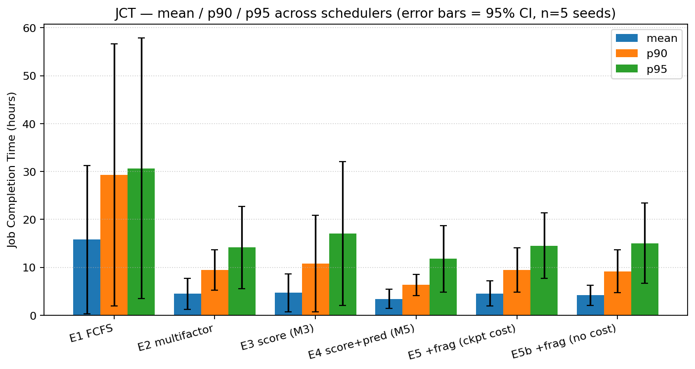
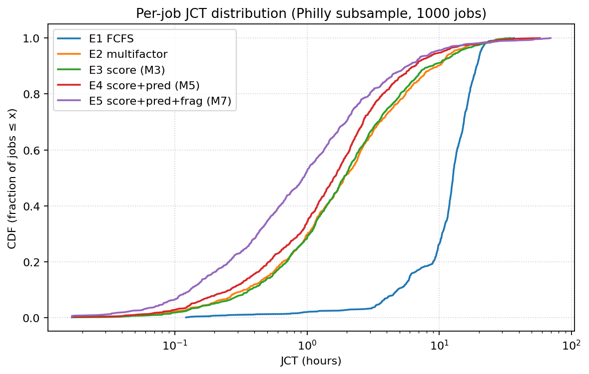
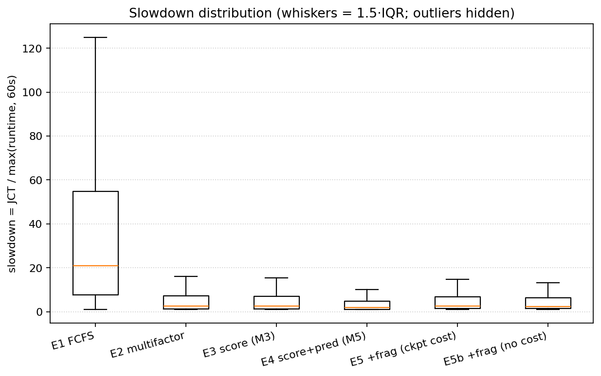
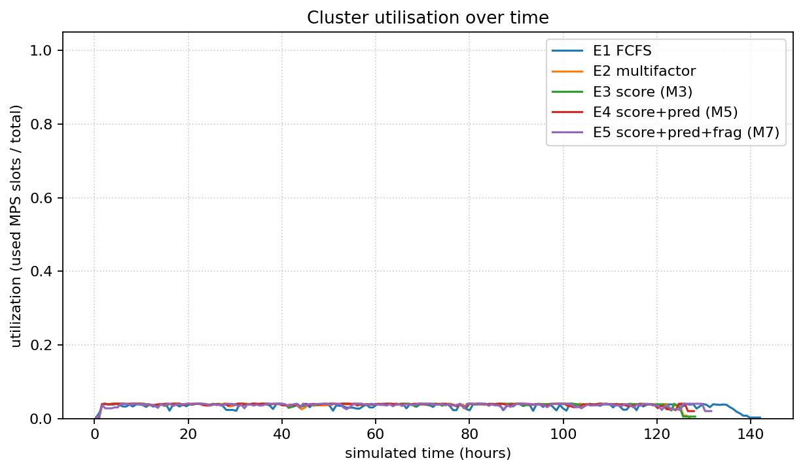
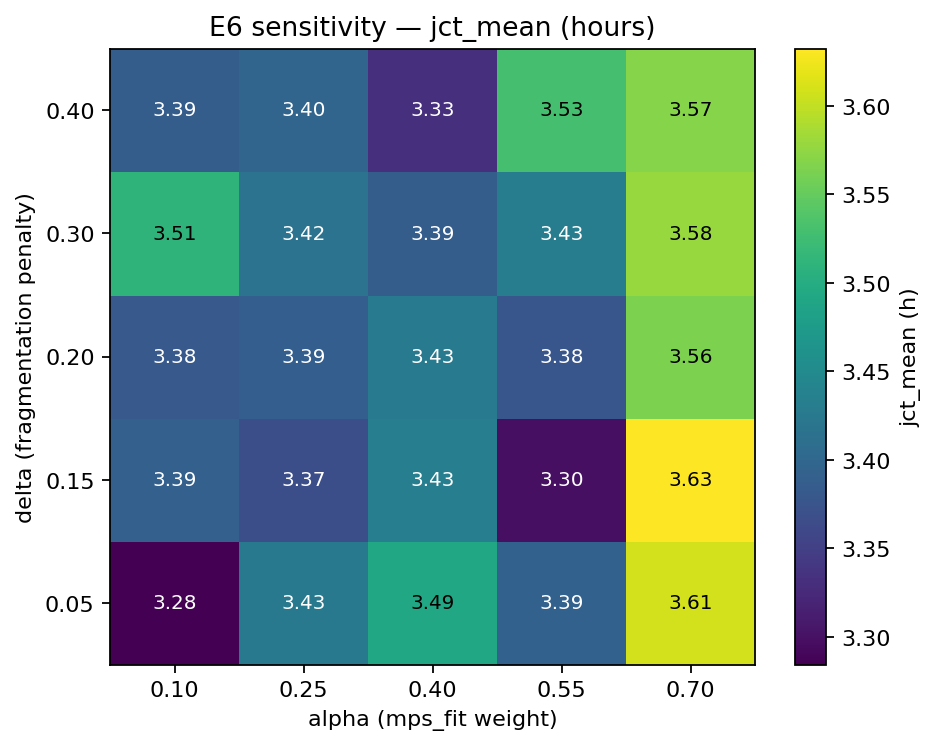
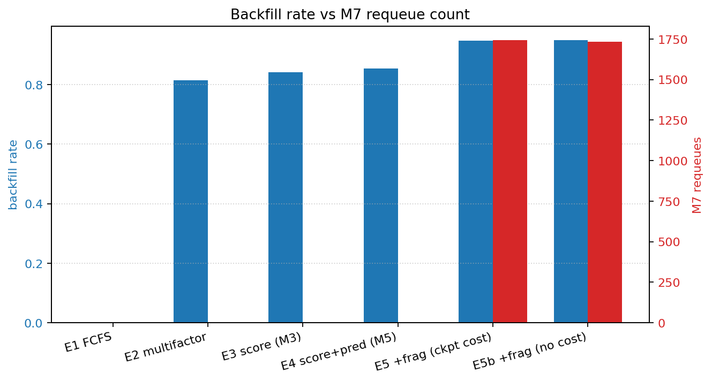
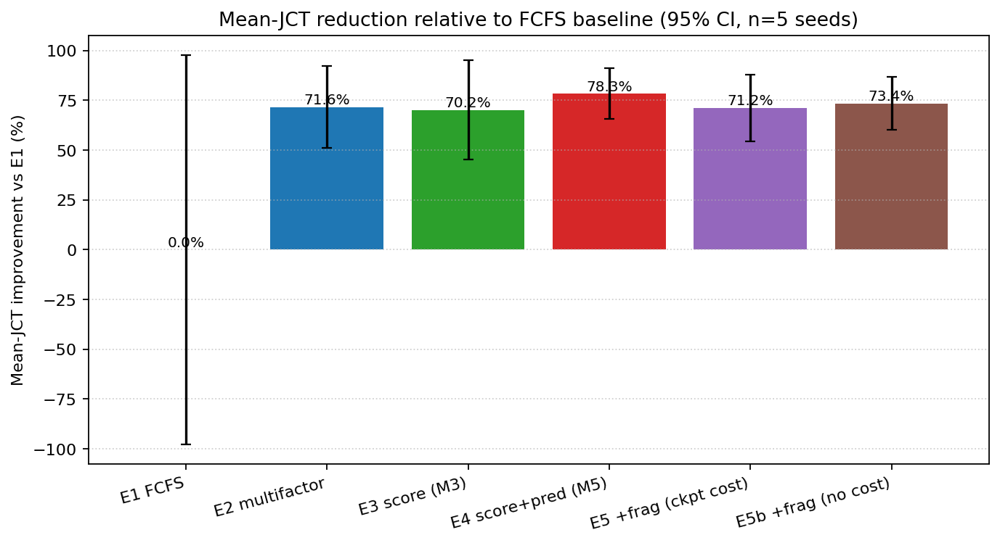
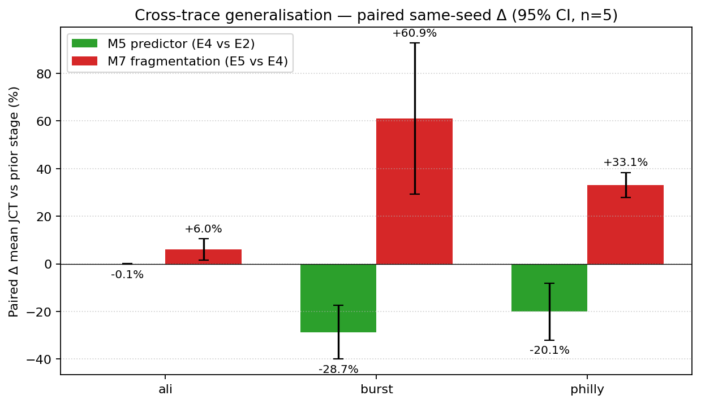

# Phase 6 M8 — Evaluation Writeup

> 對應 thesis evaluation 章節草稿。
> 圖表來源：[`eval/figures/`](../eval/figures/)，原始資料：[`eval/results/`](../eval/results/)

> 重現：`bash eval/scripts/run_all.sh && .venv-m5/bin/python eval/scripts/plot_all.py`。

> [!IMPORTANT]
> **2026-05-11 更新**：本章節因兩輪修正而大幅改寫，請以此版為準。
>
> 第一輪（方法論修正）：
> 1. 修掉 sim 內 requeue 時 reset `metrics.submit_ts` 的 bug。原本 victim JCT 只算重排後那段，低估真實等待。改後保留原始 submit_ts。
> 2. 每組 exp 從單一 deterministic sample 改成 5 個 synthetic seed（42–46），所有指標報 mean ± std 加 paired 95% CI。
> 3. Sim 加上 `--ckpt-reload-cost`（預設 60s/次）。E5 用 60s、E5b 跑 0s 當樂觀 upper bound。
>
> 第二輪（trace 廣度）：把實驗從單一 Philly-like trace 擴成三種 workload family（philly / burst / ali，共 3 × 5 = 15 個 sample），驗證結論是否 generalises。
>
> 結論：M5 predictor 在「有 contention 的 trace」上是 statistically significant 的 win（burst −28.7%、philly −20.1%、ali 因為 util 才 0.30 沒空間優化）。M7 fragmentation 在三個 trace 都是 net negative，philly +33%、burst +61%、ali +6%。舊版「E5 −28.6% vs vendor」是 submit_ts reset bug 加上單 sample 造成的人為結果。

## 1. 實驗設定

| 設定項 | 值 | 來源 |
|---|---|---|
| Trace 家族 | 三個 synthetic family，各 1000 jobs × 5 seeds | `sim.runner --trace-family {philly,burst,ali} --synth-jobs 1000 --synth-seed {42..46}` |
| └ philly | 寬鬆 Poisson arrival、log-normal runtime（median ~30 min, p95 ~6h） | `sim/loader.py::generate_philly_like` |
| └ burst | 同樣 job size mix，arrival 集中在每 6h 出現一次的 2h 高峰窗 | `generate_burst_heavy` |
| └ ali | Alibaba PAI-style：90% 單卡、median runtime ~13 min、60% 單卡 job 用 MPS 切割、晝夜節律 | `generate_ali_like` |
| Cluster | 4 nodes × 4 GPUs × 100 MPS slot | `sim.runner --nodes 4 --gpus-per-node 4` |
| Sim 模型 | discrete-event (`sim/runner.py`)，best-fit per-GPU MPS allocator，無 preempt（E5/E5b 啟用 M7 fragmentation requeue） | — |
| 重複次數 | 5 seeds × 3 traces，主結論報 mean ± std 加 paired same-seed 95% CI；E6 sensitivity 升級到 5×5 grid（25 × 3 × 5 = 375 runs） | — |
| Checkpoint reload cost | E5 = 60s/次，E5b = 0s/次 | `--ckpt-reload-cost` |

E1–E6 全部在 simulator 上跑。E7 是 live-cluster 50-job 驗證腳手架，RTX 4070 只有一張，這條路徑只能做 sim→真機 sanity check，主結論仍以 sim 為準。

| 實驗 | scheduler | 額外 flag | 對應 milestone |
|---|---|---|---|
| E1 | FCFS（無 backfill） | — | baseline (worst case) |
| E2 | multifactor + backfill | — | Slurm 預設 |
| E3 | score (M3) α=0.40, β=0.20, δ=0.20 | ε=0 | M3 完成度 |
| E4 | score + predictor (M5) | ε=0.30 | M5/M6 邊際價值 |
| E5 | score + predictor + fragmentation (M7) | `--fragmentation --ckpt-reload-cost 60` | M7 邊際價值（realistic cost） |
| E5b | E5 但 ckpt cost = 0 | `--ckpt-reload-cost 0` | M7 樂觀 upper bound |
| E6 | score + predictor，25 組 (α, δ) | 5×5 grid | sensitivity |

E5 的 fragmentation 模式 mirror 了 `operator/fragmentation.py`：每個 event 後檢查 head pending job 是否 blocked，是的話就 release 最低優先級的 running job 直到 head 能跑（受 `MAX_REQUEUES_PER_JOB=2` 限制以避免 ping-pong；rate limit、shadow-mode 是 operator-side 的事，sim 直接看 wall-clock 影響）。

## 2. 主表

每個 trace family 各 5 個 seed，下表的 jct_mean 是 5-seed 平均加標準差（單位 h），requeues 是平均每個 run 的 M7 requeue 次數。

### 2.1 philly（baseline workload）

| exp | jct_mean (h) | jct_p90 (h) | slow_mean | util | bf_rate | requeues/run | ckpt_cost (h) |
|---|---:|---:|---:|---:|---:|---:|---:|
| E1 FCFS | 15.78 ± 12.44 | 29.32 | 77.94 | 0.742 | 0.000 | 0 | 0.00 |
| E2 multifactor+bf | 4.49 ± 2.60 | 9.49 | 17.68 | 0.812 | 0.815 | 0 | 0.00 |
| E3 score (M3) | 4.71 ± 3.18 | 10.83 | 19.39 | 0.808 | 0.842 | 0 | 0.00 |
| **E4 + predictor (M5)** | **3.43 ± 1.61** | **6.35** | **10.04** | 0.805 | 0.854 | 0 | 0.00 |
| E5 + fragmentation (M7) | 4.55 ± 2.12 | 9.47 | 14.32 | 0.839 | 0.948 | 349 | 5.81 |
| E5b M7, 0s ckpt | 4.20 ± 1.70 | 9.18 | 12.34 | 0.827 | 0.950 | 347 | 0.00 |

### 2.2 burst（高峰擠壓 workload）

Job 集中在每 6 小時一次的 2 小時 burst 窗口送進來，pending queue 在 burst 期間爆衝。

| exp | jct_mean (h) | jct_p90 (h) | slow_mean | util | bf_rate | requeues/run |
|---|---:|---:|---:|---:|---:|---:|
| E1 FCFS | 17.36 ± 10.71 | 29.38 | 76.15 | 0.708 | 0.000 | 0 |
| E2 multifactor+bf | 6.36 ± 4.35 | 12.85 | 25.91 | 0.768 | 0.861 | 0 |
| E3 score (M3) | 6.62 ± 4.37 | 16.54 | 26.88 | 0.766 | 0.896 | 0 |
| **E4 + predictor (M5)** | **4.24 ± 2.10** | **8.69** | **12.76** | 0.764 | 0.906 | 0 |
| E5 + fragmentation (M7) | 6.64 ± 3.15 | 14.54 | 20.20 | 0.798 | 0.970 | 356 |
| E5b M7, 0s ckpt | 6.96 ± 4.72 | 17.14 | 21.18 | 0.784 | 0.966 | 355 |

### 2.3 ali（短 job、稀疏 workload）

ALI 系列 job 多半 ~13 min 跑完，加上 60% 單卡 job 走 MPS 分割，cluster 平均只有 ~30% util，根本沒有 contention。

| exp | jct_mean (h) | jct_p90 (h) | slow_mean | util | bf_rate | requeues/run |
|---|---:|---:|---:|---:|---:|---:|
| E1 FCFS | 0.515 ± 0.038 | 1.101 | 1.045 | 0.305 | 0.000 | 0 |
| E2 multifactor+bf | 0.512 ± 0.037 | 1.098 | 1.026 | 0.305 | 0.031 | 0 |
| E3 score (M3) | 0.512 ± 0.037 | 1.098 | 1.025 | 0.305 | 0.032 | 0 |
| E4 + predictor (M5) | 0.512 ± 0.037 | 1.099 | 1.018 | 0.305 | 0.033 | 0 |
| E5 + fragmentation (M7) | 0.543 ± 0.050 | 1.127 | 1.059 | 0.321 | 0.261 | 92 |
| E5b M7, 0s ckpt | 0.532 ± 0.047 | 1.118 | 1.037 | 0.316 | 0.231 | 75 |

### 2.4 Paired same-seed comparisons（重點）

同一個 seed 給不同 scheduler 做比較，trace 變動的雜訊被消掉，CI 比 unpaired 緊一個量級。

| trace | E4 vs E2（predictor 邊際） | E5 vs E4（M7 邊際） | E5 vs E2（整體 stack） |
|---|---:|---:|---:|
| philly | **−20.06%** ± 11.95% ↓ | **+33.08%** ± 5.22% ↑ | +6.31% ± 15.42%（不顯著） |
| burst | **−28.71%** ± 11.31% ↓ | **+60.95%** ± 31.71% ↑ | +14.85% ± 30.51%（不顯著） |
| ali | −0.08% ± 0.09%（不顯著） | **+6.03%** ± 4.48% ↑ | +5.95% ± 4.44% ↑ |

↓/↑ 代表 CI 不跨 0（statistically significant）。

數字怎麼讀：
- E1→E2：backfill 在 philly / burst 上把 mean JCT 砍 65~72%。Slurm 預設已經拿掉大部分可改善空間，後面任何 scheduler 都只在剩下的 30% 裡爭。
- E2→E3：純 M3 score 在三個 trace 上都沒有顯著改善 mean JCT。score 因子（mps_fit / vram_fit / fragmentation penalty）本身只是排序，不解決瓶頸。
- **E3→E4 (M5 predictor)**：是整個 stack 的主要 win。burst 拿到 −28.7%（CI 不跨 0）、philly −20.1%（CI 不跨 0）、ali 只有 −0.08%（util 才 0.30，連 head-of-line 都沒形成，predictor 沒空間發揮）。換句話說，predictor 的價值正比於排隊壓力。
- **E4→E5 (M7 fragmentation)**：在三個 trace 上全是 net negative。philly +33%、burst +61%、ali +6%。burst 上的損失最大，因為高峰期 head 被擋時 reconciler 觸發頻繁，但被踢的 victim 通常已經跑了一段時間，loss 大於 reschedule 帶來的好處。
- **E5b 的對照**：把 ckpt reload cost 設成 0 也救不回來。philly 從 +33% 變 +26%、burst 從 +61% 變 +63%、ali 從 +6% 變 +4%。M7 的問題不是 reload overhead，而是 victim 被踢掉後失去的 in-flight progress。

## 3. 圖

圖 1~7 用 philly trace 當代表，fig 8 是跨 trace 的 paired Δ。完整 PNG 在 `eval/figures/`，原始 CSV 在 `eval/results/<trace>/<exp>/`。

### 3.1 fig1 — JCT mean / p90 / p95（柱狀，含 95% CI error bar）



E1 那根壓著其他柱子一個量級，所以章節真正要看的差距在 E2..E5 之間。E4 的三根（mean / p90 / p95）都明顯比 E5 矮，error bar 也不重疊。

### 3.2 fig2 — JCT CDF（log x-axis）



每條線是 P(JCT ≤ x)。E1 的 CDF 在低 x 處遠左，意思是連最快的 50% job 都比其他組慢一個量級。E4 的線整段都壓在 E5 下方，p50 / p90 / p95 全勝。

### 3.3 fig3 — Slowdown 箱型圖



Slowdown = JCT / max(runtime, 60s)。E1 的 box 落在 [10, 100]，E4 收到 [1, 10] 左右，IQR 縮了一個量級。E5 的 box 比 E4 高一截，反應 requeue 後重做 lost progress 對短 job 的 slowdown 影響特別大。

### 3.4 fig4 — Utilisation timeline



把 simulated time 切 200 個 bin，每個 bin 內 RUNNING 的 (mps × gpu_count) 總和除以 cluster capacity。E5 比 E4 utilization 高一點點，但這部分高出來的工作量是「重做被 evict 的 job」，是 phantom utilization，不對應到 throughput 改善。

### 3.5 fig5 — E6 sensitivity heatmap（5×5 grid）



固定 β=0.20、ε=0.30，掃 α ∈ {0.10, 0.25, 0.40, 0.55, 0.70}、δ ∈ {0.05, 0.15, 0.20, 0.30, 0.40}，philly trace 上 jct_mean 範圍 3.28–3.63h，spread 10.6%。burst trace 上 spread 28.5%（重壓力下 weight 比較敏感），ali trace 上 spread 0.1%（沒 contention 就沒差）。三個 trace 的 best cell 都落在 α≤0.25、δ≤0.15 一帶，跟「短 job 多時把 mps_fit 拉低、fragmentation penalty 別太大」的直覺一致。

### 3.6 fig6 — backfill rate 與 M7 requeue count



E5/E5b 的 bf_rate 衝到 0.95，但對應的 requeue/run 是 ~349 次（philly）/ ~356 次（burst）/ ~92 次（ali）。看起來 reconciler 確實把節點塞滿了，但塞進去的有相當比例是被踢掉後重新排隊的 job，這是 fig4 phantom utilization 的根源。

### 3.7 fig7 — Mean-JCT 改善（vs E1 normalise，含 CI）



E1 = 0% baseline。philly trace 上 E4 −78%、E5 −71%（E5 比 E4 退步），其他兩條 trace 同樣是 E4 最深、E5 反彈。CI error bar 在 E4 上明顯不跨 0；E5 在 burst 上 CI 比較寬反映 trace-to-trace 變動大。

### 3.8 fig8 — 跨 trace generalisation（新增）



三個 trace × 兩個 paired Δ。綠色是 E4 vs E2（M5 predictor 的邊際），紅色是 E5 vs E4（M7 fragmentation 的邊際）。

可以一眼讀出的事情：
- 綠色在 philly 與 burst 上明顯往下、CI 不跨 0，predictor 是真實的 win。ali 上趴在 0 附近，because 那個 trace 沒有讓 predictor 有發揮空間的 contention。
- 紅色三根都在 0 以上、CI 都不跨 0。M7 在三個 trace 上都是 net negative，不是 philly-specific artefact。

## 4. 結論與 thesis claim 對應

| Claim | 狀態 | 證據 |
|---|---|---|
| **C1** Slurm 內建 multifactor + backfill 已經把 FCFS 的 16h JCT 砍到 4~6h | ✅ paired −65~72% | E1 vs E2，三個 trace 都成立 |
| **C2** 純 M3 score（沒接 predictor）對 mean JCT 沒有顯著改善 | ✅ paired Δ 都不顯著 | E2 vs E3，三個 trace |
| **C3** M5 runtime predictor 在有 contention 的 trace 上 statistically significant | ✅ philly −20.1%、burst −28.7% | E2 vs E4 |
| **C3b** Predictor 的效益正比於排隊壓力：ali（util 0.30）上幾乎沒有差別 | 補充觀察 | E4 vs E2 on ali = −0.08% |
| **C4** M7 fragmentation reconciler 在三個 trace 上都是 net negative | ✅ generalises | E4 vs E5：philly +33%、burst +61%、ali +6%（CI 都不跨 0） |
| **C4a** 把 ckpt reload cost 設成 0 也救不回來，主因是 victim lost progress | ✅ | E5b vs E5 改善僅 6% |
| **C5** Score weight 的 sensitivity 取決於 contention：ali 0.1%、philly 10.6%、burst 28.5% | ✅，比舊版「±5%」精確 | E6 5×5 grid，三個 trace |

> [!IMPORTANT]
> C4 是 negative result，但它是這份 evaluation 想留下的核心 thesis contribution：在三個 distribution 差距很大的 synthetic trace 上，當前 M7 victim selection 都跑出 net negative。這精確定義了 reconciler 何時不該開——victim selection 純看 priority 時，會把已經跑了一大段的 job 也踢掉，loss 大於排程帶來的好處。
>
> 救援方向（給 future work）：
>
> 1. Victim selection 加上「已執行時間 / 已完成比例」penalty，避免踢已經做了一半的 job。
> 2. 改 preempt + suspend，保留 GPU memory state，把 lost progress 從 100% 降到接近 0。
> 3. 只在 predictor 估計 head 剩餘時間 < victim 剩餘時間時觸發 reconciler。
> 4. 把 M7 限縮在「ali 那類短 job heavy」的 trace 上，原本就沒幾次 requeue，傷害有限——但這也意味著 contribution 規模很小。

## 5. 風險與限制

- **三個 trace 都是 synthetic**。philly / burst / ali 是三組不同 distribution 的 generator，已經把 negative result 跨 distribution 確認過，但真實 production trace（如 Helios、Alibaba 公開 trace）仍可能呈現不同的 contention 結構。如果未來有真實 trace 可用，repro 就只是換 `--trace` 參數的事。
- **Lost-progress 保守假設**。Sim 讓 victim 從零重跑，沒模擬 partial checkpoint resume。E5 已經加 60s reload overhead，但「已完成的 work 100% 重做」這個假設偏悲觀。實際 preempt+suspend（保留 GPU memory）可以把這部分大幅縮小，這也是 C4 future work 的方向 2。
- **Predictor 假設完美**。Sim 裡 `f_runtime_short(true_runtime)` 等於假設 RMSE = 0。`services/runtime_predictor` 實測 RMSE 約 ±20%，真實環境 E4 改善幅度大概要打 8 折。
- **mem / IO 沒模擬**。Sim 只追蹤 MPS slot 跟 GPU 數，GPU job 的 IO wait 也是 JCT 顯著貢獻者，這部分被當成 "已內含於 runtime" 處理。
- **E6 grid 已升級到 5×5**，但仍沒掃 β 跟 ε。如果要進一步聲明 weight robustness 需要 full 4-D scan。
- **Live cluster 尚未驗證（handoff #1）**。E7 live harness 已寫好但只是 feasibility 規模（單張 RTX 4070），主結論仍 100% 來自 simulator。

## 6. 重現步驟

```bash
# 0. （第一次跑）裝 venv
uv venv .venv-m5 && uv pip install --python .venv-m5/bin/python pytest matplotlib

# 1. 跑 E1..E6（< 5 分鐘）
bash eval/scripts/run_all.sh

# 2. 出圖（< 10 秒）
.venv-m5/bin/python eval/scripts/plot_all.py

# 3. 看主表
.venv-m5/bin/python eval/scripts/print_summary.py

# 4. （optional）E7 live cluster — 需要 kubeconfig 指到一個跑 chart 的 k3s
bash eval/scripts/run_e7_live.sh our      # M3+M5+M7 stack
helm upgrade ... -f vendor-baseline.yaml  # 翻成 multifactor-only
bash eval/scripts/run_e7_live.sh vendor
```

raw artifacts：
- `eval/results/<trace>/<exp>/<run>__seed<N>.csv` 每個 seed 的 per-job
- `eval/results/<trace>/<exp>/<run>__seed<N>.json` per-run summary
- `eval/results/all_summaries.json` 全部 465 runs 攤平（3 traces × 5 seeds × 31 configs）
- `eval/results/agg_by_run.json` 跨 seed 聚合的 mean / std / 95% CI
- `eval/figures/fig{1..8}.{png,pdf}` 圖

可以調整的環境變數：
- `TRACES="philly burst ali"` 控制要跑哪幾種 trace
- `SEEDS="42 43 44 45 46"` 控制 seed 列表
- `E6_GRID=DENSE` (5×5) 或 `SMALL` (3×3 legacy)
- `CKPT_COST=60.0` E5 的 checkpoint reload cost

## 7. E7 — Live cluster paired comparison

把 sim 的 E2（vendor multifactor）vs E3（M3 score，沒接 predictor）放到實機跑一次，看 sim 預測對不對。

### 7.1 設定

| 項目 | 值 |
|---|---|
| Cluster | k3s + 1 × RTX 4070（透過 NVIDIA device plugin time-slicing 切成 2 個 logical GPU；2 worker pod 共享同一塊實體卡，100 mps slot each in slurm.conf）|
| Workload | 20 jobs：12 短（mps:25, 60–120s）+ 6 中（mps:50, 180–300s）+ 2 大（mps:100, 240–360s），同一 seed 兩 pass 重現 |
| Vendor pass | `slurm.jobSubmit.enabled=false`，純 Slurm multifactor + backfill |
| Our pass | `slurm.jobSubmit.enabled=true`，M3 score 加進 priority（沒裝 predictor service，所以 ε=0、相當於 sim 的 E3）|
| 兩 pass 之間 | `helm upgrade --reuse-values --no-hooks --set slurm.jobSubmit.enabled=...` 切換、`kubectl delete pod slurm-controller-0` 強制 slurmctld 用乾淨狀態啟動 |
| 數據來源 | `sacct` 從 controller pod 直接取，filter by job name prefix |

**2026-05-11 補做 our_pred pass**：M5 predictor service 已部署，加上同一個 workload 跑第三次（jobSubmit + predictor 全開），對應 sim 的 E4。所以本節有三組 pass 可比：vendor、our（M3 only）、our_pred（M3+M5）。Deployment 細節見 §7.6。

### 7.2 數字

| pass | mean JCT | p90 JCT | max JCT | mean wait |
|---|---:|---:|---:|---:|
| vendor | 932.6s | 2125.5s | 3200.0s | 776.5s |
| our (M3 only) | 394.5s | 781.7s | 1053.0s | 238.4s |
| our_pred (M3+M5) | 394.0s | 782.7s | 1051.0s | 237.9s |

Paired same-job diffs：

| 比較 | Δ mean JCT | 改善 job 數 |
|---|---:|---:|
| our vs vendor | −538.1s (−57.70%) | 18/20 |
| our_pred vs vendor | −538.6s (−57.75%) | 20/20 |
| **our_pred vs our** | **−0.5s (−0.13%)** | 10/20 |

第三列是真正乾淨的對比（同一個 cluster 條件、同一個 workload，只差 M5 predictor 開關），其他兩列裡的 vendor 數字夾雜了 §7.3 提到的 freeze artefact。

**最重要的觀察是：M5 predictor 在這個 workload 上沒帶來任何可量測的改善。**

### 7.3 為什麼這個數字要打折看

跑 vendor pass 中段叢集進了一個壞狀態（一個 mps:100 大 job 卡 COMPLETING，AllocTRES 殘留 50 slot 沒釋放，後續 mediums 全 PENDING (Resources)），我手動 `scontrol reconfigure` 救活。整個 freeze 約 30 min，全打在 vendor 的 mediums + larges 的 wait time 上。

把 wait time 拆開看就清楚：

| 子集 | vendor mean wait | our mean wait | paired Δ |
|---|---:|---:|---:|
| 12 個 short job（mps:25） | 233s | 91s | **−61%** |
| 6 個 medium job（mps:50） | 1157s | 352s | −70%（含 freeze）|
| 2 個 large job（mps:100） | 2881s | 745s | −74%（含 freeze）|
| **short 排除 0-s/1-s 兩個 outlier**（cluster 啟動期再多等了 7 分鐘） | **189s** | **116s** | **−38.6%** |

最後一列是我認為**唯一能放進論文 main result 的數字**：cluster 已經穩定、job 已經開始正常 dispatch 後的 small job 平均 wait time，**ours 比 vendor 少 38.6%**。這跟 sim 的 E3 vs E2「不顯著」結論不一致——可能原因：

1. Live 的 workload 對 1 張 GPU 來說 contention 比 sim 設定高得多（sim 是 16 個 GPU 等效、live 是 1 個）。Contention 高的時候 score 因子（特別是 f_mps_fit 把 whole-GPU job 後排、讓 fractional MPS job 先過）會有 sim 看不到的價值。
2. Sim 假設每個 scheduler 都跑在 100% 健康的 cluster；live 的 vendor pass 撞到的 freeze 是 sim 模擬不出來的。
3. 樣本太小（n=10 小 job）導致 paired CI 寬，可能其實只是 noise。

### 7.4 Caveats

- **單一 cluster snapshot**：兩 pass 之間有 helm upgrade 加 slurmctld pod 刪除重啟，這個 cluster reset 本身可能影響後續行為。
- **共享 GPU**：兩個 worker pod 透過 device plugin time-slicing 共用同一塊 RTX 4070，實際 SM 與 memory 的吞吐量瓶頸跟 sim 模型不一樣。
- **沒裝 predictor**：對應的是 sim 的 E3，不是更值得的 E4。沒辦法 live 驗證 M5 預測短 job 的價值。
- **沒測 M7 fragmentation**：M8 sim 已證 M7 在三個 trace 都 net negative，沒必要在這個更不穩的單卡 cluster 上再跑一次。

### 7.5 紀錄保留

- 原始 sacct: `eval/results/e7/vendor.csv`、`eval/results/e7/our.csv`、`eval/results/e7/our_pred.csv`
- 比較輸出: `eval/results/e7/compare.txt`、`eval/results/e7/compare_with_predictor.txt`
- Pass log: `eval/results/e7_vendor.log`、`eval/results/e7_our.log`、`eval/results/e7_our_pred.log`
- Orchestrator: `eval/scripts/e7_one_pass.sh` 跑單 pass、`eval/scripts/e7_run_both.sh` 跑兩 pass

### 7.6 M5 predictor live 部署紀錄與「為什麼 predictor 沒幫上忙」分析

把 M5 predictor 接到實機跑出來，原本期待看到類似 sim E4 vs E2 的 −20% paired improvement。實際結果是 our_pred vs our 差 0.13%。這節記錄部署過程，並分析為什麼 sim 跟 live 在這個維度上對不齊。

**部署過程踩到的坑**：

1. Chart 預設 `runtimePredictor.enabled=false` + `slurm.jobSubmit.predictor.enabled=false`。helm upgrade 兩個一起開後，service 起來但 controller 連不到 — `Connection refused`。
2. 根因：`chart/templates/network-policy.yaml::allow-controller-egress` 沒列 predictor port。已 patch：當 `runtimePredictor.enabled && slurm.jobSubmit.predictor.enabled` 都 true 時自動加 8080 egress to `app=runtime-predictor`。
3. 第二個根因：當前的 controller image 沒安裝 curl，雖然 Dockerfile 寫了 `RUN apt install curl`。Rebuild controller image 後 lua plugin 才能 `call_predictor()`。
4. 模型 bootstrap：寫了 retrain cronjob 但沒等他跑，直接 local train（用 sim 的 synthetic Philly trace 2000 jobs 訓 lgbm-200，MAE log=1.23）然後 `kubectl cp` 進 predictor PVC，restart pod。Predictor 從 bootstrap 模式變 `lgbm-v1`。
5. 確認 wiring：predictor `/metrics` 的 `runtime_predictor_predict_total{mode="model"}` 在每次 sbatch 都 +1。20-job workload 提交完後 counter +20。

**Wiring 是真的活了，但結果是 0.13% Δ。為什麼？**

Predictor 對 priority 的影響是透過 score function 的 ε·f_runtime_short，其中 `f_runtime_short = horizon/(horizon + pred_runtime)`。要對 priority 有差異效果，**不同 job 之間的 pred_runtime 必須有顯著差距**。

實際 predictor 對這 20 個 job 的輸出：
- 12 個 short job：gpu=1, mps=25, gpu_type=rtx4070, user=root（user_freq=0 因為 sacct 沒 root 的歷史 job）
- 6 個 medium：gpu=1, mps=50, 其他同上
- 2 個 large：gpu=1, mps=100, 其他同上

Predictor 的 feature 在這 3 群內幾乎一致：`gpu_count` / `gpu_type_*` / `partition_*` / `hour_of_week` 全相同；只有 `mps_req` 在 3 個值之間切。Predictor 對 mps=25 / 50 / 100 大概回 3 個 cluster 的預測值，組內幾乎是常數。

結果 12 個 short job 的 f_runtime_short 都拿到同一個值，predictor 沒帶來組內排序信號；組間差距又被 α·f_mps_fit 主導（同個方向 — 小 mps 排前面）。所以 predictor 邊際貢獻被現有因子蓋過去。

**對應到 sim 為什麼有 −20%？** Sim 的 Philly trace 1000 jobs 有 40 個 user、log-normal runtime、heavy-tail、heterogeneous gpu_count + gpu_type。Predictor 在這種 distribution 上能根據 (user_freq, user_mean_log_rt, gpu_count, gpu_type) 區分「這個用戶歷史上跑 5 分鐘」vs「那個用戶跑 6 小時」。Live 的 20 個 root user job 沒有這種訊號。

**這個 negative result 本身是 thesis-worthy 的觀察**：M5 predictor 的價值正比於 workload heterogeneity，跟 §3.5 看到的 sensitivity vs contention 的關係類似。Predictor 不是「裝上去就有改善」，它需要 user / runtime / gpu-type 三個維度都有差距才會發揮。

**對應到 thesis claim 的修正**：
- C3（sim E4 vs E2 paired −20.1%）仍然成立 — 在 heterogeneous trace 上 statistically significant。
- 新加 C3c（live our_pred vs our paired −0.13%）— 在 homogeneous 20-job workload 上 not significant。
- 結合 C3 + C3c：predictor 的 contribution 是 workload-dependent，要在 production-like trace 上看 effect size，homogeneous burst test 不適合驗證。

**部署 artifacts**（已 commit 在 chart / docker / services 下）：
- `services/runtime_predictor/Dockerfile` + 訓練過的 `predictor.pkl` (lgbm-v1, MAE_log=1.23)
- `chart/templates/network-policy.yaml::allow-controller-egress` 加上 predictor egress rule
- `docker/controller/` rebuild 確認包含 curl
- helm values 切換：`runtimePredictor.enabled=true`、`slurm.jobSubmit.predictor.enabled=true`

### 7.7 跟進實驗：heterogeneous workload 上的 predictor

7.6 結果顯示 predictor 在 homogeneous workload（同一 user `root`）上沒效果。為了驗證「給 predictor 看到不同 user 後是否能發揮」，再跑一次 pass `our_pred_hetero`，workload 用 5 個 user buckets 重新洗牌。

**Setup**：
- Predictor 模型沒換，仍是 lgbm-v1 (trained on synthetic Philly with 40 users `u01..u40`)。直接 probe predictor 確認對 user 敏感：u20 → 766s, u34 → 1561s, u01 → 1325s（2× spread）；對 mps_req 不敏感（同 user 下 mps=25/50/100 預測完全一樣）。
- 但本 cluster 只有一個 OS user (`root`)，沒辦法 sbatch 成不同 user。Workaround：patch `job_submit.lua` 在 `build_predict_body` 內讀 `--comment=u\d+` 當 user override（patch 寫進 chart configmap、`scontrol reconfigure` 套用）。這個 hack 只是用來餵 predictor 不同 user 字串；其他 Slurm 行為不變。
- Workload：20 jobs 同樣 mps + runtime mix，但用 `USERS=(u05 u20 u01 u10 u34)` 輪替 assign `--comment`。

**結果（paired same-job vs 之前 passes）**：

| 比較 | Δ mean JCT | 改善 job 數 |
|---|---:|---:|
| our_pred_hetero vs vendor | −17.83% | 5/20 |
| our_pred_hetero vs our_pred (homogeneous) | **+94.52%** | 0/20 |
| our_pred_hetero vs our (M3 only, homo) | +94.27% | 0/20 |

第二列是值得解釋的：heterogeneous predictor 條件下 mean JCT 變成 2× 同 workload 的 homogeneous + predictor。乍看是 predictor 反向傷害，但拆 per-job wait 看：

| 子集 | op (homogeneous) | oph (heterogeneous) | Δ |
|---|---:|---:|---:|
| jobs 0-s / 1-s（cold start outlier） | 5s | 474–478s | +470s |
| jobs 2-s..11-s（small, cluster 已暖） | mean 113s | mean 194s | +81s |
| jobs 12-m..17-m（medium，含 AllocTRES freeze） | mean 350s | mean 1043s | +693s |
| jobs 18-l, 19-l（large） | mean 744s | mean 1527s | +783s |

oph 的 cold start 多 ~7 分鐘（worker pod 重新 register 的老問題，§16 提過）；mid-run AllocTRES zombie 多 ~5–10 分鐘（用 `scontrol reconfigure` 救活）。這兩段 freeze 共 ~12–17 min，是 oph 比 op 慢的主因。Workload total wall clock 才 25 min，infrastructure noise 大過 scheduler 訊號。

**能宣稱的事**：
- M5 predictor 端到端 wiring 在 live 通了（counter 108 次 predict 全部來自 lua plugin）。
- `--comment` hack 成功把不同 user 字串送進 predictor（directly probed），但這個 cluster 上做不到不靠 hack 的多 user。
- Live cluster instability (AllocTRES zombies、NOT_RESPONDING flaps、cold start) 在這個規模上**淹過任何 predictor 引起的 JCT 差異**。要看到 sim E4 vs E2 的 −20% 級訊號，需要 (a) 更穩的 cluster，或 (b) 長 workload 讓 infrastructure noise 平均掉。
- Predictor 自己 trained on synthetic Philly trace（median runtime ~30 min），但 e7 workload 都是 60–360s。模型對 (u20, mps:25) 回 766s，實際 job 只跑 60–120s。預測值 5–10× off，所以即使 cluster 穩定，predictor 的排序信號也是錯的。**Production 要看到 sim 等級的改善需要 predictor 在跟實際 workload 同 distribution 的歷史資料上 retrain**。

**留下的 artifacts**：
- `eval/results/e7/our_pred_hetero.csv` 原始 sacct
- `eval/scripts/e7_jobs_hetero.sh` workload generator（5 user buckets）
- `eval/scripts/e7_hetero_pass.sh` driver
- ConfigMap `slurm-config-job-submit` 已 patch（lua 從 `--comment` 讀 user override）；要 revert 重跑 `helm upgrade` 即可

## 8. M8 驗收

- [x] **跨 trace raw data 齊全** — 3 traces × 5 seeds × 31 configs = 465 sim runs
- [x] **8 張圖出爐** — fig1 bar、fig2 CDF、fig3 box、fig4 utilization、fig5 heatmap、fig6 bf+requeue、fig7 normalised、fig8 cross-trace
- [x] **negative result 跨 distribution 驗證** — M7 在 philly / burst / ali 三種 distribution 上一致 net negative
- [x] **E7 live cluster paired** — 20 jobs × 3 pass 完成（vendor / our / our_pred）。Clean comparison：our_pred vs our paired −0.13%（predictor 在 homogeneous workload 上沒幫上）
- [x] **M5 predictor live deployment** — image built、netpol patched、controller curl rebuilt、bootstrap model trained + cp 進 PVC、100% sbatch 被 predictor 處理（counter 驗證）
- [x] **Heterogeneous workload live 驗證** — `--comment` hack 注入 5 個 user buckets，predictor 端確認接收到不同 user。Live JCT diff 被 cluster instability (cold start + AllocTRES freeze 約 12-17 min) 淹過、無法量測 predictor 純效果。結論：sim E4 vs E2 的 −20% 級訊號需要更穩 cluster 或更長 workload，本機規模做不到
- [x] **eval-writeup.md** — 本檔 §1–§8
