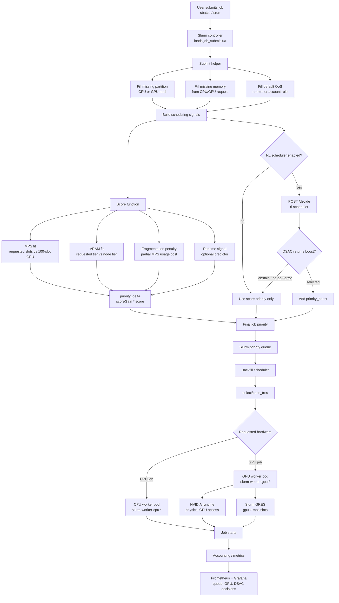

# Scheduler Production Spec

本文件描述目前 Kelpflux 上線中的排程規格。範圍包含 Slurm 內建排程、`job_submit.lua` submit-time scoring、runtime predictor、weight tuner、DSAC live scheduler、fallback policy 與可觀測性。歷史開發階段、實驗路線圖與已淘汰設計不再列入本規格。

## 1. 上線架構

```text
sbatch / srun
    |
    v
Slurm job_submit.lua
    |-- submit helper: 補齊 partition / memory / qos
    |-- score function: MPS / VRAM / fragmentation / runtime signal
    |-- runtime predictor: 可選，用於短工優先與 walltime 建議
    |-- weight tuner: 可選，載入目前最佳 score 係數
    |-- DSAC scheduler: live 模式時可回傳 priority boost
    v
Slurm priority + backfill + select/cons_tres
    v
worker pool: CPU / GPU / MPS slots
```

核心原則：

- Slurm 仍是最終資源分配與 job lifecycle owner。
- `job_submit.lua` 只在提交時調整 priority / metadata，不阻塞 Slurm 的基本行為。
- DSAC live scheduler 以 priority boost 介入排序；任何失敗都 fallback 到 score / Slurm 原生排程。
- GPU live migration 不在上線規格內；若要處理 running job，只能走 application-level checkpoint + requeue。

## 2. Job Submit 決策流程

以下 Mermaid 圖示意一個 job submit 後，系統如何補齊 job metadata、計算排序訊號、呼叫 DSAC，最後交給 Slurm 分配硬體資源。



決策重點：

- helper 只補缺值，不覆蓋使用者已指定的 partition、memory 或 QoS。
- score function 產生穩定的 submit-time priority delta，是 DSAC 不可用時的主要 fallback。
- DSAC live scheduler 目前只加 priority boost，不直接指定 worker、node 或 GPU；實際硬體 placement 仍由 Slurm `select/cons_tres` 決定。
- GPU job 的硬體資源由 Kubernetes worker pod、NVIDIA runtime、Slurm GRES 與 MPS slot 共同約束。

## 3. Slurm 基礎排程設定

上線使用 Slurm 原生能力作為穩定底座：

| 設定 | 上線值 / 行為 | 用途 |
|------|---------------|------|
| `SchedulerType` | `sched/backfill` | 允許不延後高優先 job 的前提下安排短 job 插隊 |
| `SelectType` | `select/cons_tres` | 以 TRES 表示 CPU / GPU / MPS 資源 |
| `SelectTypeParameters` | `CR_Core` | CPU core 級資源選擇；placement 仍由 Slurm 管理 |
| `PriorityType` | `priority/multifactor` | 保留 Slurm age / job size / partition / qos 等基本排序 |
| `AccountingStorageTRES` | `gres/gpu,gres/mps` | 讓 GPU 與 MPS usage 進 accounting |
| `PreemptType` | 預設關閉 | 上線不主動踢 running job |

上線邊界：

| 能力 | 狀態 |
|------|------|
| 新 job 進來時依 priority 重新排序 | 支援 |
| backfill 短 job | 支援 |
| GPU / MPS 作為 Slurm GRES | 支援 |
| GPU runtime live migration | 不支援 |
| 跨節點 GPU memory 搬移 | 不支援 |
| 強制 requeue running job | 非預設上線行為 |

## 4. Submit Helper

`job_submit.lua` 會先執行 submit helper，讓後續 score 與 DSAC 看到較完整的 job 描述。helper 不覆蓋使用者明確指定的欄位。

| Helper | 行為 | 預設 |
|--------|------|------|
| memory | 使用 GPU 數與 CPU 數估算 `--mem` | enabled |
| partition | 依 `tres_per_node` 內容選擇 `cpu` / `gpu-rtx4070` / `gpu-rtx4080` | enabled |
| qos | 依 account rule 或 default 補 `qos` | enabled，default=`normal` |

partition rule 預設：

| Match | Partition |
|-------|-----------|
| `gpu:rtx4080` | `gpu-rtx4080` |
| `gpu:rtx4070` | `gpu-rtx4070` |
| `gpu:` | `gpu-rtx4070` |
| no GPU match | `cpu` |

## 5. Score Function

score function 是 submit-time heuristic，用來產生 priority delta。分數越高，job 越值得被提前考慮。

```text
score(J, P) = α * f_mps_fit(J, P)
            + β * f_vram_fit(J, P)
            + γ * f_topology(J, P)
            - δ * f_fragmentation(J, P)
            + ε * f_pred_runtime(J)

score = clamp(score, 0, 1)
priority_delta = round(scoreGain * score)
```

上線套用方式：

```text
if scoreApply=true and priority_delta > 0 and job_desc.priority is empty:
    job_desc.priority = priority_delta
```

`scoreGain` 預設為 `1000`，用來把 `[0,1]` score 轉成 Slurm priority delta。

### 5.1 係數

chart 預設係數：

| Factor | Symbol | Default | 說明 |
|--------|--------|---------|------|
| MPS fit | α | `0.40` | 偏好 MPS request 與 GPU slot 配適 |
| VRAM fit | β | `0.20` | 避免小 VRAM job 佔用大 VRAM tier |
| Topology | γ | `0.00` | 保留欄位，目前不影響上線結果 |
| Fragmentation cost | δ | `0.20` | 懲罰容易留下 MPS 碎片的 request |
| Predicted runtime | ε | `0.00` | predictor 啟用且係數非 0 時，短 job 會拿較高分 |

若 `weight-tuner` 啟用，Lua plugin load 時會從 `GET /weights` 載入 `(α, δ, ε)`，`β` 固定，`γ` 維持 chart 設定。

### 5.2 `f_mps_fit`

衡量 job MPS request 與單 GPU MPS 容量的配適程度。

| 項目 | 規格 |
|------|------|
| Input | `job_desc.tres_per_node`，例如 `gpu:rtx4070:1,mps:25` |
| MPS 容量 | `slurm.jobSubmit.mpsPerNode`，預設 `100` |
| Formula | `mps_req / mpsPerNode`，clamp 到 `[0,1]` |
| no MPS request | 回傳 `1.0` |
| request 超過容量 | 回傳 `0.0` |

### 5.3 `f_vram_fit`

依 `--constraint` 中的 `vram-*g` 需求選擇最小可用 VRAM tier，避免過度配置。

| 項目 | 規格 |
|------|------|
| Input | `job_desc.features`，例如 `vram-12g+` |
| VRAM tiers | `slurm.jobSubmit.vramTiers`，預設 `[12, 24]` |
| Formula | `1 - (fit_tier - req) / max_tier`，clamp 到 `[0,1]` |
| 無 VRAM constraint | 回傳 `0.5` |
| 無 tier 可容納 | 回傳 `0.0` |

### 5.4 `f_topology`

目前為保留欄位，Lua 回傳中性值 `0.5`。因 chart 預設 `γ=0`，此因子不影響上線 priority。

### 5.5 `f_fragmentation`

目前使用 submit-time proxy，不讀 live cluster state。它懲罰最容易留下碎片的 MPS request。

| 項目 | 規格 |
|------|------|
| Input | `mps_req` |
| Formula | `4 * x * (1 - x)`，其中 `x = mps_req / mpsPerNode` |
| `mps_req <= 0` | 回傳 `0.0` |
| `mps_req >= mpsPerNode` | 回傳 `0.0` |
| `mps_req = 50%` | 回傳接近 `1.0`，碎片化代價最高 |

### 5.6 `f_pred_runtime`

runtime predictor 啟用時，短 job 取得較高 score。predictor 不可用時回傳中性值。

| 項目 | 規格 |
|------|------|
| Endpoint | `POST /predict`，預設 `http://runtime-predictor:8080/predict` |
| Timeout | `slurm.jobSubmit.predictor.timeoutMs`，預設 `200ms` |
| Formula | `1 - pred_seconds / fallback_seconds`，clamp 到 `[0,1]` |
| fallback seconds | `fallbackHours * 3600`，預設 `4h` |
| predictor disabled | 回傳 `0.5` |
| timeout / 5xx / invalid body | 回傳 `0.5` |

Predictor request body：

```json
{
  "user": "alice",
  "partition": "gpu-rtx4070",
  "gpu_count": 1,
  "mps_req": 25,
  "gpu_type": "rtx4070",
  "user_time_limit_seconds": 3600
}
```

Predictor response：

```json
{
  "pred_seconds": 1146.28,
  "pred_minutes": 19.10,
  "model_version": "lgbm-v1",
  "bootstrap": false,
  "latency_ms": 1.12
}
```

`applyTimeLimit=true` 時，Lua 可把 `job_desc.time_limit` 改成預測值；上線建議只有在 predictor 經過校準後才開啟，避免模型低估造成 job timeout。

## 6. Weight Tuner

`weight-tuner` 是可選 FastAPI service，用 UCB1 在離散 arm 空間中調整 score function 的 `(α, δ, ε)`。

| Endpoint | 說明 |
|----------|------|
| `GET /weights` | 回傳目前 best arm 與統計資料 |
| `POST /feedback` | 以 reward 更新指定 arm |
| `GET /stats` | 回傳所有 arms 的 pulls 與 mean reward |
| `GET /healthz` | health check |

行為：

- Lua plugin 只在 load 時抓一次 `/weights`。
- 抓取失敗時沿用 chart 預設係數。
- `β` 不由 tuner 調整。
- live reward 以 completed jobs 的 mean JCT 轉換為負 reward。

## 7. DSAC Live Scheduler

`rl-scheduler` 是 FastAPI service，載入目前 image 內的 DSAC checkpoint，提供 Slurm Lua hook 查詢。

| Endpoint | 說明 |
|----------|------|
| `GET /healthz` | model readiness、obs/action shape、snapshot age、shadow mode |
| `POST /snapshot` | 更新 cached cluster snapshot |
| `POST /decide` | 對提交中的 job 回傳 priority boost / abstain / selected placement |
| `GET /metrics` | Prometheus metrics |

目前 live 介入方式是 **priority boost**：

```text
job_submit.lua -> POST /decide
    if rl_selected=true and priority_boost>0:
        job_desc.priority += priority_boost
```

DSAC 不直接執行 `srun --nodelist`，也不直接覆蓋 Slurm placement。`node_j` 與 `gpu_k` 會回傳並記錄，用於分析與後續 placement-aware 設計；目前上線仍讓 Slurm `select/cons_tres` 做實際 placement。

### 7.1 Snapshot Schema

```json
{
  "now": 0,
  "pending_jobs": [],
  "nodes": [
    {
      "gpus": [
        {"free_mps": 100, "running_jobs": 0, "gpu_type": "rtx4070"}
      ]
    }
  ],
  "n_nodes": 1,
  "gpus_per_node": 1,
  "mps_per_gpu": 100
}
```

`/decide` 會在 snapshot 缺失或超過 `snapshotTtlSeconds` 時 abstain。

### 7.2 Decision Schema

Lua hook 送出的 request：

```json
{
  "job_id": "123",
  "mps_req": 25,
  "gpu_count": 1,
  "gpu_type": "rtx4070",
  "runtime_s": 3600,
  "now": 0
}
```

Service response：

```json
{
  "priority_boost": 1000,
  "rl_selected": true,
  "abstain": false,
  "abstain_reason": null,
  "rl_selected_job_id": "123",
  "node_j": 0,
  "gpu_k": 0,
  "value": -180.06,
  "entropy": 0.0,
  "shadow": false
}
```

### 7.3 Live Safety Gates

| Gate | 行為 |
|------|------|
| `shadowMode=true` | service 回傳 shadow decision，不實際 boost |
| stale snapshot | abstain，`priority_boost=0` |
| low value | 若 `value < valueAbstain`，abstain |
| high entropy | 若 `entropy > entropyAbstain`，abstain |
| no-op action | 不 boost |
| invalid / masked action | 不 boost |
| network / parse / Lua error | Lua hook no-op，submission 繼續 |

目前 live deployment 使用 DSAC checkpoint，`shadowMode=false` 時會實際套用 positive `priority_boost`。

## 8. Boundary Policy

| Failure | 行為 |
|---------|------|
| `job_submit.lua` Lua error | `pcall` 保護；回傳 `slurm.SUCCESS`，priority 不動 |
| predictor timeout / malformed response | `f_pred_runtime=0.5` |
| weight tuner unavailable | 使用 chart 預設 weights |
| RL scheduler unavailable | `rl_apply` no-op；submission 不失敗 |
| score < 0 | clamp 到 0 |
| score > 1 | clamp 到 1 |
| `scoreGain=0` | score 只記錄，不改 priority |
| `scoreApply=false` | score 只記錄，不改 priority |
| DSAC abstain | 不加 boost，交給 score + Slurm |

## 9. Monitoring Metrics

`rl-scheduler` 暴露 Prometheus metrics，Grafana dashboard `Scheduler Live Resource View` 會使用這些指標。

| Metric | 說明 |
|--------|------|
| `rl_scheduler_ready` | DSAC model 是否載入 |
| `rl_scheduler_shadow_mode` | 1=shadow，0=live |
| `rl_scheduler_decisions_total{result}` | selected / no_boost / abstain 次數 |
| `rl_scheduler_priority_boost_total` | positive boost 累積次數 |
| `rl_scheduler_last_priority_boost` | 最近一次 boost |
| `rl_scheduler_policy_value` | 最近一次 value estimate |
| `rl_scheduler_policy_entropy` | 最近一次 entropy |
| `rl_scheduler_snapshot_age_seconds` | snapshot age |
| `rl_scheduler_snapshot_pending_jobs` | snapshot pending jobs |
| `rl_scheduler_snapshot_free_mps` | snapshot free MPS slots |
| `rl_scheduler_last_action` | 最近一次 flat action index |
| `rl_scheduler_last_job_index` | 最近一次 selected job slot |
| `rl_scheduler_last_node_index` | 最近一次 selected node index |
| `rl_scheduler_last_gpu_index` | 最近一次 selected GPU index |

## 10. Deployment Knobs

常用 Helm values：

```yaml
slurm:
  jobSubmit:
    enabled: true
    scoreApply: true
    scoreGain: 1000
    mpsPerNode: 100
    predictor:
      enabled: false
      applyTimeLimit: false

rlScheduler:
  enabled: true
  shadowMode: false
  snapshotTtlSeconds: 86400
  valueAbstain: -100000
  entropyAbstain: 1.5
  priorityBoost: 1000
  lua:
    enabled: true

weightTuner:
  enabled: false
```

Live smoke check：

```bash
kubectl -n slurm exec slurm-controller-0 -- \
  curl -fsS http://rl-scheduler:8002/healthz

kubectl -n slurm exec slurm-controller-0 -- \
  curl -fsS http://rl-scheduler:8002/metrics | grep rl_scheduler

LOGIN_POD=$(kubectl -n slurm get pod -l app=slurm-login -o jsonpath='{.items[0].metadata.name}')
kubectl -n slurm exec "$LOGIN_POD" -- \
  sbatch --wrap='sleep 3' --job-name='dsac-live-smoke' -p cpu

kubectl -n slurm logs slurm-controller-0 --tail=500 | grep -E '\[rl\]|\[score'
```

## 11. Files

| Path | Purpose |
|------|---------|
| `chart/templates/configmap-job-submit.yaml` | Generates `job_submit.lua` |
| `chart/lua/rl_hook.lua` | Lua client for DSAC `/decide` |
| `services/rl_scheduler/serve.py` | DSAC FastAPI service |
| `services/rl_scheduler/dsac.py` | Discrete SAC implementation |
| `services/runtime_predictor/` | Runtime prediction service |
| `services/weight_tuner/` | UCB1 weight tuner |
| `chart/dashboards/scheduler-live.json` | Live scheduler Grafana dashboard |
| `docs/monitoring.md` | Monitoring metrics and dashboard details |
